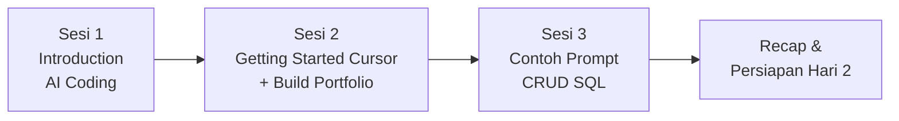

# HARI 1 — Fundamental AI Cursor (Project: Website Portfolio Personal)

**Penyelenggara**: Multimatics
**Durasi**: 1 hari (2 sesi efektif)
**Target peserta**: Developer profesional (Backend, Frontend, Full-Stack, DevOps, Data Engineer)
**Prasyarat**: Familiar dengan minimal 1 bahasa pemrograman, Git basic, terminal/CLI basic.
**Project akhir Hari 1**: Website **portfolio personal** Anda sendiri (HTML/CSS/JS vanilla) — siap dipakai dan ditampilkan di CV / LinkedIn.

> Catatan: Hari 2 & 3 melanjutkan project **Laravel + MySQL lokal** — dashboard data berbasis AI-assisted query.

---

## Tujuan Hari 1

Hari pertama membentuk **fondasi mental dan teknis** peserta sebelum masuk ke Laravel dan database di Hari 2. Fokusnya bukan "menulis kode lebih cepat", tetapi **mengubah cara berpikir** developer dalam berkolaborasi dengan AI sambil menghasilkan **artefak nyata yang langsung dapat Anda pakai**:

1. Memahami posisi AI coding assistant dalam siklus pengembangan modern.
2. Menguasai 4 mode Cursor (Tab, Inline Edit, Ask, Agent) lewat latihan nyata.
3. Menghasilkan website portfolio personal yang bisa langsung dipakai.

---

## Learning Outcomes Hari 1

Setelah menyelesaikan Hari 1, peserta mampu:

- **Menjelaskan** perbedaan AI-assisted coding vs traditional coding beserta implikasi pada proses review.
- **Mempraktikkan** instalasi, konfigurasi, dan navigasi Cursor IDE pada mesin kerja masing-masing.
- **Menggunakan** 4 mode Cursor (Tab, Cmd+K, Ask, Agent) sesuai konteks tugas.
- **Menghasilkan** halaman portfolio personal fungsional menggunakan HTML/CSS/JS vanilla dengan bantuan AI.

---

## Alur Sesi



| Sesi | Topik                              | Output utama yang Anda hasilkan                                                         |
| ---- | ---------------------------------- | --------------------------------------------------------------------------------------- |
| 1    | Introduction to AI-Assisted Coding | Pemahaman lanskap AI coding, belum ada praktik Cursor                                   |
| 2    | Getting Started with Cursor        | Repo `portfolio/` dengan halaman portfolio personal lengkap (HTML/CSS/JS)               |
| 3    | Contoh Prompt CRUD SQL di Cursor   | Koleksi prompt siap pakai untuk CREATE, INSERT, SELECT, UPDATE, DELETE + query lanjutan |

---

## Jadwal Harian (contoh, dapat disesuaikan)

| Waktu         | Kegiatan                                               | Durasi |
| ------------- | ------------------------------------------------------ | ------ |
| 08.30 – 09.00 | Registrasi & Pre-test singkat                          | 30'    |
| 09.00 – 10.30 | **Sesi 1**: Introduction to AI-Assisted Coding         | 90'    |
| 10.30 – 10.45 | Coffee break                                           | 15'    |
| 10.45 – 12.15 | **Sesi 2**: Getting Started with Cursor (+ Latihan 01) | 90'    |
| 12.15 – 13.15 | Lunch                                                  | 60'    |
| 13.15 – 15.15 | **Lanjutan Sesi 2**: Build portfolio page              | 120'   |
| 15.15 – 15.30 | Coffee break                                           | 15'    |
| 15.30 – 16.00 | **Sesi 3**: Contoh Prompt CRUD SQL di Cursor           | 30'    |
| 16.00 – 16.30 | Recap, Q&A, briefing Hari 2                            | 30'    |

---

## Struktur Folder

```
Hari-1-Fundamental-DevNotes/
├── README.md                                  <- file ini
├── portfolio-brd.md                           <- BRD portfolio Hari 1 (BACA DULU)
├── perjalanan-project.md                      <- panduan tahap-tahap build portfolio
├── contoh-prompt-sql-crud.md                  <- Sesi 3: prompt CRUD SQL siap pakai
├── Sesi-01-Introduction-AI-Coding/
│   └── materi.md
└── Sesi-02-Getting-Started-Cursor/
    ├── materi.md
    ├── instalasi-checklist.md
    └── latihan-01-tour-cursor/README.md       <- build portfolio dari awal
```

---

## Catatan untuk Fasilitator

- Stack Hari 1 **fixed**: HTML + CSS + JavaScript vanilla (no build tool, no framework).
- Pastikan peserta sudah install Cursor dan Git sebelum hari pertama — lihat `instalasi-checklist.md`.
- Pastikan koneksi internet stabil — Cursor butuh akses ke model provider.
- Setiap peserta commit & push ke GitHub di akhir hari — repo `portfolio/` ini milik peserta sendiri.
- Setiap sesi diakhiri dengan **mini-checkpoint**: peserta menulis 1 hal yang dipelajari + 1 pertanyaan terbuka.

---

## Persiapan Sebelum Hari 1

Peserta diharapkan datang dengan:

- Laptop dengan minimum RAM 8 GB, free disk ≥ 10 GB.
- Cursor terinstall & login berhasil.
- Git terinstall + identitas global ter-set.
- Akun GitHub aktif.

Lihat detail di `Sesi-02-Getting-Started-Cursor/instalasi-checklist.md`.
