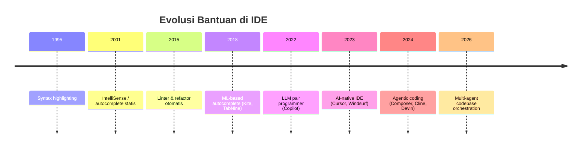
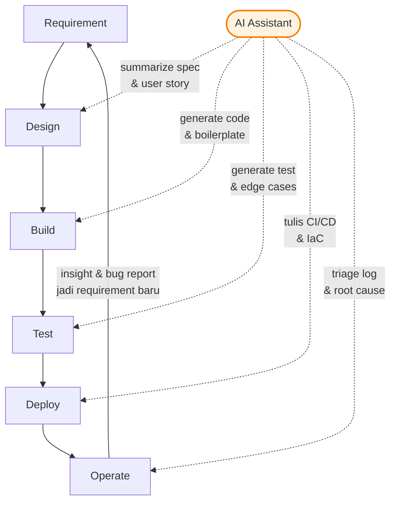

# Sesi 1 — Introduction to AI-Assisted Coding

Materi pembuka Hari 1. Belum ada praktik Cursor di sesi ini — fokuskan diri untuk memahami **mengapa** cara kerja Anda akan berubah sebelum masuk ke tools-nya di Sesi 2.

---

## Yang Akan Anda Pahami

Setelah membaca materi ini, Anda akan mampu:

1. **Menjelaskan** evolusi pengembangan software dari era manual coding sampai AI-assisted dengan minimal 3 milestone kunci.
2. **Membedakan** karakteristik AI-assisted coding vs traditional coding pada 5 dimensi: kecepatan, akurasi, beban kognitif, review, dan akuntabilitas.
3. **Mengidentifikasi** minimal 4 peran AI dalam siklus modern software engineering.
4. **Memetakan** 3 use case AI coding yang relevan dengan pekerjaan harian Anda.
5. **Mengartikulasikan** mindset shift dari *writer-first* menjadi *reviewer-first*.

---

## 1. Konsep Inti

### 1.1 Mengapa Topik Ini Penting Sekarang

Sebelum 2022, dukungan AI di IDE terbatas pada autocomplete berbasis statistik (IntelliSense, Kite). Setelah peluncuran Copilot (2022) dan munculnya model generatif besar (GPT-4 class, Claude 3+, Gemini), kemampuan AI berubah dari **suggest token berikutnya** menjadi **memahami niat dan menghasilkan unit kerja**. Cursor lahir dari perubahan ini: bukan plugin di atas IDE, tapi IDE yang **dirancang ulang dari awal** dengan AI sebagai *first-class citizen*.

Implikasi langsung untuk Anda sebagai developer profesional:

- Skill "menulis kode dari nol" tidak hilang, tapi **bobot relatifnya turun**.
- Skill yang naik bobotnya: **membaca kode dengan cepat, menulis spesifikasi, melakukan review kritis, dan mendesain konteks**.
- Tanggung jawab atas kualitas dan keamanan kode **tetap di Anda**, bukan di AI.

### 1.2 Evolusi Software Development



Pergeseran utama bukan pada *kapasitas mengetik*, tapi pada **abstraksi unit kerja**:

| Era          | Unit kerja terkecil | Beban developer            |
| ------------ | ------------------- | -------------------------- |
| Manual       | Karakter / token    | Mengingat sintaks          |
| Autocomplete | Identifier / line   | Memilih dari kandidat      |
| AI inline    | Function / block    | Memvalidasi logika         |
| AI agentic   | Feature / task      | Menulis spec & review diff |

### 1.3 AI-Assisted vs Traditional Coding

| Dimensi                 | Traditional                | AI-Assisted                                            |
| ----------------------- | -------------------------- | ------------------------------------------------------ |
| Sumber kode             | 100% diketik developer     | Sebagian besar di-generate, di-edit developer          |
| Kecepatan iterasi       | Linier dengan kecepatan ketik | Linier dengan kecepatan review                       |
| Beban kognitif dominan  | Sintaks + logika           | Spesifikasi + verifikasi                               |
| Risiko bug              | Typo, off-by-one, copy-paste | Hallucination API, asumsi salah, over-engineering    |
| Review                  | Optional di solo project   | **Wajib** — output AI harus dibaca                     |
| Knowledge transfer      | Dokumentasi manual         | Otomatis (commit, comment) + tetap perlu validasi      |
| Akuntabilitas           | Developer                  | Developer (tidak berubah)                              |

Poin penting: **akuntabilitas tidak berpindah**. Jika kode AI bug di production, yang bertanggung jawab adalah Anda yang meng-*approve* commit, bukan vendor model.

### 1.4 Peran AI di Modern Software Engineering



Lima peran konkret AI yang akan Anda praktikkan sepanjang pelatihan:

1. **Spec → Code**: dari user story → skeleton modul.
2. **Code → Code**: refactor, rename, translate antar bahasa.
3. **Code → Test**: generate unit / integration test.
4. **Code → Docs**: docstring, README, ADR.
5. **Log → Insight**: meringkas error & stack trace.

### 1.5 Use Case Konkret per Profil

Lihat baris yang paling cocok dengan peran Anda — gunakan sebagai inspirasi saat menjawab refleksi di akhir materi:

| Profil         | Use case high-impact                                                                      |
| -------------- | ----------------------------------------------------------------------------------------- |
| Backend        | Generate endpoint REST/gRPC dari OpenAPI spec; tulis migration & seeder; integration test |
| Frontend       | Generate komponen dari Figma/desain; tulis state management; a11y audit                   |
| Full-Stack     | Bridging contract antar layer; type-safe API client                                       |
| DevOps         | Tulis Terraform/Helm dari requirement; jelaskan log error; bikin runbook                  |
| Data Engineer  | Tulis transformasi SQL/Spark; generate dbt model dari schema; data quality check          |

### 1.6 Mindset Shift: Reviewer-First

Developer yang sukses dengan AI tidak bertanya "kode apa yang harus saya tulis?" tapi:

1. **Apa hasil yang saya inginkan?** (intent)
2. **Konteks apa yang AI perlu tahu?** (context)
3. **Apa kriteria 'kode ini benar'?** (acceptance)
4. **Bagaimana saya membuktikan kode ini benar?** (verification)

Loop kerja yang Anda akan biasakan:

```
spec → prompt → generate → read diff → test → commit
                ↑__________(loop)__________|
```

### 1.7 Risiko & Batasan AI Coding

Lima risiko utama yang harus Anda waspadai sejak hari pertama memakai AI coding:

- **Hallucination** — AI bisa memanggil API/library/fungsi yang tidak ada.
- **Outdated knowledge** — model punya cutoff date; bisa kasih versi atau syntax usang.
- **Security leakage** — mengirim secret/PII ke model provider berisiko bocor.
- **Over-confidence** — gaya bahasa AI selalu meyakinkan, walau salah.
- **Skill atrophy** — developer yang hanya copy-paste output AI kehilangan fundamental.

Mitigasi (akan Anda pelajari mendalam di Hari 3 Sesi 10 — Security & Governance):

- Set rules `.cursorrules` / `cursor rules` per project.
- Gunakan privacy mode untuk repo sensitif.
- Tetap latih fundamental dengan code reading & code review.

---

## 2. Bacaan Lanjutan

- Cursor — *Welcome to Cursor*: <https://cursor.com/docs/get-started/welcome>
- Cursor — *Models overview*: <https://cursor.com/docs/models>
- Anthropic — *Claude for Coding*: <https://www.anthropic.com/solutions/coding>
- GitHub — *Research: quantifying GitHub Copilot's impact on developer productivity* (2022): <https://github.blog/2022-09-07-research-quantifying-github-copilots-impact-on-developer-productivity-and-happiness/>
- Addy Osmani — *The 70% problem: Hard truths about AI-assisted coding* (2024).
- Simon Willison — *AI-assisted programming* blog series.
- Buku: *The Pragmatic Programmer* (Hunt & Thomas) — bab tentang abstraction & ortogonalitas tetap relevan.
