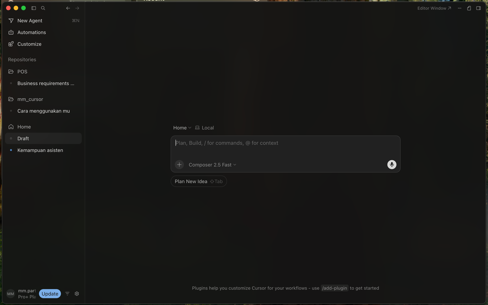
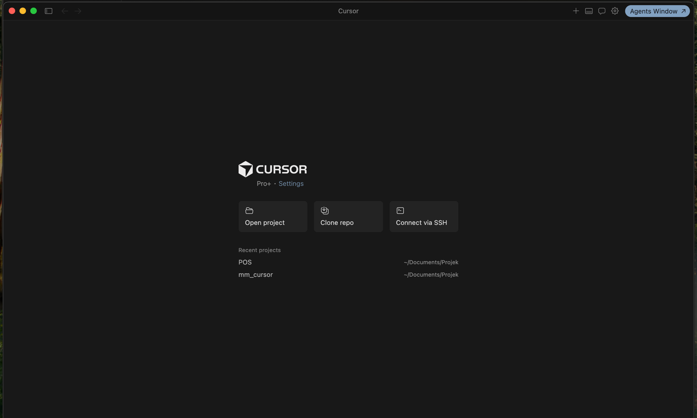
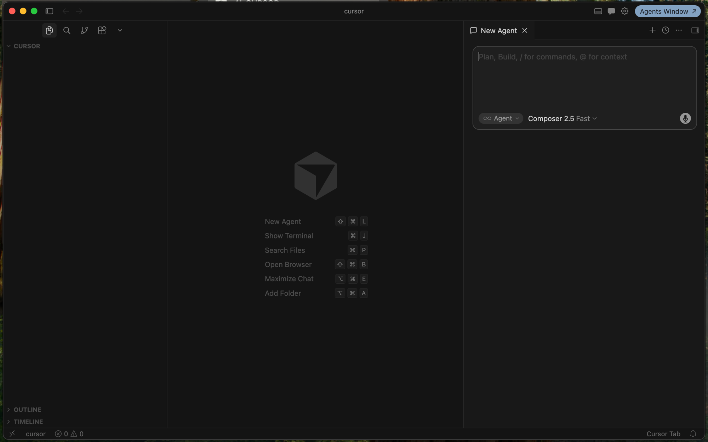

# Instalasi Checklist — Cursor IDE

Gunakan checklist ini **sebelum** Sesi 2 dimulai bila memungkinkan, atau pandu peserta saat segmen instalasi. Tandai ✓ saat selesai.

---

## 0. Prasyarat Umum

- [ ] Laptop nyala, charger terhubung.
- [ ] Koneksi internet stabil (ping ke `cursor.com` < 200ms ideal).
- [ ] Akses ke email kerja (untuk login).
- [ ] Hak admin / sudo di laptop (untuk install aplikasi).
- [ ] Free disk ≥ 5 GB.
- [ ] RAM ≥ 8 GB (16 GB direkomendasikan).

---

## 1. Download

- [ ] Buka <https://cursor.com>.
- [ ] Klik **Download** → pilih installer sesuai OS.
  - macOS: `.dmg` (Apple Silicon **atau** Intel — pilih sesuai chip).
  - Windows: `.exe` installer (User Setup, **tidak perlu admin**).
  - Linux: `.AppImage` atau `.deb`.

---

## 2. Install per OS

### macOS

- [ ] Buka `.dmg`.
- [ ] Drag `Cursor.app` ke folder `Applications`.
- [ ] Buka via Launchpad / Spotlight.
- [ ] (Jika muncul "unidentified developer") System Settings → Privacy & Security → **Open Anyway**.

### Windows

- [ ] Jalankan installer `.exe`.
- [ ] Tick "Add to PATH" & "Create desktop shortcut".
- [ ] Selesai → buka dari Start Menu.

### Linux (Ubuntu/Debian)

- [ ] `.deb`: `sudo dpkg -i cursor_*.deb` → `sudo apt -f install` jika ada dependency error.
- [ ] `.AppImage`: `chmod +x Cursor-*.AppImage && ./Cursor-*.AppImage`.

---

## 3. First Run & Login

- [ ] Buka Cursor.
- [ ] Pilih theme (dark/light).
- [ ] Import VS Code Settings? **Ya** jika sudah pakai VS Code (extension + keybinding ikut).
- [ ] Login → pakai email kerja → verifikasi via browser.
- [ ] Verifikasi nama akun muncul di kiri-bawah (status bar / activity bar).

---

## 3b. Mengenal Antarmuka Cursor 3.x (Agents Window)

Sejak **Cursor 3.0** (rilis April 2026), tampilan default berubah ke antarmuka *agent-first* yang disebut **Agents Window** (Hub). Versi yang akan Anda pakai di pelatihan ini adalah **Cursor 3.6** (rilis 29 Mei 2026, fitur Auto-review Run Mode). Saat pertama membuka aplikasi, Anda akan melihat **3 state antarmuka** yang berbeda. Pahami perpindahan antar-state ini supaya tidak bingung saat mulai latihan.

### State 1 — Hub View (default saat pertama buka)



Antarmuka pertama yang muncul. **Bukan tempat menulis kode** — ini launcher untuk Agent & project. Yang penting di sini:

- **New Agent** (⌘N) — mulai sesi Agent baru.
- **Repositories** — daftar project yang baru-baru ini Anda kerjakan (di screenshot: POS, mm_cursor).
- **Editor Window ↗** (pojok kanan atas) — link untuk berpindah ke mode editor klasik. **Ini yang Anda butuhkan untuk latihan**.
- **Prompt box** di tengah — bisa langsung tulis instruksi untuk Agent tanpa membuka editor.

> Selama pelatihan DevNotes, Anda **hampir tidak menyentuh** Hub view. Klik **"Editor Window ↗"** untuk pindah.

### State 2 — Editor Welcome (belum ada project terbuka)



Window editor terbuka, tapi belum ada folder/project yang di-load. 3 tombol utama:

- **Open project** — pilih folder lokal (mis. folder `devnotes/` yang Anda siapkan di pendahuluan).
- **Clone repo** — clone dari URL git langsung.
- **Connect via SSH** — buka folder di mesin remote via SSH.

Di bawah ada **Recent projects** — daftar project yang pernah Anda buka.

Untuk mulai DevNotes: klik **Open project** → pilih `~/devnotes-workshop/devnotes/` (atau folder tempat Anda menyiapkan).

### State 3 — Editor Penuh (project ter-load)



Tampilan ini disebut **mode klasik** karena layout-nya identik dengan **Visual Studio Code (VS Code)** — *code editor* gratis dari Microsoft yang menjadi standar de facto pengembangan software modern. Cursor memang dibangun di atas basis kode VS Code, lalu di-*augment* dengan panel AI di sebelah kanan dan fitur seperti Cmd/Ctrl+K (inline edit) dan Composer.

Konsekuensinya untuk Anda:

- **Layout sama persis**: Activity Bar di kiri, file tree, editor di tengah, status bar di bawah. Kalau Anda pernah pakai VS Code, semua shortcut & habit Anda langsung berlaku.
- **Extension VS Code kompatibel**: ESLint, Prettier, Docker, GitLens, dll. bisa di-install dari marketplace (OpenVSX).
- **Theme & keybinding bisa diimpor** dari VS Code di first-run.
- **Yang berbeda**: panel AI di kanan, status bar tambahan untuk indexing/privacy, dan ikon "Cursor Tab" di pojok kanan-bawah.

**Di sinilah seluruh latihan dikerjakan.**

| Area | Fungsi |
| ---- | ------ |
| **Activity Bar** (paling kiri) | Explorer, Search (`⌘P`), Source Control (git), Extensions |
| **Sidebar** | File tree project (di screenshot: "CURSOR"). Di bawah ada OUTLINE & TIMELINE |
| **Editor area** (tengah) | Area menulis & membaca kode. Kosong saat belum buka file — tampak logo + cheatsheet shortcut |
| **AI Panel** (kanan) | Chat / Composer / Agent — input prompt + pilih model (mis. "Composer 2.5 Fast") |
| **Status bar** (bawah) | Nama project, jumlah error/warning, indikator Cursor Tab |
| **Agents Window ↗** (kanan atas) | Kembali ke Hub view (State 1) |

### Cara cepat berpindah antar-state

| Dari | Ke | Cara |
| ---- | -- | ---- |
| Hub | Editor (welcome / penuh) | Klik **"Editor Window ↗"** di pojok kanan atas Hub |
| Editor (welcome) | Editor (penuh) | Klik **Open project** / **Clone repo** / pilih dari Recent |
| Editor (penuh) | Hub | Klik **"Agents Window ↗"** di pojok kanan atas Editor |
| Mana pun | Editor cepat | `⌘O` (mac) / `Ctrl+O` (Win/Linux) — Open Folder langsung |

### Membuat Editor menjadi default saat buka Cursor

Kalau Anda lebih nyaman langsung masuk ke editor klasik tiap buka Cursor (skip Hub):

1. Buka Cursor Settings (`⌘,` di mac / `Ctrl+,` di Win/Linux).
2. Cari setting **"Default startup view"** / **"Open editor on launch"** (nama bisa beda per versi).
3. Set ke **Editor**.

Alternatif tanpa setting: tutup window Hub setelah Editor terbuka — Cursor akan mengingat last-state dan langsung buka Editor di sesi berikutnya.

---

## 3a. Plan & Quota Awareness (PENTING — baca sebelum hari pelatihan)

Sejak 2026, Cursor menggunakan model billing berbasis **usage credit** (bukan request count). Setiap plan punya kredit bulanan; pemakaian model premium mengurangi kredit Anda. Cek halaman resmi <https://cursor.com/pricing> untuk update terbaru. Gambaran umum (Juni 2026):

| Plan                  | Harga/bulan | Kredit & Kuota                                                                   | Cocok untuk                                                                                       |
| --------------------- | ----------- | -------------------------------------------------------------------------------- | ------------------------------------------------------------------------------------------------- |
| **Hobby (Free)**      | $0          | Limited Agent requests + Limited Tab completions                                 | Eksplorasi ringan; **TIDAK cukup untuk 3 hari pelatihan intensif**                                |
| **Pro Trial**         | $0 (14 hari)| Akses penuh Pro selama 2 minggu sejak sign-up                                    | Cocok bila Anda baru daftar maksimal H-14 sebelum pelatihan                                       |
| **Pro**               | $20         | ~$20 kredit/bulan + akses MCPs/skills/hooks/cloud agents                         | Lanjut pakai Cursor pasca-pelatihan                                                               |
| **Pro+**              | $60         | 3× kredit Pro (~$60) + akses prioritas model frontier                            | Power user yang sering pakai model frontier (Opus/GPT-5) untuk task berat                         |
| **Ultra**             | $200        | **20× kredit Pro** (~$400 effective), prioritas akses model & fitur terbaru      | Power user / agent-heavy workflow                                                                 |
| **Teams**             | $40/user    | Sama dengan Individual + SSO, audit, shared context, Bugbot code review          | Adopsi tim/organisasi                                                                             |
| **Enterprise**        | Custom      | Pooled usage, SCIM, model access control, AI tracking API, priority support      | Korporasi besar                                                                                   |

**Yang dihitung sebagai 1 premium request:**
- 1 Chat (Cmd+L) ke model premium (Sonnet/Opus/GPT/Gemini)
- 1 Inline Edit (Cmd+K) ke model premium
- 1 Agent / Composer (Cmd+I) — 1 task multi-step bisa makan 1 atau lebih request

**Yang TIDAK menghabiskan premium request:**
- Tab autocomplete (model kecil)
- Chat/Cmd+K ke model auto/free fallback

### Rekomendasi untuk peserta pelatihan

- [ ] **Idealnya pakai Pro Trial** — daftar akun H-1 sampai maksimal H-14 sebelum hari pertama agar trial aktif selama 3 hari pelatihan.
- [ ] Bila tidak mau bayar: gunakan **Auto model** sebanyak mungkin untuk hemat request, simpan request premium untuk lab yang kompleks (Hari 2-3).
- [ ] Bila peserta sudah Pro berbayar: tidak perlu khawatir, kuota cukup.
- [ ] Fasilitator: bila organisasi mengadakan pelatihan tim, pertimbangkan **Business plan** terlebih dahulu.

> ⚠️ Free tier 50 request/bulan biasanya **habis di pertengahan Hari 1**. Pastikan peserta tahu pilihannya sebelum hari pertama agar tidak terganggu.

---

## 4. Verifikasi Versi & Update

- [ ] Buka **Help → About** (atau Cmd/Ctrl+Shift+P → "About").
- [ ] Catat versi (mis. `Cursor 0.4x.x`).
- [ ] Cek update: **Help → Check for Updates**. Pastikan sudah versi terbaru sebelum pelatihan.

---

## 5. Install Git & Tools Pendukung

### Git (wajib)
- [ ] macOS: `git --version` (akan trigger install Xcode CLT) atau pakai Homebrew `brew install git`.
- [ ] Windows: download dari <https://git-scm.com>.
- [ ] Linux: `sudo apt install git`.
- [ ] Konfigurasi: `git config --global user.name "<nama>"` & `user.email`.

### Stack-specific runtime
<!-- STACK-PLACEHOLDER: isi sesuai hasil pretest -->

- [ ] Node.js LTS + npm/pnpm (untuk peserta FE/Full-Stack/Node BE).
- [ ] Python 3.11+ + pip + venv (untuk peserta Python/Data).
- [ ] Go 1.22+ (untuk peserta Go).
- [ ] JDK 21 + Maven/Gradle (untuk peserta Java).
- [ ] Docker Desktop / colima (untuk peserta DevOps).

---

## 6. Setup Model Preferensi

- [ ] Buka **Cursor Settings** (gear icon → Settings → Models).
- [ ] Aktifkan minimal 2 model: **Auto** + 1 model spesifik (Claude / GPT / Gemini terbaru).
- [ ] Set default = **Auto** (rekomendasi pemula).
- [ ] Verifikasi quota / billing (free tier vs paid).

---

## 7. Privacy & Security

- [ ] Settings → **General → Privacy Mode** → **Enabled** (jika company policy).
- [ ] Buat file `.cursorignore` di root project untuk file sensitif (mirip `.gitignore`). Contoh:

```
.env
.env.*
*.pem
secrets/
```

- [ ] Verifikasi proxy corporate (kalau ada): Settings → HTTP → set proxy.

---

## 8. Smoke Test (5 menit)

- [ ] Buka folder kosong baru.
- [ ] Buat file `hello.<ext>`. <!-- STACK-PLACEHOLDER -->
- [ ] Ketik komentar `// fungsi sapa nama` lalu Enter — Cursor **Tab** harusnya menyarankan fungsi.
- [ ] Highlight fungsi → `Cmd/Ctrl+K` → ketik *"tambahkan input validation"* → terima diff.
- [ ] `Cmd/Ctrl+L` buka Chat → ketik *"jelaskan kode ini"* → cek respons muncul.
- [ ] `Cmd/Ctrl+I` buka Composer → ketik *"buat file README.md sederhana"* → cek file ter-create.

Bila semua ✓ → peserta siap masuk Lab 01.

---

## 9. Troubleshooting Cepat

| Gejala | Solusi |
|--------|--------|
| "Cannot connect to model" | Cek proxy, login ulang, ganti model |
| Indexing stuck | Tutup-buka folder; cek `.cursorignore` terlalu permisif |
| Extension VS Code tidak ada | Install ulang via Extensions panel; cari di OpenVSX |
| Tab tidak muncul | Pastikan auto-save aktif, cek Settings → Features → Cursor Tab |
| Login terus loop | Hapus cache: keluar app → hapus `~/.cursor` (backup dulu) |

