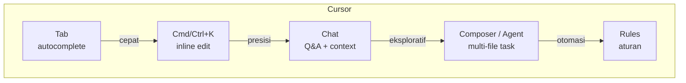
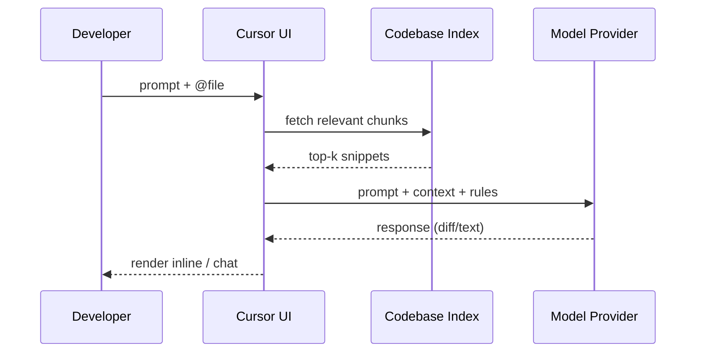

# Sesi 2 — Getting Started with Cursor

Sesi pertama Anda menyalakan Cursor. Setelah Sesi 1 memberi pemahaman *kenapa* AI coding penting, sesi ini fokus ke **alat** — install Cursor, kenali antarmukanya, lalu siap-siap praktik di Latihan 01 (scaffold skeleton website portfolio Anda).

---

## Yang Akan Anda Pahami

Setelah membaca materi ini, Anda akan mampu:

1. **Menjelaskan** posisi Cursor sebagai *AI-native code editor* yang dibangun di atas basis VS Code, dan menyebut minimal 4 kapabilitas inti yang tidak ada di IDE biasa.
2. **Menginstall** Cursor pada OS Anda (macOS / Windows / Linux), login, dan memilih model default.
3. **Menavigasi** 5 area utama UI: Editor, Chat, Composer, Inline Edit (Cmd/Ctrl+K), dan Cursor Tab.
4. **Mengintegrasikan** Cursor dengan workflow eksisting Anda: Git, terminal, extension VS Code, dan project lokal.
5. **Mengkonfigurasi** preferensi model, privacy mode, dan rules dasar di level user / project.

---

## 1. Konsep Inti

### 1.1 Apa itu Cursor?

Cursor adalah **code editor yang dibangun di atas basis VS Code**, lalu dirancang ulang dengan AI sebagai komponen inti — bukan sekadar plugin yang ditempel. Implikasi praktis:

- Hampir semua **extension VS Code kompatibel** (Marketplace OpenVSX + ekspor manual).
- Keybinding dan tema VS Code bisa diimpor langsung di first-run.
- Tapi UI di-*augment* dengan panel AI, *inline diff*, dan model orchestration yang tidak bisa dicapai dengan plugin.

| Atribut                  | VS Code + Copilot       | Cursor                                |
| ------------------------ | ----------------------- | ------------------------------------- |
| Inline suggestion        | ✓ (Copilot)             | ✓ (Tab) — multi-line + cross-file     |
| Inline edit (instruct)   | Parsial (Copilot Chat)  | ✓ (Cmd/Ctrl+K) native                 |
| Chat dengan codebase     | Limited                 | ✓ (@-mentions, indexed)               |
| Edit banyak file otomatis | Parsial                 | ✓ (Agent)                            |
| Switch model             | Tidak                   | ✓ (Claude, GPT, Gemini, dll.)         |
| Privacy mode             | Per-org                 | Per-user & per-project                |
| Project rules            | Parsial                 | ✓ (`.cursor/rules/*.mdc`)             |

### 1.2 Kapabilitas Inti

| Fitur                            | Pemicu                                | Use case khas                                         |
| -------------------------------- | ------------------------------------- | ----------------------------------------------------- |
| **Tab**                          | Mengetik di editor                    | Lanjutkan baris/blok, edit prediktif lintas file      |
| **Cmd/Ctrl+K**                   | Highlight kode + shortcut             | Refactor terlokalisasi, generate snippet              |
| **Chat** (Cmd/Ctrl+L)            | Buka panel                            | Tanya jawab tentang codebase, eksplorasi              |
| **Composer / Agent** (Cmd/Ctrl+I)| Buka composer                         | Bikin/edit beberapa file, jalankan terminal           |
| **Rules**                        | Otomatis dari file `.cursor/rules/`   | Pasang aturan style, arsitektur, keamanan             |

### 1.3 Tools yang Tersedia di Agent Mode

Saat Anda menggunakan **Agent** (`Cmd/Ctrl+I`), AI tidak hanya menghasilkan teks — ia bisa memanggil *tools* untuk benar-benar membaca file, menjalankan perintah, dan mencari informasi di codebase Anda. Inilah yang membuat Agent berbeda dari Chat biasa.

| Tool | Fungsi | Kapan dipakai |
|------|--------|---------------|
| **Read** | Membaca isi file | Selalu, sebelum memodifikasi — agar Agent tahu konteks file saat ini |
| **Edit** | Modifikasi file (string replacement) | Perubahan presisi: ubah fungsi, tambah baris, rename variabel |
| **Write** | Tulis file baru / overwrite total | Membuat file baru, atau rewrite besar yang lebih mudah dari awal |
| **Bash** | Jalankan perintah shell | `npm install`, `git`, `mkdir`, menjalankan test, dan sebagainya |
| **Grep** | Cari teks dalam files | Mencari simbol, pattern, pesan error di seluruh codebase |
| **Glob** | Cari file berdasarkan pattern | Menemukan semua file `.tsx`, `.env`, atau `*.test.js` |
| **WebFetch** | Ambil konten dari URL spesifik | Membaca dokumentasi online yang URL-nya sudah diketahui |
| **WebSearch** | Cari di internet | Mencari solusi error, package terbaru, referensi API |
| **TaskCreate / TaskUpdate** | Kelola task list internal | Memecah dan melacak kemajuan task multi-langkah |
| **Agent** | Spawn sub-agent untuk task terisolasi | Riset luas atau pekerjaan paralel yang tidak bergantung satu sama lain |

> **Yang perlu Anda perhatikan**: Agent bisa **memanggil tools ini secara otomatis** saat menjalankan instruksi Anda. Artinya, satu prompt bisa berujung pada Agent membaca 5 file, menjalankan `npm test`, lalu menulis 3 file sekaligus — semua tanpa Anda ketik satu pun perintah. Ini kekuatannya, sekaligus alasan Anda harus **review setiap perubahan sebelum accept**.

### 1.5 Arsitektur Kerja (model & context)

#### Alur singkat (apa yang terjadi saat Anda tekan Enter)

1. **Anda** mengetik prompt + `@file utils.ts` di chat.
2. **Cursor UI** mencari potongan kode paling relevan dari project (lewat Codebase Index).
3. **Index** mengembalikan *top-k snippets* (mis. 5–10 potongan).
4. **Cursor UI** merangkai paket: `prompt + snippets + cursor rules` → kirim ke server model.
5. **Model Provider** memproses dan mengembalikan jawaban (diff atau text).
6. **Cursor UI** menampilkan ke Anda — inline diff (Cmd+K) atau bubble chat.

#### Analogi: asisten di luar gedung

Bayangkan Cursor seperti asisten yang bekerja di luar gedung:

- Anda kasih instruksi (**prompt**).
- Sekretaris (Cursor UI) cari fotokopi dokumen relevan dari arsip (**index lokal**).
- Sekretaris kirim ke asisten luar (**model provider**) lewat kurir (**network**).
- Asisten balas dengan draft (**jawaban LLM**).
- Sekretaris terima dan serahkan ke Anda.

Yang penting: **Anda tidak pernah kirim seluruh isi arsip** — selalu pilihan dokumen relevan. Itulah *retrieval-augmented*.

#### Tiga konsep kunci

**1. Codebase Index (lokal).** Saat pertama membuka folder, Cursor men-*scan* semua file, memecahnya jadi chunks, lalu menghitung *embedding* (representasi numerik). Index ini disimpan di laptop Anda. Project kecil seperti `portfolio/` selesai di-index < 30 detik; project besar bisa beberapa menit.

**2. Retrieval-Augmented (konteks ter-batas).** LLM punya **token budget**. Tidak mungkin seluruh codebase dikirim sekaligus. Cursor hanya kirim *top-k snippets* paling relevan, ditentukan oleh: kemiripan embedding + file yang Anda sebut via `@-mention` + file yang sedang dibuka. **Karena itulah skill memilih konteks = skill kritis** — fokus Sesi 3.

**3. Model Provider eksternal.** LLM tidak jalan di laptop Anda; dikirim ke server Anthropic/OpenAI/Google. Implikasinya: ada latency network, dan kode Anda meninggalkan laptop. **Privacy mode** mencegah provider menyimpan kode untuk training.

#### Implikasi praktis untuk Anda

| Saat ini terjadi…                          | Kemungkinan besar penyebabnya…                | Mitigasi cepat                                                                |
| ------------------------------------------ | --------------------------------------------- | ----------------------------------------------------------------------------- |
| Jawaban AI **terasa generik / salah arah** | Konteks yang dikirim tidak tepat              | Tambah `@-mention` file kunci atau contoh acuan yang ingin Anda tiru          |
| Cursor **lambat** merespons                | Network ke provider lambat / model berat      | Cek koneksi, ganti ke model lebih ringan (Auto / Sonnet), tutup chat panjang  |
| Khawatir kode sensitif terkirim            | Default mode bisa simpan untuk improvement    | Aktifkan **Privacy mode** + tambahkan `.cursorignore` untuk file rahasia      |
| Chat panjang mulai "ngawur"                | Token budget penuh, snippet penting kepotong  | Reset chat, mulai sesi baru dengan @-mention yang lebih spesifik              |

### 1.6 Model — Memilih yang Tepat

| Model (per 2026)                    | Cocok untuk                       | Catatan                          |
| ----------------------------------- | --------------------------------- | -------------------------------- |
| Claude Opus / Sonnet kelas terbaru  | Reasoning panjang, refactor besar | Default untuk kode kompleks      |
| GPT-5 / o-series                    | Algoritmik, struktur baru         | Bagus untuk debug logika         |
| Gemini terbaru                      | Konteks sangat besar              | Cocok untuk repo besar           |
| Auto                                | Cursor pilih per-task             | Default aman untuk pemula        |

> Nama model berubah cukup cepat. Lihat versi terkini di [cursor.com/docs/models](https://cursor.com/docs/models).

### 1.7 Instalasi & Konfigurasi (ringkas)

Checklist lengkap ada di [`instalasi-checklist.md`](./instalasi-checklist.md). Kalau Anda sudah mengikuti panduan di [`pendahuluan.md`](../../pendahuluan.md#3-persiapan-sebelum-hari-1), poin 1–5 di bawah ini seharusnya sudah selesai.

1. Download dari [cursor.com](https://cursor.com).
2. Install seperti aplikasi biasa (macOS: drag ke Applications; Windows: installer; Linux: AppImage/deb).
3. First run → import VS Code settings/extensions (opsional, direkomendasikan kalau Anda sudah pakai VS Code).
4. Login dengan kredensial akun Cursor Anda (Pro Trial / Pro / akun yang Anda gunakan).
5. Pilih model default → **Auto** untuk awal.
6. Aktifkan **Privacy Mode** kalau Anda akan membuka repo yang sensitif.
7. Pastikan Git terinstall + identitas global ter-set (sudah Anda lakukan di pendahuluan).

### 1.8 Tour Antarmuka

Setelah Cursor terbuka dan project ter-load (lihat 3 state antarmuka di [`instalasi-checklist.md`](./instalasi-checklist.md#3b-mengenal-antarmuka-cursor-3x-agents-window)), area utama dari kiri ke kanan:

1. **Activity Bar** — explorer, search, git, debug, extensions.
2. **Editor** — sama seperti VS Code, plus *inline diff ghost text*.
3. **Right Sidebar AI Panel** — switch antara Chat dan Composer.
4. **Status Bar** — model aktif, privacy state, indexing status.
5. **Command Palette** (Cmd/Ctrl+Shift+P) — semua perintah Cursor + VS Code.

Shortcut yang akan sering Anda pakai di Hari 1:

| Shortcut (mac / win-linux)     | Aksi                       |
| ------------------------------ | -------------------------- |
| `Cmd+K` / `Ctrl+K`             | Inline edit                |
| `Cmd+L` / `Ctrl+L`             | Buka Chat                  |
| `Cmd+I` / `Ctrl+I`             | Buka Composer              |
| `Tab`                          | Terima saran Cursor Tab    |
| `Esc`                          | Tolak saran                |
| `Cmd+Enter` / `Ctrl+Enter`     | Submit prompt di Chat      |
| `Cmd+Shift+P` / `Ctrl+Shift+P` | Command Palette            |
| `@` di prompt                  | Buka context picker        |

### 1.9 Integrasi Workflow

- **Git**: Cursor pakai Git client VS Code; commit message bisa di-generate via tombol "Generate Commit Message".
- **Terminal**: built-in terminal; output bisa Anda kirim ke Chat dengan shortcut atau "Add to Chat".
- **Extension**: install lewat marketplace yang terintegrasi. Kompatibel dengan Copilot, ESLint, Prettier, Docker, dll.
- **Sync settings**: via Settings Sync (mirip VS Code) atau export `settings.json`.
- **Project rules**: file di `.cursor/rules/*.mdc` (markdown + frontmatter). Akan Anda pakai mulai Hari 2.

### 1.10 Privacy & Keamanan (intro)

- **Privacy Mode**: prompt & kode Anda tidak disimpan / tidak dipakai training oleh provider.
- **Ignore files**: file `.cursorignore` mencegah indexing file sensitif (mirip `.gitignore`).
- **Model endpoint**: di plan enterprise Anda bisa pakai endpoint sendiri (Azure OpenAI, Anthropic Bedrock).
- **Detail governance**: dibahas lebih dalam di Hari 3 Sesi 10 — Security & Ethics.

---

## 2. Lanjut ke Latihan

Setelah membaca materi ini, lanjut ke **[Latihan 01 — Tour Cursor + Scaffold Portfolio](./latihan-01-tour-cursor/README.md)**. Di sana Anda akan:

- Membuat repo `portfolio/` baru di laptop Anda.
- Memakai 4 mode interaksi Cursor (Tab, Cmd/Ctrl+K, Chat, Agent) pada satu task nyata.
- Menghasilkan skeleton website portfolio dengan CSS variables siap pakai, yang akan Anda lanjutkan di Sesi 3 & 4.

---

## 3. Bacaan Lanjutan

- Cursor — *Get Started / Installation*: <https://cursor.com/docs/get-started/installation>
- Cursor — *Editor overview*: <https://cursor.com/docs/editor>
- Cursor — *Keyboard shortcuts*: <https://cursor.com/docs/keyboard-shortcuts>
- Cursor — *Models*: <https://cursor.com/docs/models>
- Cursor — *Privacy & Security*: <https://cursor.com/docs/privacy>
- VS Code — *Migrate to Cursor* notes (community).
