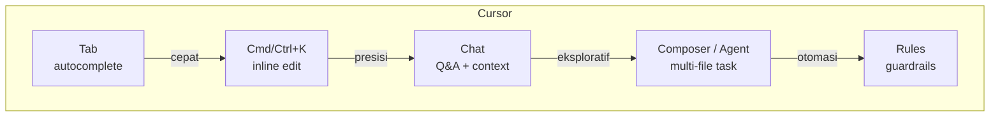
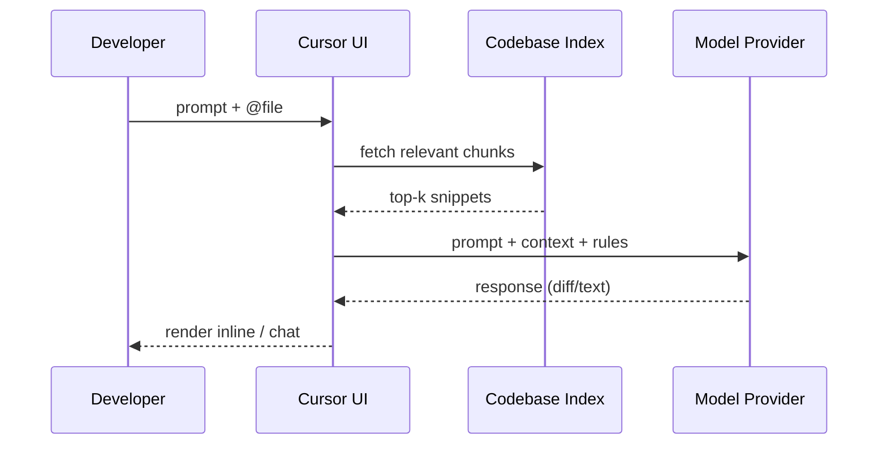

# Sesi 2 — Getting Started with Cursor

**Durasi**: 90 menit
**Format**: Penjelasan (25') + Instalasi & verifikasi (20') + Tour UI (20') + Lab 01 (20') + Wrap-up (5')

---

## Learning Outcomes

Setelah sesi ini peserta mampu:

1. **Menjelaskan** posisi Cursor sebagai *AI-native code editor* yang dibangun di atas basis VS Code, serta menyebut minimal 4 kapabilitas inti yang tidak ada di IDE biasa.
2. **Menginstall** Cursor pada OS masing-masing (macOS / Windows / Linux), login, dan memilih model default.
3. **Menavigasi** 5 area utama UI: Editor, Chat, Composer, Inline Edit (Cmd/Ctrl+K), dan Cursor Tab.
4. **Mengintegrasikan** Cursor dengan workflow eksisting: Git, terminal, extension VS Code, dan project lokal.
5. **Mengkonfigurasi** preferensi model, privacy mode, dan rules dasar di level user / project.

---

## 1. Konsep Inti

### 1.1 Apa itu Cursor?

Cursor adalah **code editor yang dibangun di atas basis VS Code**, lalu dirancang ulang dengan AI sebagai komponen inti — bukan sekadar plugin yang ditempel. Implikasi praktis:

- Hampir semua **extension VS Code kompatibel** (Marketplace OpenVSX + ekspor manual).
- Keybinding dan tema VS Code bisa diimpor langsung di first-run.
- Tapi UI di-*augment* dengan panel AI, *inline diff*, dan model orchestration yang tidak bisa dicapai dengan plugin.

| Atribut | VS Code + Copilot | Cursor |
|---------|-------------------|--------|
| Inline suggestion | ✓ (Copilot) | ✓ (Tab) — multi-line + cross-file |
| Inline edit (instruct) | Parsial (Copilot Chat) | ✓ (Cmd/Ctrl+K) native |
| Chat dengan codebase | Limited | ✓ (@-mentions, indexed) |
| Multi-file edit (agentic) | Parsial | ✓ (Composer / Agent) |
| Switch model | Tidak | ✓ (Claude, GPT, Gemini, dll.) |
| Privacy mode | Per-org | Per-user & per-project |
| Project rules | Parsial | ✓ (`.cursor/rules/*.mdc`) |

### 1.2 Kapabilitas Inti

| Fitur | Pemicu | Use case khas |
|-------|--------|--------------|
| **Tab** | Mengetik di editor | Lanjutkan baris/blok, edit prediktif lintas file |
| **Cmd/Ctrl+K** | Highlight kode + shortcut | Refactor terlokalisasi, generate snippet |
| **Chat** (Cmd/Ctrl+L) | Buka panel | Tanya jawab tentang codebase, eksplorasi |
| **Composer / Agent** (Cmd/Ctrl+I) | Buka composer | Bikin/edit beberapa file, jalankan terminal |
| **Rules** | Otomatis dari file `.cursor/rules/` | Pasang guardrail style, arsitektur, security |

### 1.3 Arsitektur Kerja (model & context)

Yang harus dipahami peserta:

- Codebase di-**index** lokal lalu retrieval-augmented dikirim ke provider.
- Konteks yang dikirim **terbatas** (token budget). Karenanya kemampuan **memilih konteks** = skill kritis (Sesi 3).
- Provider model bersifat **eksternal**. Privacy mode mencegah penyimpanan/training.

### 1.4 Model — Memilih yang Tepat

| Model (per 2026) | Cocok untuk | Catatan |
|------------------|-------------|---------|
| Claude Opus / Sonnet kelas terbaru | Reasoning panjang, refactor besar | Default untuk kode kompleks |
| GPT-5 / o-series | Algoritmik, struktur baru | Bagus untuk debug logika |
| Gemini terbaru | Konteks sangat besar | Cocok untuk repo besar |
| Auto | Cursor pilih per-task | Default aman untuk pemula |

> Detail nama model di-*pin* ke versi terkini saat hari training. Lihat [cursor.com/docs/models](https://cursor.com/docs/models).

### 1.5 Instalasi & Konfigurasi

Ringkasan; checklist lengkap di `instalasi-checklist.md`.

1. Download dari [cursor.com](https://cursor.com).
2. Install seperti app biasa (macOS: drag ke Applications; Windows: installer; Linux: AppImage/deb).
3. First run → import VS Code settings/extensions (opsional, **direkomendasikan jika sudah pakai VS Code**).
4. Login dengan email kerja (SSO bila tersedia).
5. Pilih model default → "Auto" untuk pemula.
6. Aktifkan **Privacy Mode** jika company policy mensyaratkan.
7. Pasang Git, Node/Python/JDK/Go sesuai stack. <!-- STACK-PLACEHOLDER: tools per profil peserta -->

### 1.6 Tour Antarmuka

Area utama (dari kiri ke kanan, default layout):

1. **Activity Bar** — explorer, search, git, debug, extensions.
2. **Editor** — sama seperti VS Code, plus *inline diff ghost text*.
3. **Right Sidebar AI Panel** — switch antara Chat dan Composer.
4. **Status Bar** — model aktif, privacy state, indexing status.
5. **Command Palette** (Cmd/Ctrl+Shift+P) — semua perintah Cursor + VS Code.

Shortcut wajib hafal di hari 1:

| Shortcut (mac / win-linux) | Aksi |
|----------------------------|------|
| `Cmd+K` / `Ctrl+K` | Inline edit |
| `Cmd+L` / `Ctrl+L` | Buka Chat |
| `Cmd+I` / `Ctrl+I` | Buka Composer |
| `Tab` | Terima saran Cursor Tab |
| `Esc` | Tolak saran |
| `Cmd+Enter` / `Ctrl+Enter` | Submit prompt di Chat |
| `Cmd+Shift+P` / `Ctrl+Shift+P` | Command Palette |
| `@` di prompt | Buka context picker |

### 1.7 Integrasi Workflow

- **Git**: Cursor pakai Git client VS Code; commit message bisa di-generate via tombol "Generate Commit Message".
- **Terminal**: built-in terminal; output bisa dikirim ke Chat dengan shortcut atau "Add to Chat".
- **Extension**: install lewat marketplace yang terintegrasi. Kompatibilitas Copilot, ESLint, Prettier, Docker, dll.
- **Sync settings**: via Settings Sync (mirip VS Code) atau export `settings.json`.
- **Project rules**: file di `.cursor/rules/*.mdc` (markdown + frontmatter). Akan didalami Hari 2.

### 1.8 Privacy & Keamanan (intro)

- **Privacy Mode**: prompt & code tidak disimpan / tidak dipakai training.
- **Ignore files**: file `.cursorignore` mencegah indexing file sensitif (mirip `.gitignore`).
- **Model endpoint**: enterprise dapat pakai endpoint sendiri (Azure OpenAI, Anthropic Bedrock).
- **Detail governance**: dibahas Hari 2.

---

## 2. Demo Live

**Skenario**: "First 10 minutes in Cursor".

1. **Buka Cursor** kosong → tunjukkan welcome screen, import VS Code settings.
2. **Open Folder** sample repo (sediakan repo demo kecil). Tunjukkan **indexing status** di status bar.
3. **Tab demo**: buka file, ketik komentar `// fungsi untuk validasi email` di atas baris kosong → tekan Enter, biarkan Tab menyarankan implementasi.
4. **Cmd/Ctrl+K demo**: highlight fungsi → minta *"tambahkan JSDoc dan handle null input"*. Review diff hijau/merah.
5. **Chat demo**: `Cmd+L`, ketik `@folder src/` lalu *"jelaskan struktur folder ini dalam 5 bullet"*.
6. **Composer demo (singkat)**: `Cmd+I`, ketik *"buat file README.md ringkas berisi cara menjalankan project ini berdasarkan package.json dan .env.example"* — biarkan agent menyentuh beberapa file.

Pesan kunci: **4 cara berinteraksi (Tab, K, Chat, Composer)** — tiap cara punya niche-nya.

---

## 3. Hands-on Latihan

**Latihan 01 — Tour Cursor** (20 menit).
Lokasi: `./latihan-01-tour-cursor/README.md`.

Briefing singkat:
- Peserta install Cursor, login, import settings.
- Buka sample repo, jalankan 4 jenis interaksi minimal 1x.
- Submit screenshot hasil ke shared folder.

---

## 4. Wrap-up & Q&A

Pertanyaan refleksi:

1. Dari 4 mode interaksi (Tab / K / Chat / Composer), mana yang **paling akan Anda pakai** minggu depan? Mengapa?
2. Pengaturan privasi apa yang akan Anda **wajibkan** sebelum bawa Cursor ke repo kantor?
3. Extension VS Code apa yang **tidak boleh hilang** dari workflow Anda dan apakah sudah berjalan di Cursor?
4. Model mana yang akan Anda set sebagai default? Atas dasar apa?
5. Apa 1 friction yang Anda temukan saat tour hari ini?

---

## 5. Bacaan Lanjutan

- Cursor — *Get Started / Installation*: <https://cursor.com/docs/get-started/installation>
- Cursor — *Editor overview*: <https://cursor.com/docs/editor>
- Cursor — *Keyboard shortcuts*: <https://cursor.com/docs/keyboard-shortcuts>
- Cursor — *Models*: <https://cursor.com/docs/models>
- Cursor — *Privacy & Security*: <https://cursor.com/docs/privacy>
- VS Code — *Migrate to Cursor* notes (community).
