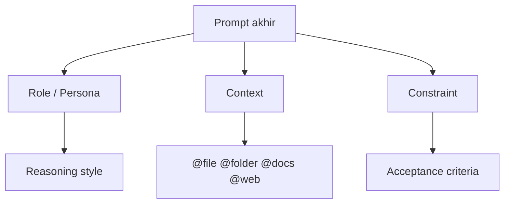
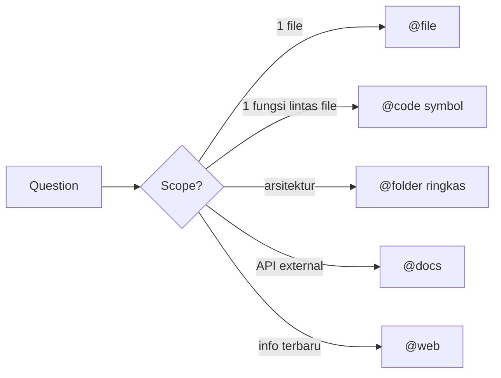

# Sesi 3 — Prompting & Context Management

Setelah Sesi 2 mengenalkan **alat** Cursor, sesi ini fokus pada **bahasa** untuk berbicara dengannya. Kualitas output AI bukan ditentukan model, tapi prompt + konteks + rules yang Anda susun. Anda akan praktikkan langsung di Latihan 02 dengan menulis query SQL dasar — SELECT, INSERT, UPDATE, DELETE — menggunakan teknik prompting yang dibahas di sini.

---

## Yang Akan Anda Pahami

Setelah membaca materi ini, Anda akan mampu:

1. **Menjelaskan** mengapa kualitas output AI di Cursor adalah **fungsi dari prompt + konteks + rules**, bukan hanya prompt.
2. **Menerapkan** 3 pola prompting (role-based, context-based, constraint-based) pada minimal 5 contoh skenario kerja.
3. **Menggunakan** @-mentions (`@file`, `@folder`, `@code`, `@docs`, `@web`, `@git`) untuk mengontrol konteks secara presisi.
4. **Mengelola** *context budget* dengan strategi pruning, scoping, dan reusable snippets.
5. **Mengevaluasi** prompt Anda sendiri menggunakan checklist kualitas dan iterasi *prompt → diff → prompt'*.

---

## 1. Konsep Inti

### 1.1 Prinsip Dasar: Prompt = Brief untuk Junior Developer

Anggap AI sebagai junior developer yang **sangat cepat, sangat patuh, sangat lupa**. Brief yang Anda berikan harus berisi:

- **Apa** (tujuan / hasil yang diinginkan).
- **Untuk siapa** (konteks pengguna / sistem).
- **Dengan apa** (file/library/data yang harus dipakai).
- **Batasan** (style, performa, security, library yang dilarang).
- **Bagaimana tahu selesai** (kriteria, test, contoh I/O).

Prompt yang sukses **menjawab kelima dimensi** ini, eksplisit atau implisit.

### 1.2 Formula Prompt: 3 Lapis



| Lapis | Tujuan | Contoh |
|-------|--------|--------|
| **Role-based** | Set perspektif & gaya jawaban | "Sebagai senior backend engineer..." |
| **Context-based** | Beri bahan/fakta | "Berdasarkan @file user.service.ts dan @docs OpenAPI..." |
| **Constraint-based** | Jepit ruang solusi | "Tanpa library baru. Pakai pola repository. Maks 80 baris." |

Prompt produksi yang baik **mengkombinasikan ketiganya**.

### 1.3 Anatomi Prompt yang Baik

Template umum:

```
[Role]
Saya butuh bantuan sebagai <peran AI>.

[Goal]
Tujuan: <hasil yang diinginkan, 1 kalimat>.

[Context]
Bahan: @file …, @folder …, @docs …
Asumsi: <list asumsi>.

[Constraints]
- <constraint 1>
- <constraint 2>

[Acceptance]
Selesai jika: <kriteria terukur>.
Contoh I/O (opsional): …
```

### 1.4 @-Mentions: Mengontrol Konteks

| Mention | Apa yang dikirim | Kapan dipakai |
|---------|------------------|---------------|
| `@file <path>` | Isi file (atau chunk relevan) | Edit/refer spesifik 1 file |
| `@folder <path>` | Ringkasan file di folder | Arsitektur, eksplorasi |
| `@code <symbol>` | Definisi simbol (fungsi/class) | Refactor lintas file |
| `@docs <library>` | Dokumentasi resmi (yang sudah diindex Cursor) | Pakai API library terbaru |
| `@web <query>` | Hasil pencarian web | Info terkini, error msg unik |
| `@git` / `@commit` | Diff / commit history | Review, summarize PR |
| `@terminal` | Output terminal terakhir | Debug error, log |
| `@past chat` | Riwayat chat sebelumnya | Continuity multi-turn |

> Detail dan ketersediaan menyesuaikan versi Cursor. Lihat dokumentasi resmi.

### 1.5 Context Budget

Setiap model punya **token window** terbatas (puluhan ribu hingga jutaan). Aturan praktis:

- **Lebih banyak konteks ≠ lebih baik**. Bahan tidak relevan justru menurunkan kualitas (dilution).
- Pilih **chunk paling relevan**, bukan seluruh folder.
- Untuk repo besar, andalkan `@code <symbol>` ketimbang `@folder`.
- Hapus konteks lama di chat panjang (reset chat saat topik berubah).



### 1.6 Tiga Pola Prompting (Detail)

#### a. Role-based
> "Sebagai data analyst SQL berpengalaman di e-commerce, tulis query MySQL untuk menghitung total revenue per kota customer bulan ini, hanya order status 'paid' atau 'shipped'. Sertakan komentar singkat di setiap JOIN."

Kapan dipakai: ingin gaya jawaban/standar profesi tertentu — AI akan lebih hati-hati soal edge case yang diperhatikan profesi tersebut.

#### b. Context-based
> "Berdasarkan schema berikut: customers (id, name, city), orders (id, customer_id, status), order_items (id, order_id, product_id, qty, unit_price) — tulis query untuk menemukan 3 customer dengan total belanja terbesar sepanjang waktu."

Kapan dipakai: jawaban sangat bergantung pada struktur tabel yang konkret. Tanpa schema, AI akan menebak nama kolom.

#### c. Constraint-based
> "Tulis query MySQL untuk top 3 customer berdasarkan total spending. CONSTRAINT: (1) tidak boleh pakai subquery, (2) tidak boleh pakai WITH/CTE, (3) hanya satu SELECT dengan JOIN + GROUP BY, (4) LIMIT 3. Kalau constraint tidak bisa dipenuhi, jelaskan kenapa dulu."

Kapan dipakai: ruang solusi terlalu lebar — ada banyak cara menulis query yang sama, tapi Anda punya alasan teknis memilih satu pendekatan.

### 1.7 Iterasi Prompt: *Prompt → Hasil → Prompt'*

Prompt pertama jarang sempurna. Loop:

1. **Submit prompt** awal.
2. **Baca jawaban / jalankan query**. Catat *deviasi* dari yang Anda inginkan.
3. **Beri umpan balik spesifik** (bukan "ini salah, coba lagi"). Contoh: *"Query ini masih pakai subquery di baris 4, padahal constraint-nya tidak boleh subquery. Tulis ulang dengan murni JOIN."*
4. **Ulangi** maks 3–4 kali. Jika belum konvergen, *reset* dengan prompt baru yang menyebut schema lebih lengkap.

### 1.8 Kebiasaan Prompting yang Sering Gagal

Lima pola prompt yang **terlihat masuk akal tapi konsisten menghasilkan output buruk**. Kenali dan hindari sejak hari pertama.

| Kebiasaan buruk            | Contoh prompt (SQL)                                              | Cara membenahi                                                                |
| -------------------------- | ---------------------------------------------------------- | ----------------------------------------------------------------------------- |
| **Terlalu samar**          | "buatkan laporan penjualan"                                | "tulis SELECT revenue per kota dari tabel orders + customers, filter status='paid', GROUP BY city" |
| **Banyak tujuan sekaligus**| "buat SELECT, INSERT, UPDATE, DELETE sekaligus"            | Pecah per operasi — satu prompt satu query                                    |
| **Tanpa schema**           | "tampilkan semua order customer"                           | Sebutkan nama tabel dan kolom: "FROM orders JOIN customers ON orders.customer_id = customers.id" |
| **Menyalahkan AI**         | "query kamu salah"                                         | "Kolom `city` di output harusnya dari tabel customers, bukan orders. Perbaiki JOIN-nya" |
| **Terlalu banyak aturan**  | 10 constraint untuk SELECT sederhana                       | Pakai 2–3 constraint paling kritikal; sisanya bisa iterasi                    |

### 1.9 Reusable Prompt: Snippets & Rules

- **Snippets pribadi**: simpan template prompt di file `prompts.md` di luar repo.
- **Project rules** (`.cursor/rules/*.mdc`): instruksi otomatis yang ter-load. Dipelajari Hari 2.
- **User rules** (Settings → Rules): preferensi gaya lintas project (mis. "selalu pakai TypeScript strict").

### 1.10 Checklist Kualitas Prompt

Sebelum tekan Enter, cek:

- [ ] Ada **tujuan jelas** dalam 1 kalimat?
- [ ] Sudah pasang **@-mention** konteks relevan?
- [ ] Sudah sebutkan **constraint** non-negotiable?
- [ ] Sudah sebutkan **acceptance criteria**?
- [ ] Tidak ada **ambiguitas pronoun** ("ini", "itu", "tadi")?
- [ ] Sudah pilih **mode yang tepat** (Tab / K / Chat / Composer)?

---

## 2. Lanjut ke Latihan

Setelah membaca materi ini, lanjut ke **[Latihan 02 — Prompting Drill: SQL Dasar](./latihan-02-prompting-drill/README.md)**. Di sana Anda akan:

- Menulis query MySQL dasar — SELECT (filter, JOIN), INSERT, UPDATE, DELETE — dengan Cursor Chat.
- Menerapkan 3 pola prompting (Role + Context + Constraint) pada konteks SQL yang konkret.
- Memverifikasi setiap query di playground SQL, bukan hanya percaya output AI.

Latihan 02 (Tahap 1–4) dilanjutkan di **[Latihan 03 — SQL Lanjutan](../Sesi-04-Code-Generation/latihan-03-build-feature/README.md)** (Tahap 5–8) dengan schema dan data yang sama: agregasi, multi-JOIN, CTE, dan pola UPDATE/DELETE aman.

---

## 3. Bacaan Lanjutan

- Cursor — *Chat & Composer*: <https://cursor.com/docs/chat>
- Cursor — *@-symbols / context*: <https://cursor.com/docs/context/@-symbols>
- Cursor — *Rules*: <https://cursor.com/docs/context/rules>
- Anthropic — *Prompt engineering guide*: <https://docs.anthropic.com/en/docs/build-with-claude/prompt-engineering/overview>
- OpenAI — *Prompt engineering best practices*.
- Lilian Weng — *Prompt Engineering* (blog post).
- Buku: *Software Engineering at Google*, bab "Knowledge Sharing" — relevan untuk reusable prompt di tim.
