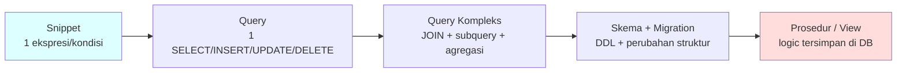
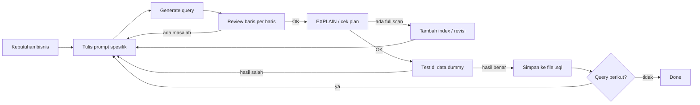

# Sesi 4 — Code Generation untuk SQL dengan Cursor

Setelah Sesi 3 memperkenalkan koleksi prompt CRUD SQL siap pakai, sesi ini membahas **cara berpikir** di balik prompt yang baik untuk SQL — bagaimana memecah kebutuhan, menyusun prompt yang presisi, dan memvalidasi query hasil generate sebelum dijalankan ke database.

---

## Yang Akan Anda Pahami

Setelah membaca materi ini, Anda akan mampu:

1. **Menerjemahkan** kebutuhan bisnis atau user story menjadi prompt SQL yang terstruktur untuk Cursor.
2. **Memilih** mode Cursor yang tepat sesuai kompleksitas query yang diminta.
3. **Menggunakan** pseudocode sebagai jembatan antara logika bisnis dan query SQL.
4. **Memvalidasi** query hasil generate sebelum dieksekusi — correctness, performance, dan keamanan.
5. **Menerapkan** loop kerja yang aman: generate → review → test di data dummy → commit.

---

## 1. Konsep Inti

### 1.1 Spektrum Kompleksitas Query SQL

Seperti code generation pada umumnya, SQL punya **tingkatan kompleksitas** — dari yang sederhana sampai yang berisiko tinggi jika salah. Setiap level butuh mode Cursor yang berbeda dan porsi review yang berbeda.



| Level | Contoh | Mode Cursor Optimal | Risiko | Review effort |
|-------|--------|---------------------|--------|---------------|
| **Snippet** | Satu kondisi WHERE, satu ekspresi CASE | **Tab** | Rendah | Detik |
| **Query** | SELECT dengan JOIN sederhana, INSERT satu tabel | **Cmd/Ctrl+K** | Rendah–sedang | Menit |
| **Query Kompleks** | Laporan dengan multi-JOIN, subquery, CTE, agregasi | **Chat** | Sedang | 10–20 menit |
| **Skema / Migration** | CREATE TABLE, ALTER TABLE, tambah index | **Agent** | Tinggi | 30+ menit |
| **Prosedur / View** | Stored procedure, trigger, materialized view | **Agent bertahap** | Sangat tinggi | Jam |

**Tiga pola yang perlu diingat:**

1. **Semakin kompleks query → semakin tinggi risiko.** Snippet WHERE sulit salah fatal. UPDATE tanpa WHERE yang tepat bisa merusak seluruh tabel.
2. **Mode disesuaikan dengan kompleksitas.** Tab untuk melengkapi kondisi, Cmd+K untuk satu query utuh, Agent untuk multi-file (migration + seeder + test).
3. **Review effort untuk SQL tidak linier.** Query SELECT 10 baris mudah di-review. Stored procedure 100 baris dengan kondisi bercabang butuh waktu jauh lebih lama — dan lebih bahaya kalau salah.

> **Aturan paling penting untuk SQL**: **Selalu jalankan SELECT dulu sebelum UPDATE/DELETE.** Pastikan baris yang akan terpengaruh sudah benar sebelum eksekusi destruktif.

---

### 1.2 Dari User Story ke Prompt SQL

Kebutuhan bisnis sering datang dalam bentuk **user story** — format standar yang dipakai tim product. Tugas Anda adalah **membongkar** user story menjadi elemen SQL, lalu merangkainya menjadi prompt yang presisi untuk Cursor.

#### Format User Story

```
Sebagai [peran],
saya ingin [melihat / mendapatkan / melakukan X],
agar [manfaat bisnis].
```

#### Peta Terjemahan: User Story → SQL

| Elemen User Story | Diterjemahkan ke SQL |
|---|---|
| **Saya ingin melihat** [kolom apa] | Kolom di `SELECT` |
| **Dari** [sumber data] | Tabel di `FROM` + relasi `JOIN` |
| **Yang memenuhi** [kondisi] | Klausa `WHERE` |
| **Dikelompokkan per** [dimensi] | `GROUP BY` |
| **Diurutkan berdasarkan** [metrik] | `ORDER BY` |
| **Hanya** [N] teratas | `LIMIT` |
| **Total / jumlah / rata-rata** | `SUM` / `COUNT` / `AVG` |
| **Hanya yang sudah** [status] | Filter `WHERE status = '...'` |

---

#### Contoh 1 — User Story Sederhana (SELECT + filter)

**User Story:**
> "Sebagai manajer sales, saya ingin melihat daftar customer yang berdomisili di Jakarta, diurutkan berdasarkan nama, agar saya bisa menghubungi mereka untuk promo bulan ini."

**Proses dekomposisi:**

| Elemen | Nilai |
|--------|-------|
| Ingin melihat | id, name, email → kolom SELECT |
| Dari | tabel `customers` |
| Yang memenuhi | city = 'Jakarta' → WHERE |
| Diurutkan | berdasarkan nama → ORDER BY name ASC |

**Prompt ke Cursor:**

```
Tulis query MySQL untuk menampilkan customer yang berdomisili di Jakarta.

Tabel: customers (id, name, email, city)
Output: id, name, email
Filter: city = 'Jakarta'
Urutan: name ASC
MySQL 8.0.
```

---

#### Contoh 2 — User Story dengan Agregasi (GROUP BY + JOIN)

**User Story:**
> "Sebagai direktur, saya ingin tahu total revenue per kategori produk bulan ini dari order yang sudah dibayar, diurutkan dari yang tertinggi, agar saya bisa memutuskan fokus promosi bulan depan."

**Proses dekomposisi:**

| Elemen | Nilai |
|--------|-------|
| Ingin melihat | nama kategori + total revenue → SELECT + SUM |
| Dari | categories, products, order_items, orders → JOIN 4 tabel |
| Yang memenuhi | bulan ini + status 'paid' → WHERE |
| Dikelompokkan | per kategori → GROUP BY |
| Diurutkan | revenue tertinggi dulu → ORDER BY DESC |

**Prompt ke Cursor:**

```
Tulis query MySQL untuk laporan revenue per kategori produk bulan ini.

Tabel:
- categories (id, name)
- products (id, category_id)
- order_items (order_id, product_id, qty, unit_price)
- orders (id, status, created_at)

Output: category_name, total_revenue (SUM qty * unit_price)
Filter: MONTH(orders.created_at) = bulan ini, YEAR = tahun ini, orders.status = 'paid'
Group: per categories.id
Urutan: total_revenue DESC

Gunakan LEFT JOIN agar kategori tanpa penjualan tetap muncul.
MySQL 8.0.
```

---

#### Contoh 3 — User Story dengan Kondisi Berjenjang (CASE WHEN)

**User Story:**
> "Sebagai tim CRM, saya ingin mengklasifikasikan customer ke dalam tier belanja (Regular / Silver / Gold) berdasarkan total pembelian sepanjang waktu, agar saya bisa menentukan program loyalty yang sesuai."

**Proses dekomposisi:**

| Elemen | Nilai |
|--------|-------|
| Ingin melihat | nama customer + total belanja + tier |
| Dari | users / customers JOIN orders JOIN order_items |
| Klasifikasi tier | CASE WHEN → kondisi berjenjang |
| Filter | hanya order status 'paid' |

**Prompt ke Cursor:**

```
Tulis query MySQL untuk mengklasifikasikan customer berdasarkan total belanja.

Tier:
- total_spent < 500.000 → 'Regular'
- 500.000 ≤ total_spent ≤ 2.000.000 → 'Silver'
- total_spent > 2.000.000 → 'Gold'

Tabel:
- customers (id, name)
- orders (id, customer_id, status)
- order_items (order_id, qty, unit_price)

Output: name, total_spent (SUM qty * unit_price), tier (CASE WHEN)
Filter: hanya orders.status = 'paid'
Urutan: total_spent DESC
MySQL 8.0.
```

---

**Pola yang perlu diingat:** semakin kompleks user story (lebih banyak kondisi, lebih banyak tabel), semakin penting menulis dekomposisi dulu sebelum langsung ke Cursor. Dekomposisi membantu Anda *tahu apa yang diminta* sebelum AI mulai menebak.

---

### 1.3 Pseudocode sebagai Jembatan ke SQL

Untuk query yang logikanya kompleks, tulis pseudocode dulu sebelum minta AI generate SQL. Ini membantu Anda memastikan logika sudah benar sebelum AI menerjemahkannya.

**Contoh pseudocode untuk query ranking:**

```
INPUT: tabel orders, order_items, users
OUTPUT: top 5 customer berdasarkan total belanja sepanjang waktu

ALGORITMA:
1. Hitung total_spent per user_id dari orders (status = PAID)
2. JOIN ke tabel users untuk dapat nama dan email
3. Rank berdasarkan total_spent DESC
4. Ambil 5 teratas
```

**Prompt ke Cursor:**

```
Implementasi pseudocode berikut sebagai query MySQL:
[paste pseudocode]

Gunakan CTE (WITH clause) untuk total_spent per user.
Tampilkan: user_id, name, email, total_spent.
Format angka total_spent dengan 2 desimal.
```

Pendekatan pseudocode sangat berguna saat:
- Logika melibatkan lebih dari 2 tabel.
- Ada kondisi bercabang (CASE WHEN).
- Anda ingin memastikan urutan JOIN sudah tepat sebelum AI menulis sintaks.

---

### 1.4 Contoh Prompt per Skenario

#### SELECT — laporan sederhana

```
Tulis SELECT untuk mengambil 10 produk terlaris bulan lalu:
- Tabel: products (id, name), order_items (product_id, quantity), orders (id, created_at, status)
- Filter: MONTH/YEAR bulan lalu, status = 'PAID'
- Output: product_name, total_sold (SUM quantity)
- Order: total_sold DESC
- Limit: 10
```

#### SELECT — dengan kondisi dinamis (CASE WHEN)

```
Tulis query untuk mengklasifikasikan pelanggan berdasarkan total belanja:
- < 500.000 → 'Regular'
- 500.000 – 2.000.000 → 'Silver'
- > 2.000.000 → 'Gold'

Tabel: users (id, name), orders (user_id, total_amount, status='PAID')
Output: name, total_spent, tier
```

#### INSERT — dengan validasi duplikat

```
Tulis INSERT INTO untuk menambah produk baru ke tabel products.
Sertakan pengecekan duplikat: jika produk dengan name yang sama sudah ada,
gunakan INSERT IGNORE atau ON DUPLICATE KEY UPDATE stock = stock + [nilai baru].

Kolom: name, price, stock, category_id, created_at (NOW()).
```

#### UPDATE — aman dengan WHERE spesifik

```
Tulis dua query:
1. SELECT dulu — tampilkan semua produk yang stock = 0 dan tidak ada order dalam 90 hari
2. UPDATE — set is_active = 0 untuk produk yang sama

Pastikan kondisi WHERE identik di kedua query.
Tambahkan komentar: "Jalankan SELECT dulu, verifikasi hasilnya, baru jalankan UPDATE."
```

#### DELETE — soft delete

```
Tulis soft delete untuk orders yang status = 'CANCELLED' dan created_at > 1 tahun lalu.
Soft delete = set deleted_at = NOW(), bukan hapus baris.

Sertakan:
1. SELECT verifikasi (berapa baris yang akan terpengaruh)
2. UPDATE soft delete
3. SELECT konfirmasi (pastikan deleted_at sudah terisi)
```

---

### 1.5 Validasi Query Hasil Generate

Jangan langsung eksekusi query dari AI ke database produksi. Gunakan checklist ini:

| Aspek | Yang dicek | Cara cek |
|-------|-----------|----------|
| **Correctness** | Apakah output sesuai yang diharapkan? | Jalankan di data dummy / staging |
| **WHERE clause** | Apakah UPDATE/DELETE punya WHERE yang tepat? | Baca ulang baris per baris |
| **JOIN type** | INNER vs LEFT — sudah sesuai kebutuhan? | Cek apakah baris yang hilang itu expected |
| **Performance** | Apakah ada full table scan? | Jalankan `EXPLAIN` sebelum eksekusi |
| **SQL Injection** | Apakah ada input user yang langsung diconcat ke query? | Pastikan pakai parameterized query / prepared statement |
| **Destructive** | UPDATE/DELETE tanpa LIMIT di tabel besar? | Tambahkan `LIMIT` saat pertama kali test |
| **Naming** | Nama kolom/tabel sesuai schema aktual? | Bandingkan dengan schema file |

**Cara cek performance dengan EXPLAIN:**

```sql
EXPLAIN SELECT p.name, SUM(oi.quantity) as total_sold
FROM products p
JOIN order_items oi ON oi.product_id = p.id
JOIN orders o ON o.id = oi.order_id
WHERE o.status = 'PAID'
GROUP BY p.id
ORDER BY total_sold DESC
LIMIT 10;
```

Perhatikan kolom `type` di hasil EXPLAIN:
- `const` / `ref` / `range` → baik
- `ALL` (full table scan) → butuh index

---

### 1.6 Anti-pattern SQL Generation

| Anti-pattern | Kenapa berbahaya | Yang seharusnya |
|---|---|---|
| **UPDATE/DELETE tanpa SELECT dulu** | Tidak tahu baris mana yang terpengaruh | Selalu SELECT dengan kondisi yang sama dulu |
| **Accept query langsung tanpa baca** | Query bisa punya JOIN yang salah atau WHERE yang hilang | Baca setiap baris query sebelum eksekusi |
| **Prompt terlalu samar** | AI menebak schema dan nama tabel | Selalu sebutkan nama tabel dan kolom yang relevan |
| **Tidak pakai `EXPLAIN`** | Query berjalan tapi lambat di data besar | Jalankan EXPLAIN dulu di tabel > 10.000 baris |
| **Copy-paste ke produksi langsung** | Belum teruji di data nyata | Test di staging / data dummy dulu |
| **Query monolith satu prompt** | Sulit di-debug kalau salah | Pecah jadi bagian kecil, build bertahap |

---

### 1.7 Loop Kerja: Generate → Review → Test → Commit



**Yang membedakan loop SQL dari loop kode biasa:**
- "Test lokal" untuk SQL = jalankan di data dummy, bukan unit test.
- "Commit" untuk SQL = simpan ke file `.sql` yang ter-version di Git.
- Review harus mencakup: logika bisnis **dan** keamanan (WHERE clause, injection).

---

## 2. Lanjut ke Latihan

Setelah membaca materi ini, lanjut ke **[Latihan 03 — SQL Lanjutan](./latihan-03-build-feature/README.md)** (Tahap 5–8). Di sana Anda akan:

- Menulis query agregasi (GROUP BY, SUM, COUNT, HAVING) menggunakan schema e-commerce yang sama dari Latihan 02.
- Menggabungkan 3–4 tabel dengan multi-JOIN dan menemukan data yang "tidak ada" menggunakan LEFT JOIN + IS NULL.
- Menyusun CTE (WITH clause) untuk memecah logika kompleks menjadi bagian yang bisa di-review satu per satu.
- Mempraktikkan pola **SELECT → UPDATE → SELECT verifikasi** agar tidak ada data yang berubah di luar ekspektasi.

Latihan 03 adalah kelanjutan langsung dari Latihan 02 — schema, data, dan playground yang sama, hanya kompleksitasnya bertingkat.

---

## 3. Referensi Prompt SQL

Buka file [`../../contoh-prompt-sql-crud.md`](../../contoh-prompt-sql-crud.md) untuk koleksi prompt siap pakai per operasi SQL (CREATE, INSERT, SELECT, UPDATE, DELETE, query lanjutan). Pilih minimal **3 skenario** yang paling relevan dengan pekerjaan Anda sehari-hari dan adaptasi ke schema Anda sendiri.

---

## 4. Bacaan Lanjutan

- MySQL — *EXPLAIN output format*: <https://dev.mysql.com/doc/refman/8.0/en/explain-output.html>
- MySQL — *Optimization overview*: <https://dev.mysql.com/doc/refman/8.0/en/optimization.html>
- OWASP — *SQL Injection Prevention Cheat Sheet*: <https://cheatsheetseries.owasp.org/cheatsheets/SQL_Injection_Prevention_Cheat_Sheet.html>
- Use The Index, Luke — panduan indexing SQL yang praktis: <https://use-the-index-luke.com>
