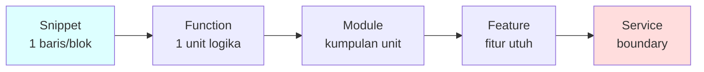
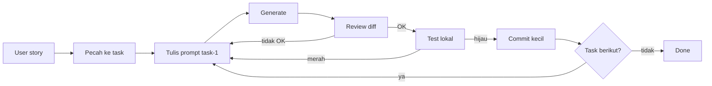

# Sesi 4 — Code Generation Fundamentals

Setelah menguasai cara berbicara dengan Cursor di Sesi 3, sekarang waktunya merangkai banyak prompt menjadi **fitur fungsional**. Di sesi ini Anda akan menutup Hari 1 dengan menambahkan Contact form (validasi + submit ke localStorage), navigation sticky responsive, dan polish accessibility ke portfolio Anda — portfolio siap dipakai di akhir hari.

---

## Yang Akan Anda Pahami

Setelah membaca materi ini, Anda akan mampu:

1. **Menerjemahkan** user story / requirement menjadi prompt produksi untuk Cursor secara terstruktur.
2. **Menghasilkan** fungsi, class, dan modul yang konsisten dengan style codebase eksisting.
3. **Mengkonversi** pseudocode menjadi implementasi runnable dalam bahasa target.
4. **Membangun** 1 fitur CRUD sederhana end-to-end (data → service → endpoint/UI → test) menggunakan kombinasi Tab / Cmd-K / Chat / Composer.
5. **Memvalidasi** kualitas kode hasil generate dengan checklist (correctness, security, style, test coverage).

---

## 1. Konsep Inti

### 1.1 Spektrum Code Generation

"Code generation" itu bukan satu hal — ada **tingkatan ukuran kode** yang Anda minta AI buatkan, dari yang kecil (1 baris) sampai yang besar (1 service utuh). Setiap tingkatan punya **mode Cursor yang optimal**, **tingkat risiko**, dan **effort review yang dibutuhkan** berbeda.



Warna di diagram: **biru muda** = risiko rendah, **merah muda** = risiko tinggi. Semakin besar unit kerja, semakin besar pula peluang AI salah arah karena harus menjaga konsistensi antar banyak bagian.

#### Penjelasan tiap level

| Level        | Apa itu (contoh portfolio Hari 1)                                                            | Mode Cursor Optimal              | Risiko        | Review effort |
| ------------ | -------------------------------------------------------------------------------------------- | -------------------------------- | ------------- | ------------- |
| **Snippet**  | 1 baris atau blok kecil — mis. `const STORAGE_KEY = 'portfolio:messages';`                   | **Tab** (autocomplete)           | Rendah        | Detik         |
| **Function** | 1 unit logika utuh — mis. `validateEmail(s)` atau `smoothScrollTo(id)`                       | **Cmd/Ctrl+K** (inline edit)     | Rendah–sedang | Menit         |
| **Module**   | Kumpulan fungsi terkait — mis. modul form validation (validate per field + submit handler)   | **Chat** atau Cmd/Ctrl+K bertahap | Sedang       | 10+ menit     |
| **Feature**  | Fitur utuh end-to-end (UI sampai data) — mis. section Contact (form + validasi + submit + toast + storage) | **Agent**                        | Tinggi        | 30+ menit     |
| **Service**  | Sistem dengan boundary jelas — mis. seluruh BE DevNotes Hari 2 (Supabase + auth + RLS)       | Agent **bertahap** + desain manual | Sangat tinggi | Jam        |

#### Tiga pola yang muncul di tabel

**1. Semakin besar unit → semakin tinggi risiko.** Snippet sulit salah secara fatal (mis. autocomplete `console.log`). Service mudah salah secara fatal (mis. RLS policy bocor → semua user lihat data orang lain).

**2. Mode Cursor disesuaikan dengan ukuran.** Tab untuk yang reflex, Cmd+K untuk yang fokus, Chat untuk yang butuh diskusi, Composer untuk yang sentuh banyak file. Pakai Composer untuk snippet = overkill; pakai Tab untuk feature = di luar kemampuan.

**3. Review effort tumbuh non-linear.** Function 20-baris cukup 2 menit review. Feature 200-baris di 4 file butuh 30+ menit review. **Bukan karena baris-nya 10× lebih banyak, tapi interaksi antar bagian-nya** yang perlu divalidasi.

#### Implikasi untuk Anda

- **Mulai dari yang kecil**. Untuk fitur baru, pecah dulu jadi module → function → snippet sebelum minta AI generate. Jangan langsung Composer "buat semua".
- **Pasangkan mode dengan unit yang benar**. Snippet pakai Tab; jangan paksakan Cmd+K untuk 1 baris.
- **Investasi review proporsional**. Untuk feature/service, alokasikan waktu review yang setara dengan waktu generate. AI 5 menit + review 30 menit lebih aman daripada AI 5 menit + review 1 menit.

> **Aturan ringkas**: *semakin tinggi level di spektrum, semakin penting spesifikasi (sebelum) & review (sesudah).*

### 1.2 Dari User Story ke Prompt

User story klasik:

> Sebagai *user*, saya ingin *mendaftar dengan email & password* sehingga *saya bisa login kemudian*.
>
> **Acceptance**:
> - Email valid (format + belum terdaftar).
> - Password ≥ 8 karakter, ada angka.
> - Sukses → return 201 + user.id.
> - Gagal validasi → 400 + pesan.

Strategi penerjemahan:

1. **Pecah ke task teknis** (route, controller, service, repository, schema, test).
2. **Petakan ke file** yang sudah ada di repo (pakai konvensi).
3. **Susun prompt per task**, atau 1 prompt Composer untuk fitur kecil dengan scope tegas.

### 1.3 Menulis Fungsi / Class / Module

#### Fungsi (≤30 baris)
- Gunakan **Cmd/Ctrl+K** di file target.
- Sebut signature, behavior, edge case, error mode.
- Selalu generate test pada langkah berikutnya — jangan tunggu nanti.

Contoh prompt (untuk portfolio — fungsi `validateEmail`):

```
Buat fungsi validateEmail(value: string): { valid: boolean, error: string | null }
- valid: true kalau format email RFC-5322 simple (regex /^[^\s@]+@[^\s@]+\.[^\s@]+$/),
  panjang ≤ 254 karakter
- Edge case: value null/undefined/"" → { valid: false, error: "Email wajib diisi" }
- value valid → { valid: true, error: null }
- value tidak match regex → { valid: false, error: "Format email tidak valid" }
- Vanilla JS, tidak melempar exception
- Konsisten dengan style fungsi lain di @file assets/app.js
```

#### Class
- Sebut **single responsibility** secara eksplisit.
- Sebut dependency yang di-inject (DI).
- Sebut pola yang dipakai di repo (mis. repository pattern).

Contoh prompt (pseudo, agnostik stack):
```
Buat class UserService dengan:
- Dependency: UserRepository, PasswordHasher, Logger
- Method: register(input), findById(id)
- register: validasi input, cek email unique, hash password, simpan, return user (tanpa password)
- Lempar DomainError untuk pelanggaran rule
- Konsisten dengan style class lain di @folder src/services/
```

#### Module / Folder
- Gunakan **Agent** dengan scope file/folder eksplisit.
- Wajib **list file yang akan dibuat** sebelum accept.
- Wajib **review per-file**, bukan accept-all.

Contoh prompt (untuk portfolio — modul Contact form):

```
Buat modul Contact form di assets/app.js (jangan bikin file baru):
- Konstanta STORAGE_KEY = 'portfolio:messages'
- validateField(name, value): { valid, error } — name = 'name'|'email'|'message'
- getMessages(): Message[] — return [] kalau kosong, try/catch JSON.parse
- saveMessage(msg): Message — push ke array, save, return msg dengan id+receivedAt
- showToast(text, type): void — buat <div.toast>, append body, auto-remove 3 detik
- attachContactForm(formEl): void — bind submit handler yang validate semua field,
  kalau valid: saveMessage, showToast sukses, form.reset

Constraints: vanilla JS, no library, export via window.ContactForm.
List dulu fungsi yang akan ditambah sebelum apply — saya mau review.
```

### 1.4 Pseudocode → Kode

Pseudocode adalah jembatan antara desain dan implementasi yang sangat cocok untuk AI. Format yang baik:

```
INPUT: list of order (id, amount, status)
OUTPUT: total amount of orders with status="PAID" in last 30 days

ALGORITHM:
1. now = currentDate()
2. cutoff = now - 30 days
3. filter orders where status="PAID" AND createdAt >= cutoff
4. sum amount
5. return rounded to 2 decimals
```

Lalu prompt:
```
Implementasi pseudocode berikut dalam <bahasa> sesuai style @folder src/.
Tambahkan unit test 4 case (happy, empty, all unpaid, tanggal batas).
[paste pseudocode]
```

### 1.5 Konsistensi dengan Codebase

AI **tidak otomatis** mengikuti style repo Anda. Pastikan dengan:

- `@folder` referensi ke folder dengan style yang ingin di-mirror.
- `@file` ke file *contoh acuan* — contoh "begini cara kami menulis service".
- Project rules (`.cursor/rules/*.mdc`) yang menjelaskan konvensi (akan dipakai Hari 2).
- Selalu **jalankan linter/formatter** setelah generate.

### 1.6 Validasi Kualitas Output

Checklist minimal sebelum commit:

| Aspek | Cek |
|-------|-----|
| Correctness | Lulus test (eksisting + baru) |
| Style | Lulus linter/formatter |
| Security | Tidak ada SQL injection / XSS / kebocoran secret |
| Performance | Tidak ada N+1 query, loop boros |
| Readability | Nama variabel/fungsi jelas, komentar seperlunya |
| Boundary | Edge case (null, empty, very large) terhandle |
| Dependency | Tidak menambah library tanpa perlu |

### 1.7 Anti-pattern Code Generation

- **Accept-all Composer** tanpa baca diff.
- **Build feature di-1-prompt** padahal estimasi 1 hari kerja.
- **Skip test** karena "AI sudah pasti benar".
- **Asumsi style** tanpa contoh acuan.
- **Tidak menjalankan code** setelah generate (kompilasi/lint/test).
- **Commit dengan pesan default AI** tanpa review.

### 1.8 Loop Kerja Rekomendasi (Build Feature)



Karakter loop: **commit kecil, sering, dengan test**. Hindari mega-commit "feature X done".

---

## 2. Lanjut ke Latihan

Setelah membaca materi ini, lanjut ke **[Latihan 03 — Build Feature: Contact Form + Polish Portfolio](./latihan-03-build-feature/README.md)**. Di sana Anda akan:

- Menambahkan section Contact dengan form, validasi inline, dan submit ke `localStorage` ke portfolio Anda.
- Membuat navigation sticky responsive (desktop nav + mobile hamburger).
- Run Lighthouse audit dan fix isu accessibility/performance.
- Menerapkan loop *prompt → review diff → test → commit* sebanyak ≥ 4 iterasi commit bermakna.
- Memakai semua 4 mode interaksi Cursor (Tab, Cmd/Ctrl+K, Chat, Agent) minimal sekali.

Output akhir Hari 1: website portfolio personal Anda yang siap di-deploy & dipakai untuk apply kerja / freelance.

---

## 3. Bacaan Lanjutan

- Cursor — *Composer / Agent*: <https://cursor.com/docs/agent>
- Cursor — *Code completion*: <https://cursor.com/docs/tab>
- Martin Fowler — *Refactoring*, edisi 2.
- Kent Beck — *Test-Driven Development by Example*.
- *Working Effectively with Legacy Code* (Feathers) — relevan untuk generate test pada kode lama.
- Anthropic — *Patterns for building agentic systems*.
- Addy Osmani — *Why developers should care about prompt engineering*.
