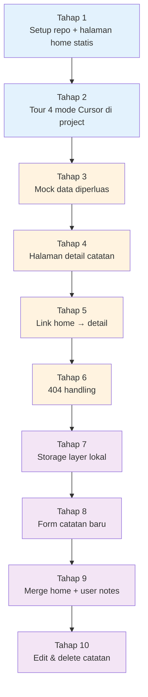

# Perjalanan Project DevNotes — Hari 1

Hari 1 dirancang sebagai **satu perjalanan linear** membangun DevNotes (web statis HTML/CSS/JS). Anda tidak menyelesaikan latihan-latihan terpisah — Anda menyelesaikan **1 project bertahap**, masing-masing tahap menambahkan kemampuan baru ke aplikasi yang sama.

Lihat juga BRD lengkap di [`../project-brd.md`](../project-brd.md).

---

## Peta 10 Tahap



Warna menandakan sesi: **biru** = Sesi 2, **oranye** = Sesi 3, **ungu** = Sesi 4.

---

## Tabel Tahap

| # | Tahap | Output yang Anda tambahkan ke `devnotes/` | Sesi | FR (BRD) |
| - | ----- | ----------------------------------------- | ---- | -------- |
| 1 | **Setup repo + halaman home statis** | `index.html`, `assets/styles.css`, `assets/app.js` dengan `MOCK_NOTES` array | Sesi 2 | FR-01 |
| 2 | **Tour 4 mode Cursor di project** | 5 screenshot bukti pakai Tab/K/Chat/Agent + `formatRelativeTime()` di `app.js` | Sesi 2 | (skill) |
| 3 | **Mock data diperluas** | `MOCK_NOTES` dapat field baru: `id`, `body_md`, `is_public` | Sesi 3 | — |
| 4 | **Halaman detail catatan** | `notes/[id].html` dengan render markdown (via `marked` CDN) | Sesi 3 | FR-02 |
| 5 | **Link home → detail** | `renderNotes()` wrap kartu dengan `<a href="notes/[id].html?id=...">` | Sesi 3 | FR-02 |
| 6 | **404 handling** | Empty state "Catatan tidak ditemukan" di `notes/[id].html` | Sesi 3 | (UX) |
| 7 | **Storage layer lokal** | `DevNotesStorage` di `app.js` (get/save/delete/slug/getAll) + JSON guard | Sesi 4 | FR-04 (lokal) |
| 8 | **Form catatan baru** | `new.html` (form + markdown preview + radio public/private + submit handler) | Sesi 4 | FR-04 (lokal) |
| 9 | **Merge home + user notes** | `renderNotes()` ambil dari `getAllNotes()` + label "(draft)" untuk privat | Sesi 4 | FR-04 (lokal) |
| 10 | **Edit & delete catatan** | Tombol Edit/Hapus di detail (owner only) + prefill form di `new.html?id=...` | Sesi 4 | FR-06 (lokal) |

---

## Pengelompokan per Sesi

| Sesi | Materi (baca) | Tahap (kerjakan) | Lokasi file |
| ---- | ------------- | ---------------- | ----------- |
| **1** | Introduction to AI-Assisted Coding | — (belum ada praktik Cursor) | [`Sesi-01-Introduction-AI-Coding/materi.md`](./Sesi-01-Introduction-AI-Coding/materi.md) |
| **2** | Getting Started with Cursor | **Tahap 1–2** | [`Sesi-02-Getting-Started-Cursor/latihan-01-tour-cursor/`](./Sesi-02-Getting-Started-Cursor/latihan-01-tour-cursor/) |
| **3** | Prompting & Context Management | **Tahap 3–6** | [`Sesi-03-Prompting-Context/latihan-02-prompting-drill/`](./Sesi-03-Prompting-Context/latihan-02-prompting-drill/) |
| **4** | Code Generation Fundamentals | **Tahap 7–10** | [`Sesi-04-Code-Generation/latihan-03-build-feature/`](./Sesi-04-Code-Generation/latihan-03-build-feature/) |

---

## Checkpoint per Tahap

Untuk setiap tahap, peserta dinyatakan "lulus tahap" jika:

| Tahap | Bukti lulus (commit minimal) |
| ----- | ---------------------------- |
| 1 | `git log` punya commit `feat: scaffold DevNotes home page (FR-01)`; `index.html` tampil di browser dengan 3 kartu |
| 2 | 5 screenshot di `submissions/<nama>/` + `formatRelativeTime` dipakai di kartu home |
| 3 | `MOCK_NOTES` punya minimal 3 item dengan field `id`, `body_md`, `is_public` lengkap |
| 4 | Buka `notes/[id].html?id=<slug>` di browser → tampil judul, meta, body markdown ter-render |
| 5 | Klik kartu di home → otomatis navigasi ke halaman detail (tidak ada `console.error`) |
| 6 | Akses `notes/[id].html?id=tidak-ada` → muncul empty state, tidak crash, tidak redirect otomatis |
| 7 | DevTools console: `DevNotesStorage.saveUserNote({...})` lalu lihat key `devnotes:notes` di Local Storage |
| 8 | Buka `new.html`, isi form, submit → redirect ke detail catatan baru, data persistent setelah refresh |
| 9 | Home page tampilkan draft baru di paling atas dengan label "(draft)" untuk yang `is_public=false` |
| 10 | Edit catatan → simpan → data ter-update; delete → confirm → catatan hilang dari home & localStorage |

---

## Skenario "Tertinggal"

Pelatihan ini padat. Kalau Anda **tidak selesai 1 tahap** di waktu yang dialokasikan, ini panduan praktis:

1. **Catat tahap terakhir yang selesai** di refleksi (mis. "selesai sampai Tahap 5, Tahap 6 belum").
2. **Lanjut ikuti materi Sesi berikutnya** secara konseptual — jangan menahan diri di Tahap yang stuck.
3. **Kejar tahap yang tertinggal di break atau malam hari** — semua brief latihan ada di repo, bisa diakses kapan saja.
4. **Tahap minimum untuk masuk Hari 2**: idealnya selesai sampai **Tahap 8** (web statis fungsional dengan create catatan). Tahap 9–10 boleh menyusul.

Yang penting: di akhir Hari 1, Anda punya **artefak `devnotes/` yang bisa di-`git push`** ke GitHub, walaupun belum sempurna.

---

## Output Akhir Hari 1 (akhir Tahap 10)

Folder `devnotes/` Anda berisi:

```
devnotes/
├── README.md
├── index.html                ← feed publik + draft
├── new.html                  ← form editor
├── notes/
│   └── [id].html             ← detail (juga edit & hapus untuk owner)
├── assets/
│   ├── styles.css
│   └── app.js                ← MOCK_NOTES + DevNotesStorage + render utils
└── submissions/<nama>/       ← bukti screenshot & refleksi
```

Aplikasi ini akan Anda **migrasi ke Next.js + Supabase + Vercel** di Hari 2. Folder yang Anda hasilkan di Hari 1 adalah **starting point** untuk Hari 2 Sesi 7 (Refactoring).
