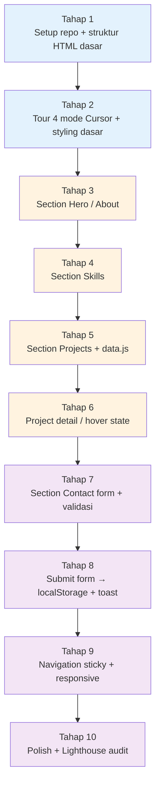

# Perjalanan Project Hari 1 — Website Portfolio Personal

Hari 1 dirancang sebagai **satu perjalanan linear** membangun website portfolio personal Anda (HTML/CSS/JS vanilla). Anda tidak menyelesaikan latihan-latihan terpisah — Anda menyelesaikan **1 project bertahap**, masing-masing tahap menambahkan section atau kemampuan baru.

> Catatan: project ini **khusus Hari 1**. Hari 2 dan 3 melanjutkan project berbeda (DevNotes — backend & full-stack). Lihat [`../project-brd.md`](../project-brd.md) untuk konteks Hari 2-3.

---

## Peta 10 Tahap



Warna menandakan sesi: **biru** = Sesi 2, **oranye** = Sesi 3, **ungu** = Sesi 4.

---

## Tabel Tahap

| #  | Tahap                                          | Output yang Anda tambahkan ke `portfolio/`                                              | Sesi | FR (BRD) |
| -- | ---------------------------------------------- | --------------------------------------------------------------------------------------- | ---- | -------- |
| 1  | **Setup repo + struktur HTML dasar**           | `index.html` dengan skeleton semantic (header/nav/main/footer), `assets/styles.css` reset | Sesi 2 | FR-01 |
| 2  | **Tour 4 mode Cursor + styling dasar**         | 5 screenshot bukti pakai Tab/K/Chat/Agent + variabel CSS dasar (warna, font, spacing)   | Sesi 2 | (skill) |
| 3  | **Section Hero / About**                       | `<section id="hero">` dengan foto, nama, headline, bio singkat, 2 tombol CTA            | Sesi 3 | FR-01 |
| 4  | **Section Skills**                             | `<section id="skills">` dengan grid icon + label dari array `SKILLS`                    | Sesi 3 | FR-01 |
| 5  | **Section Projects + data.js**                 | `assets/data.js` (PROFILE, SKILLS, PROJECTS arrays) + `<section id="projects">` grid    | Sesi 3 | FR-03 |
| 6  | **Project detail / hover state**               | Hover effect kartu + modal/expanded view berisi deskripsi panjang & screenshot          | Sesi 3 | (UX) |
| 7  | **Section Contact form + validasi**            | `<section id="contact">` form (nama, email, pesan) + validasi inline                    | Sesi 4 | FR-04 |
| 8  | **Submit form → localStorage + toast**         | Handler submit yang simpan ke `localStorage` + toast "Pesan terkirim"                   | Sesi 4 | FR-05 |
| 9  | **Navigation sticky + responsive**             | Nav sticky dengan smooth scroll + hamburger menu mobile + media query ≤ 768px            | Sesi 4 | FR-02, FR-06 |
| 10 | **Polish + Lighthouse audit**                  | Dark/light mode toggle (opsional), animasi halus, accessibility fixes, run Lighthouse   | Sesi 4 | FR-07, NFR-02 |

---

## Pengelompokan per Sesi

| Sesi  | Materi (baca)                       | Tahap (kerjakan) | Lokasi file                                                                                              |
| ----- | ----------------------------------- | ---------------- | -------------------------------------------------------------------------------------------------------- |
| **1** | Introduction to AI-Assisted Coding  | — (belum praktik) | [`Sesi-01-Introduction-AI-Coding/materi.md`](./Sesi-01-Introduction-AI-Coding/materi.md)                |
| **2** | Getting Started with Cursor         | **Tahap 1–2**    | [`Sesi-02-Getting-Started-Cursor/latihan-01-tour-cursor/`](./Sesi-02-Getting-Started-Cursor/latihan-01-tour-cursor/) |
| **3** | Prompting & Context Management      | **Tahap 3–6**    | [`Sesi-03-Prompting-Context/latihan-02-prompting-drill/`](./Sesi-03-Prompting-Context/latihan-02-prompting-drill/)   |
| **4** | Code Generation Fundamentals        | **Tahap 7–10**   | [`Sesi-04-Code-Generation/latihan-03-build-feature/`](./Sesi-04-Code-Generation/latihan-03-build-feature/)           |

---

## Checkpoint per Tahap

Untuk setiap tahap, peserta dinyatakan "lulus tahap" jika:

| Tahap | Bukti lulus (commit minimal)                                                                            |
| ----- | ------------------------------------------------------------------------------------------------------- |
| 1     | `git log` punya commit `feat: scaffold portfolio skeleton`; `index.html` tampil di browser (boleh kosong) |
| 2     | 5 screenshot di `submissions/<nama>/` + CSS variables (`--color-primary`, `--font-base`, dll) di `:root` |
| 3     | Section Hero terlihat: foto + nama + headline + bio + 2 tombol CTA                                       |
| 4     | Section Skills render minimal 6 skill dari array `SKILLS` di `data.js`                                   |
| 5     | Section Projects render minimal 3 project dari array `PROJECTS`; tiap kartu link ke demo & repo          |
| 6     | Hover kartu project ada transisi visual; klik kartu → modal/expanded view muncul dengan deskripsi penuh |
| 7     | Form Contact tampil; validasi inline aktif (nama < 2, email invalid, pesan < 10 → error visible)        |
| 8     | Submit form → toast muncul → cek DevTools → key `portfolio:messages` ada di localStorage                |
| 9     | Buka di mobile viewport (DevTools responsive mode) → layout tetap rapi, nav berubah jadi hamburger      |
| 10    | Lighthouse audit jalan → Performance ≥ 85, Accessibility ≥ 90, Best Practices ≥ 90                     |

---

## Skenario "Tertinggal"

Kalau Anda **tidak selesai 1 tahap** di waktu yang dialokasikan:

1. **Catat tahap terakhir yang selesai** di refleksi.
2. **Lanjut ikuti materi Sesi berikutnya** secara konseptual — jangan menahan diri di tahap yang stuck.
3. **Kejar tahap yang tertinggal di break atau malam hari**.
4. **Tahap minimum supaya portfolio layak share**: sampai **Tahap 8** (4 sections + form fungsional). Tahap 9–10 (responsive + polish) boleh menyusul.

---

## Output Akhir Hari 1 (akhir Tahap 10)

Folder `portfolio/` Anda berisi:

```
portfolio/
├── README.md                 ← cara menjalankan + cara update data
├── index.html                ← single-page: hero + skills + projects + contact
├── assets/
│   ├── styles.css            ← CSS modern: Flexbox/Grid + variables + media query
│   ├── app.js                ← render functions + form handler + nav scroll
│   ├── data.js               ← PROFILE, SKILLS, PROJECTS arrays
│   ├── profile.jpg           ← foto Anda (atau placeholder)
│   └── projects/
│       └── *.png             ← thumbnail project
└── submissions/<nama>/       ← 5 screenshot Cursor + refleksi.md
```

(Bonus) Deploy ke **GitHub Pages / Netlify / Vercel** — gratis, < 5 menit. Sharable URL untuk LinkedIn / CV.

---

## Catatan Penting

- Portfolio ini **milik Anda**. Anda bebas lanjutkan, modify, atau pakai sungguhan untuk apply kerja / freelance.
- Hari 2 dan 3 **tidak melanjutkan** project portfolio ini — Anda akan mulai project baru (DevNotes — full-stack app dengan BE Supabase). Detail di [`../project-brd.md`](../project-brd.md).
- Project portfolio Anda layak ditampilkan **sebagai project pertama di Section Projects sendiri** — ironis tapi efektif sebagai showcase.
