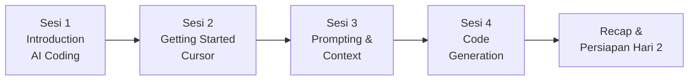

# HARI 1 — Fundamental AI Cursor & AI-Assisted Coding

**Penyelenggara**: Multimatics
**Durasi**: 1 hari penuh (8 jam efektif, 4 sesi × 90 menit + break)
**Target peserta**: Developer profesional (Backend, Frontend, Full-Stack, DevOps, Data Engineer)
**Prasyarat**: Familiar dengan minimal 1 bahasa pemrograman, Git basic, terminal/CLI basic.

---

## Tujuan Hari 1

Hari pertama membentuk **fondasi mental dan teknis** peserta sebelum masuk ke topik lanjutan di Hari 2 (workflow tim & rules) dan Hari 3 (proyek end-to-end). Fokusnya bukan "menulis kode lebih cepat", tetapi **mengubah cara berpikir** developer dalam berkolaborasi dengan AI:

1. Memahami posisi AI coding assistant dalam siklus pengembangan modern.
2. Menguasai Cursor sebagai IDE — bukan sekadar VS Code dengan ChatGPT.
3. Membangun keterampilan prompting yang reproducible dan context-aware.
4. Membuat kode pertama dengan AI sesuai spec/requirement, dengan kualitas yang dapat dipertanggungjawabkan.

---

## Learning Outcomes Hari 1

Setelah menyelesaikan Hari 1, peserta mampu:

- **Menjelaskan** perbedaan AI-assisted coding vs traditional coding beserta implikasi pada proses review dan testing.
- **Mempraktikkan** instalasi, konfigurasi, dan navigasi Cursor IDE pada mesin kerja masing-masing.
- **Menyusun** prompt yang efektif menggunakan teknik role-based, context-based, dan constraint-based dengan @-mentions.
- **Menghasilkan** sebuah fitur fungsional (CRUD sederhana) di stack pilihan menggunakan kombinasi Tab, Inline Edit (Cmd/Ctrl+K), dan Chat/Composer.
- **Mengevaluasi** output AI menggunakan kriteria correctness, security, dan maintainability.

---

## Alur Sesi



| Sesi | Topik | Output Utama |
|------|-------|--------------|
| 1 | Introduction to AI-Assisted Coding | Pemahaman lanskap & use case |
| 2 | Getting Started with Cursor | Cursor terinstall + tour selesai |
| 3 | Prompting & Context Management | Cheatsheet personal + drill prompt |
| 4 | Code Generation Fundamentals | Fitur CRUD pertama berjalan |

---

## Jadwal Harian (contoh, dapat disesuaikan)

| Waktu | Kegiatan | Durasi |
|-------|----------|--------|
| 08.30 – 09.00 | Registrasi & Pre-test singkat | 30' |
| 09.00 – 10.30 | **Sesi 1**: Introduction to AI-Assisted Coding | 90' |
| 10.30 – 10.45 | Coffee break | 15' |
| 10.45 – 12.15 | **Sesi 2**: Getting Started with Cursor (+ Lab 01) | 90' |
| 12.15 – 13.15 | Lunch | 60' |
| 13.15 – 14.45 | **Sesi 3**: Prompting & Context (+ Lab 02) | 90' |
| 14.45 – 15.00 | Coffee break | 15' |
| 15.00 – 16.30 | **Sesi 4**: Code Generation (+ Lab 03) | 90' |
| 16.30 – 17.00 | Recap, Q&A, briefing Hari 2 | 30' |

---

## Struktur Folder

```
Hari-1-Fundamental/
├── README.md                                  <- file ini
├── Sesi-01-Introduction-AI-Coding/
│   └── materi.md
├── Sesi-02-Getting-Started-Cursor/
│   ├── materi.md
│   ├── instalasi-checklist.md
│   └── latihan-01-tour-cursor/README.md
├── Sesi-03-Prompting-Context/
│   ├── materi.md
│   ├── prompting-cheatsheet.md
│   └── latihan-02-prompting-drill/README.md
└── Sesi-04-Code-Generation/
    ├── materi.md
    └── latihan-03-build-feature/README.md
```

---

## Catatan untuk Fasilitator

- Hasil **pre-test** menentukan stack yang dipakai di Lab 03. Bagian bertanda `<!-- STACK-PLACEHOLDER -->` di lab harus diisi sebelum sesi dimulai.
- Pastikan koneksi internet stabil — Cursor butuh akses ke model provider (Anthropic/OpenAI) dan indexing codebase.
- Siapkan **sample repo** kecil (10–20 file) yang akan dipakai bersama untuk demo @-mentions di Sesi 3.
- Setiap sesi diakhiri dengan **mini-checkpoint**: peserta menulis 1 hal yang dipelajari + 1 pertanyaan terbuka.

---

## Persiapan Sebelum Hari 1

Peserta diharapkan datang dengan:

- Laptop dengan minimum RAM 8 GB, free disk 5 GB.
- Akun GitHub/GitLab aktif.
- Akun email kerja untuk login Cursor.
- Sudah membaca [cursor.com/docs/get-started](https://cursor.com/docs/get-started) (≈10 menit).

Lihat detail di `Sesi-02-Getting-Started-Cursor/instalasi-checklist.md`.
