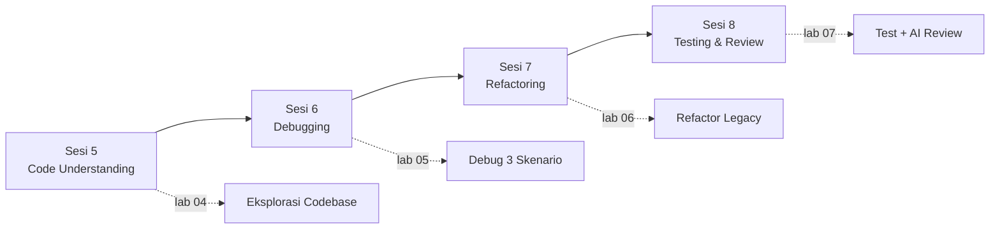

# HARI 2 — Code Understanding, Debugging & Refactoring

Pelatihan AI Cursor untuk Developer Profesional — Multimatics
Durasi: 1 hari penuh (4 sesi @ 90 menit)

## Ringkasan

Hari 2 berfokus pada kemampuan inti developer sehari-hari: memahami codebase yang sudah ada, menemukan dan memperbaiki bug, melakukan refactoring berkualitas, serta menulis test dan code review berbantuan AI. Peserta akan banyak praktik langsung pada kode nyata.

## Learning Outcomes Hari 2

Setelah menyelesaikan Hari 2, peserta diharapkan mampu:

1. Mengeksplorasi codebase besar (>10k LOC) menggunakan Cursor AI untuk memahami arsitektur, flow utama, dan dependency tanpa membuka tiap file manual.
2. Menghasilkan dokumentasi teknis (README modul, ADR, diagram) berbantuan AI yang akurat dan dapat diverifikasi.
3. Mendiagnosis bug dari error message dan stack trace secara sistematis menggunakan AI sebagai partner berpikir, bukan oracle.
4. Melakukan refactoring kode legacy (extract function, rename, decompose) dengan AI sambil menjaga behaviour-preserving melalui karakterisasi test.
5. Menulis unit test dan melakukan code review berbantuan AI dengan kesadaran terhadap false positive, hallucination, dan technical debt.

## Alur Sesi



## Jadwal

| Waktu | Sesi | Topik | Lab |
|-------|------|-------|-----|
| 08.30 – 10.00 | Sesi 5 | Code Understanding & Documentation | Lab 04 |
| 10.00 – 10.15 | Coffee Break | — | — |
| 10.15 – 11.45 | Sesi 6 | Debugging & Error Analysis | Lab 05 |
| 11.45 – 13.00 | ISHOMA | — | — |
| 13.00 – 14.30 | Sesi 7 | Refactoring & Code Quality | Lab 06 |
| 14.30 – 14.45 | Coffee Break | — | — |
| 14.45 – 16.15 | Sesi 8 | Testing & Code Review | Lab 07 |
| 16.15 – 16.30 | Wrap-up Hari 2 | Refleksi & preview Hari 3 | — |

## Prasyarat Hari 2

- Telah menyelesaikan Hari 1 (Setup Cursor, prompt engineering dasar, fitur inti).
- Repository contoh yang akan dipakai pada lab sudah di-clone (lihat tiap lab).
- Akses Cursor aktif (Pro atau trial), model Claude / GPT tersedia di workspace.

## Struktur Folder

```
Hari-2-Code-Understanding-Debugging-Refactoring/
├── README.md                          (file ini)
├── Sesi-05-Code-Understanding-Documentation/
│   ├── materi.md
│   └── latihan-04-eksplorasi-codebase/
├── Sesi-06-Debugging-Error-Analysis/
│   ├── materi.md
│   └── latihan-05-debugging-studi-kasus/
├── Sesi-07-Refactoring-Code-Quality/
│   ├── materi.md
│   └── latihan-06-refactor-legacy/
└── Sesi-08-Testing-Code-Review/
    ├── materi.md
    └── latihan-07-testing-review/
```

## Catatan Fasilitator

- Stack peserta bervariasi (Backend, Frontend, Full-stack, DevOps, Data). Setiap lab menyediakan placeholder `<!-- STACK-PLACEHOLDER -->` untuk disesuaikan sebelum kelas.
- Siapkan repository contoh per stack minimal H-3.
- Pastikan peserta sudah login Cursor sejak Hari 1 untuk menghindari kehilangan waktu setup.
