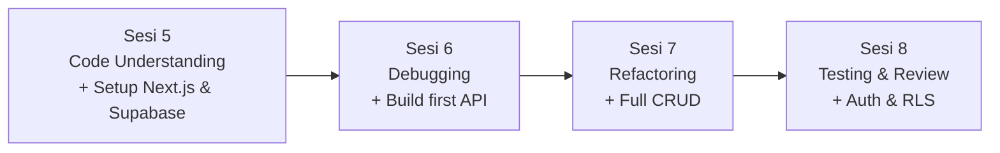

# HARI 2 — Code Understanding, Debugging & Refactoring (Project: DevNotes Backend)

**Penyelenggara**: Multimatics
**Durasi**: 1 hari penuh (8 jam efektif, 4 sesi × 90 menit + break)
**Project akhir Hari 2**: Backend **DevNotes** (Next.js App Router + Supabase) — API CRUD, auth magic link, RLS policy, tests. Berjalan di `localhost:3000`, siap di-deploy & di-konsumsi FE di Hari 3.

> Catatan: project Hari 2-3 (DevNotes) **terpisah** dari project Hari 1 (portfolio personal). Anda mulai folder `devnotes/` baru di awal Sesi 5. Lihat [`../project-brd.md`](../project-brd.md) untuk spek DevNotes.

---

## Tujuan Hari 2

Hari 2 mempraktikkan **4 kemampuan inti developer sehari-hari** sambil membangun BE DevNotes dari nol:

1. **Memahami codebase** yang ada (Next.js template + Supabase docs) dengan bantuan AI.
2. **Mendiagnosis bug** sistematis dari error message & stack trace — AI sebagai partner berpikir, bukan oracle.
3. **Refactoring** kode hasil generate AI agar maintainable dan konsisten.
4. **Menulis test** + melakukan code review berbantuan AI dengan kesadaran terhadap false positive dan hallucination.

---

## Yang Akan Anda Pahami

Setelah Hari 2 selesai, Anda akan mampu:

1. Mengeksplorasi codebase baru menggunakan Cursor AI untuk memahami arsitektur, flow utama, dan dependency tanpa membuka tiap file manual.
2. Menghasilkan dokumentasi teknis (README modul, ADR, diagram) berbantuan AI yang akurat dan dapat diverifikasi.
3. Mendiagnosis bug dari error message dan stack trace secara sistematis.
4. Melakukan refactoring (extract function, rename, decompose) sambil menjaga behaviour-preserving melalui test.
5. Menulis unit test untuk API routes Next.js + skenario RLS Supabase.

---

## Alur Sesi



| Sesi | Topik                                       | Tahap Project   | Output utama                                                                  |
| ---- | ------------------------------------------- | --------------- | ----------------------------------------------------------------------------- |
| 5    | Code Understanding & Documentation          | **Tahap 11–12** | Next.js + Supabase project terinit, `docs/architecture.md` ter-generate       |
| 6    | Debugging & Error Analysis                  | **Tahap 13–15** | Tabel `notes` + RLS di Supabase, `GET /api/notes` jalan, debug-log catatan    |
| 7    | Refactoring & Code Quality                  | **Tahap 16–17** | Full CRUD API + refactor (supabase client split, response helpers)            |
| 8    | Testing & Code Review                       | **Tahap 18–20** | Auth magic link + protected routes, Vitest test, PR simulasi siap deploy      |

> 📋 Detail 10 tahap, urutan kerja, dan checkpoint per tahap ada di [`perjalanan-project.md`](./perjalanan-project.md). **Baca file itu sebelum mulai latihan apa pun di Hari 2.**

---

## Jadwal Harian (Acuan)

| Waktu          | Sesi                                  | Durasi |
| -------------- | ------------------------------------- | ------ |
| 08.30 – 09.00  | Registrasi & recap Hari 1             | 30'    |
| 09.00 – 10.30  | **Sesi 5**: Code Understanding         | 90'    |
| 10.30 – 10.45  | Coffee break                          | 15'    |
| 10.45 – 12.15  | **Sesi 6**: Debugging                  | 90'    |
| 12.15 – 13.15  | ISHOMA                                | 60'    |
| 13.15 – 14.45  | **Sesi 7**: Refactoring                | 90'    |
| 14.45 – 15.00  | Coffee break                          | 15'    |
| 15.00 – 16.30  | **Sesi 8**: Testing & Review           | 90'    |
| 16.30 – 17.00  | Wrap-up & briefing Hari 3             | 30'    |

---

## Struktur Folder

```
Hari-2-Code-Understanding-Debugging-Refactoring/
├── README.md                                          <- file ini
├── perjalanan-project.md                              <- master narrative 10 tahap (BACA DULU)
├── Sesi-05-Code-Understanding-Documentation/
│   ├── materi.md
│   └── latihan-04-eksplorasi-codebase/                <- Tahap 11–12
├── Sesi-06-Debugging-Error-Analysis/
│   ├── materi.md
│   └── latihan-05-debugging-studi-kasus/              <- Tahap 13–15
├── Sesi-07-Refactoring-Code-Quality/
│   ├── materi.md
│   └── latihan-06-refactor-legacy/                    <- Tahap 16–17
└── Sesi-08-Testing-Code-Review/
    ├── materi.md
    └── latihan-07-testing-review/                     <- Tahap 18–20
```

---

## Prasyarat Hari 2

- Telah menyelesaikan Hari 1 (Setup Cursor lulus, prompt engineering dasar di tangan, portfolio statis tuntas).
- Akun **Supabase** aktif (daftar di <https://supabase.com> dengan GitHub login — 1 menit).
- Node.js LTS terinstall (untuk `npx create-next-app`).
- `curl` di terminal atau Postman/Insomnia untuk test API.
- Akses Cursor aktif.
