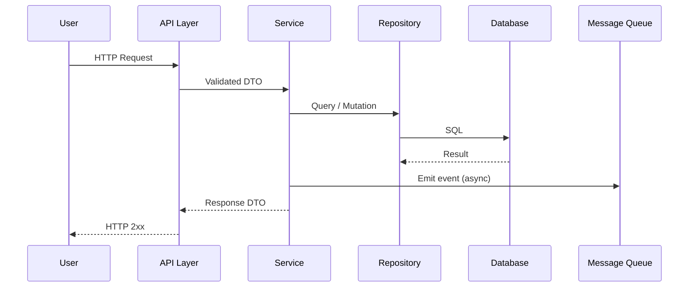

# Sesi 5 — Code Understanding & Documentation

Durasi: 90 menit
Modul: Hari 2 / Sesi 1 dari 4

## Learning Outcomes

Setelah sesi ini peserta mampu:

1. Menggunakan fitur `@codebase`, `@folder`, dan semantic search Cursor untuk memahami arsitektur sebuah project asing dalam < 30 menit.
2. Memetakan flow eksekusi end-to-end (dari entry point hingga persistence) menggunakan AI dan memverifikasinya dengan pembacaan kode aktual.
3. Mengidentifikasi dependency internal & eksternal beserta side-effect (I/O, network, global state) pada modul yang ditunjuk.
4. Menghasilkan dokumentasi teknis (README modul, sequence diagram, ADR singkat) menggunakan AI dengan output yang sudah diverifikasi terhadap kode.
5. Mengetahui batas reliabilitas AI dalam menjelaskan kode (hallucination, scope window, outdated context).

## Konsep Inti

### 1. Mengapa Code Understanding Memakan Waktu

Studi internal beberapa tim engineering menunjukkan ~58% waktu developer dihabiskan untuk membaca kode (bukan menulis). Sumber utama overhead:

- Naming yang tidak konsisten antar modul.
- Implicit contract antar service (tidak ada interface eksplisit).
- Dokumentasi yang outdated atau hilang.
- Cross-cutting concern (auth, logging, transaction) yang tersebar.

AI membantu memotong waktu eksplorasi awal, namun **tidak menggantikan verifikasi**.

### 2. Tiga Lapis Pemahaman Kode

| Lapis | Pertanyaan Kunci | Tool Cursor |
|-------|------------------|-------------|
| Struktural | Apa modul utama? Bagaimana folder dipetakan ke domain? | `@folder`, file tree, mermaid diagram |
| Behavioral | Apa yang terjadi ketika user melakukan X? | `@codebase` + chain-of-flow prompt |
| Evolusional | Mengapa kode begini? Apa trade-off historisnya? | `git log`, `@git`, ADR generator |

### 3. Anatomi Prompt untuk Code Understanding

Prompt yang baik untuk eksplorasi memiliki 4 elemen:

1. **Scope**: tentukan @-context (file/folder/codebase).
2. **Pertanyaan spesifik**: bukan "jelaskan kode ini" tapi "petakan flow dari endpoint POST /orders sampai DB write".
3. **Format output**: bullet, tabel, mermaid, atau prosa.
4. **Verification hook**: minta AI menyebut nomor baris / nama fungsi yang menjadi sumber klaimnya.

Contoh:

```
@codebase Petakan flow request dari endpoint POST /api/orders
hingga persistence di database.
- Sebutkan setiap fungsi yang dipanggil + path:line
- Identifikasi semua side-effect (I/O, message broker, cache)
- Output sebagai numbered list, lalu mermaid sequence diagram
```

### 4. Diagram Flow Standar



Diagram ini menjadi template yang akan peserta isi pada Lab 04.

### 5. Dokumentasi yang Dihasilkan AI: 4 Bentuk Utama

| Bentuk | Tujuan | Risiko Utama |
|--------|--------|--------------|
| README modul | Onboarding cepat | Misinterpretasi domain term |
| Sequence diagram | Memvisualisasi flow | Step yang di-skip / di-hallucinate |
| ADR (Architecture Decision Record) | Menangkap rationale | Rationale fiktif jika tidak ada konteks git |
| API reference | Dokumentasi kontrak | Drift dengan implementasi |

### 6. Pola Verifikasi: "Cite Your Source"

Selalu minta AI menyebut sumber. Contoh tambahan ke akhir prompt:

> Untuk setiap klaim, sertakan `path/to/file.ext:line`. Jika tidak yakin, tulis `[UNVERIFIED]`.

Pola ini menurunkan hallucination hingga signifikan karena AI terdorong untuk grounded pada konteks.

### 7. Batasan yang Wajib Disampaikan

- Context window terbatas: AI tidak "melihat" seluruh repo sekaligus; ia melakukan retrieval.
- Kode yang baru di-edit di branch lain mungkin belum ter-index.
- Dynamic dispatch (reflection, DI container, metaprogramming) sering di-skip oleh AI.
- Untuk monorepo besar, gunakan `@folder` spesifik daripada `@codebase` global.

## Demo Live (15 menit)

Skenario: instruktur clone repo open-source berukuran sedang (mis. `expressjs/express`, `pallets/flask`, `gin-gonic/gin`, atau sesuai stack peserta — lihat speaker notes).

Langkah:

1. **Orientasi struktural** — Prompt: `@folder src jelaskan peran tiap subfolder, output sebagai tabel`. Tunjukkan jawaban AI, lalu buka 1–2 folder untuk validasi.
2. **Map flow** — Prompt: `@codebase petakan lifecycle sebuah HTTP request dari entry point hingga response, sertakan path:line`. Tunjukkan sequence diagram hasil.
3. **Identifikasi dependency** — Prompt: `Daftar semua dependency eksternal (package + alasan dipakai) di modul X`. Diskusikan akurasi.
4. **Generate ADR singkat** — Prompt: `Buat ADR untuk pilihan arsitektur Y, format MADR`. Diskusi: bagian mana yang fiktif vs faktual.
5. **Verifikasi** — Buka 2 klaim AI yang paling mencurigakan, validasi bersama peserta.

## Hands-on Lab

Lihat folder [`lab-04-eksplorasi-codebase/`](./lab-04-eksplorasi-codebase/).

Briefing singkat: peserta dipasangkan, memilih satu open-source repo (atau repo internal yang disediakan), dan dalam 45 menit menghasilkan:

- Peta modul (tabel)
- Sequence diagram flow utama
- README modul untuk satu submodul yang dipilih
- Daftar 3 pertanyaan yang AI tidak bisa jawab dengan yakin

## Wrap-up & Q&A

Pertanyaan refleksi:

1. Pada bagian mana AI paling membantu, dan pada bagian mana paling sering keliru?
2. Bagaimana Anda akan memodifikasi prompt agar AI menyebut sumber lebih konsisten?
3. Kapan menggunakan `@codebase` vs `@folder` vs `@file`?
4. Apakah dokumentasi hasil AI siap di-commit langsung? Apa proses review minimum?
5. Bagaimana strategi memetakan modul yang menggunakan heavy DI / reflection?

## Bacaan Lanjutan

- Cursor Docs — "Codebase Indexing & @-symbols": https://docs.cursor.com/
- Michael Nygard — "Documenting Architecture Decisions" (ADR original)
- "Working Effectively with Legacy Code" — Michael Feathers, Bab 16 (Characterization)
- Simon Brown — C4 Model untuk dokumentasi arsitektur
- "Software Engineering at Google" — Bab 10 (Documentation)
