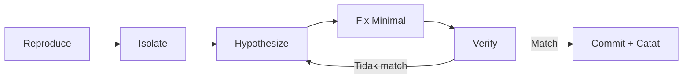

# Sesi 6 (SQL) — Debugging & Error Analysis

Durasi: 90 menit
Modul: Hari 2 / Sesi 2 dari 4

> Versi SQL dari `materi.md`. Fokus debugging query salah hasil / lambat menggunakan AI + tools native MySQL.

---

## Learning Outcomes

Setelah sesi ini peserta mampu:

1. Membedakan **symptom** (gejala) vs **root cause** (penyebab) saat query salah.
2. Mengenali **5 trap SQL** paling sering: NULL, BETWEEN datetime, AND/OR precedence, JOIN explosion, GROUP BY ambiguity.
3. Menerapkan **workflow debug 5 langkah** tanpa terburu-buru minta AI fix.
4. Memakai `EXPLAIN` sebagai diagnose tool *sebelum* tanya AI.
5. Memberi AI prompt diagnose-first, bukan fix-first (anti-pattern utama).

---

## Konsep Inti

### 1. Anatomi Bug SQL

Bug SQL biasanya muncul lewat **3 jenis symptom**:

| Symptom | Contoh | Penyebab Tipikal |
|---------|--------|------------------|
| **Hasil salah jumlah** | Total 4.5jt padahal hand-count 1.25jt | JOIN explosion, duplicate row |
| **Hasil hilang** | "Customer baru tidak muncul" | `NOT IN` NULL trap, JOIN type salah |
| **Performance** | Query timeout, EXPLAIN show full scan | Missing index, bad query plan |

Penting: **symptom yang sama bisa punya penyebab beda**. "Total inflated" bisa karena JOIN explosion ATAU karena timezone shift ATAU karena duplicate insert. Diagnose dulu, baru fix.

### 2. Lima Trap SQL Paling Sering

#### Trap 1: NULL Handling (`NOT IN` + NULL = 0 rows)

```sql
-- BUG: selalu return 0 baris kalau orders.customer_id punya NULL
select * from customers
where id not in (select customer_id from orders);
```

Sebab: `NOT IN (NULL, 1, 2)` → SQL evaluasi `NOT IN (..., NULL)` = UNKNOWN → row di-exclude.

Fix:
```sql
where id not in (
  select customer_id from orders where customer_id is not null
)
-- atau pakai NOT EXISTS (lebih NULL-safe):
where not exists (
  select 1 from orders o where o.customer_id = customers.id
)
```

#### Trap 2: `BETWEEN '...' AND '2026-01-31'` Exclude Jam > 00

```sql
-- BUG: order tanggal 2026-01-31 15:30 tidak muncul
where created_at between '2026-01-01' and '2026-01-31'
```

Sebab: `'2026-01-31'` di-cast jadi `'2026-01-31 00:00:00'`. Apapun > 00:00 di hari itu tidak masuk.

Fix:
```sql
where created_at >= '2026-01-01'
  and created_at <  '2026-02-01'
-- atau:
where date(created_at) between '2026-01-01' and '2026-01-31'
-- (tapi date() bikin index tidak terpakai)
```

#### Trap 3: Operator Precedence `AND` > `OR`

```sql
-- BUG: filter "paid atau shipped DAN total>1jt" tidak bekerja
where status = 'paid' or status = 'shipped' and total > 1000000
```

Sebab: SQL eval `AND` dulu → `status='paid' OR (status='shipped' AND total>1jt)`.

Fix:
```sql
where (status = 'paid' or status = 'shipped')
  and total > 1000000
-- atau lebih bersih:
where status in ('paid', 'shipped')
  and total > 1000000
```

#### Trap 4: JOIN Explosion (Multiple LEFT JOIN tanpa Aggregate)

```sql
-- BUG: revenue per customer membengkak
select c.id, sum(o.total)
from customers c
left join orders o    on o.customer_id = c.id
left join payments p  on p.order_id    = o.id  -- ⚠️ 1 order bisa banyak payment
left join shipments s on s.order_id    = o.id  -- ⚠️ idem
group by c.id;
```

Sebab: 1 order yang punya 2 payment + 1 shipment → JOIN explode jadi 2 baris → `sum(o.total)` di-count 2x.

Fix: aggregate dulu sebelum join, atau jangan JOIN payments/shipments kalau tidak perlu kolom dari sana.

```sql
select c.id, sum(o.total)
from customers c
left join orders o on o.customer_id = c.id
group by c.id;
```

#### Trap 5: `GROUP BY` Ambiguity (MySQL Permissive Mode)

```sql
-- BUG: name yang ditampilkan tidak konsisten antar query run
select customer_id, name, sum(total)
from orders o
join customers c on c.id = o.customer_id
group by customer_id;
-- `name` tidak ada di GROUP BY!
```

Sebab: MySQL non-strict mode mengizinkan ini, tapi `name` yang muncul = random dari salah satu baris match.

Fix: tambah `name` ke GROUP BY, atau pakai `MIN(name)` / `ANY_VALUE(name)`.

```sql
select customer_id, c.name, sum(total)
from orders o
join customers c on c.id = o.customer_id
group by customer_id, c.name;
```

### 3. Workflow Debug 5 Langkah



1. **Reproduce**: jalankan query persis, lihat output. Catat number/symptom.
2. **Isolate**: kecilkan query — kalau bug muncul di 5-tabel-join, coba 2 tabel saja. Sering bug muncul di JOIN tertentu.
3. **Hypothesize**: tulis 1-2 kalimat dugaan penyebab. **Sebelum** lihat fix.
4. **Fix minimal**: ubah baris yang relevan saja. Jangan rewrite.
5. **Verify**: bandingkan output sebelum vs sesudah. Test edge case lain.

Aturan: **1 bug = 1 commit**. Kalau Anda fix 2 hal sekaligus, sulit ke-track mana yang sebenarnya menyelesaikan masalah.

### 4. `EXPLAIN` sebagai Diagnose Tool

Sebelum tanya AI "kenapa query saya lambat", run `EXPLAIN` dulu:

```sql
EXPLAIN
SELECT c.name, SUM(o.total)
FROM customers c
JOIN orders o ON o.customer_id = c.id
WHERE o.created_at >= '2026-01-01'
GROUP BY c.name;
```

Output yang penting:

| Kolom | Yang Dicari |
|-------|-------------|
| `type` | `ALL` (full scan) = jelek; `ref`/`eq_ref` = bagus |
| `rows` | Estimate baris diproses. Kalau jutaan padahal expect ratusan → ada masalah |
| `Extra` | "Using temporary", "Using filesort" = mahal |
| `key` | NULL = tidak pakai index | yang dipakai = bagus |

Sering `EXPLAIN` jawab pertanyaan tanpa AI: "Index `idx_orders_created` tidak terpakai karena Anda pakai `date()` di WHERE".

### 5. Pakai AI sebagai Diagnose Partner

**Anti-pattern utama**: "Fix query ini" — AI akan rewrite total tanpa Anda paham penyebab.

**Pola yang benar**: minta diagnose dulu, fix kemudian.

```
Query berikut hasilnya salah. Symptom: <X>.

Query:
<paste>

Tugas kamu:
1. Diagnose: cari penyebab dalam 1-2 kalimat
2. Reproduce: query SELECT pendek untuk membuktikan hipotesis
3. JANGAN beri fix dulu — saya minta fix di prompt berikutnya

Saya perlu paham KENAPA, bukan cuma hasilnya.
```

Setelah Anda yakin diagnose benar (verifikasi sendiri), minta fix:

```
Hipotesismu benar (output investigatif sesuai). Sekarang:
1. Berikan query fix — ubah seminimal mungkin
2. Komentar 1 baris di atas baris yang diubah: -- FIX: <apa & kenapa>
3. Query verifikasi: bandingkan hasil sebelum & sesudah
```

### 6. Mengukur Resiko Debug

Tidak semua bug perlu di-fix segera. Trade-off:

| Risiko Bug | Urgency Fix |
|------------|--------------|
| Hasil salah di laporan eksternal (customer/audit) | 🔴 Sekarang |
| Hasil salah di dashboard internal | 🟡 Hari ini |
| Performance lambat tapi hasil benar | 🟢 Sprint ini |
| Edge case yang jarang muncul | 🔵 Backlog |

Pakai AI untuk **assess risiko** juga: *"Skenario apa yang bisa trigger bug ini di production?"*

### 7. Anti-pattern Saat Debug dengan AI

| ❌ Hindari | ✅ Lakukan |
|-----------|-----------|
| "Fix query ini" | "Diagnose dulu, baru fix" |
| Accept fix tanpa verify | Run + bandingkan output |
| Rewrite total query | Patch minimal, baris yang salah saja |
| Cuma test happy path | Test edge case (NULL, 0 row, banyak baris) |
| Lupa save query asli | `git diff` atau backup file |
| Lupa run `EXPLAIN` | Cek execution plan sebelum tanya kenapa lambat |

---

## Demo Live (15 menit)

Skenario: bug report dari QA — "total revenue per customer di laporan bulan Mei salah".

Buka `sql-playground/queries/sesi-06-debug/01_inflated_revenue.sql`.

Langkah:

1. **Reproduce**: run, lihat output → Andi muncul 4.5jt, hand-count cuma 1.25jt.
2. **Isolate**: drop JOIN ke `shipments` dulu → masih 4.5jt. Drop JOIN ke `payments` → jadi 1.25jt. **Aha**, payments JOIN-nya bermasalah.
3. **Hypothesize ke AI**: "JOIN ke payments bikin row duplicate karena ada 2 payment per order untuk beberapa order?"
4. **Verifikasi**: `SELECT order_id, COUNT(*) FROM payments GROUP BY order_id HAVING COUNT(*) > 1;` → buktikan ada order dengan 2 payment.
5. **Fix**: hapus JOIN ke payments (tidak dipakai kolomnya), atau aggregate dulu.
6. **Verify**: run ulang, total = 1.25jt. ✅

---

## Hands-on Latihan

Lihat [`latihan-05-debugging-studi-kasus/`](./latihan-05-debugging-studi-kasus/).

---

## Wrap-up & Q&A

1. Apa beda debugging "bug logic" vs "bug performance"?
2. Kapan justru lebih baik **tidak** fix bug (accept trade-off)?
3. AI memberi diagnose yang salah — bagaimana cara Anda tahu sebelum jauh?

---

## Bacaan Lanjutan

- *SQL Antipatterns* — Bill Karwin (Part II: Logical Antipatterns)
- MySQL EXPLAIN: <https://dev.mysql.com/doc/refman/8.0/en/explain-output.html>
- Markus Winand: *"Three-Valued Logic in SQL"* — <https://modern-sql.com/blog/2015-07/three-valued-logic>
