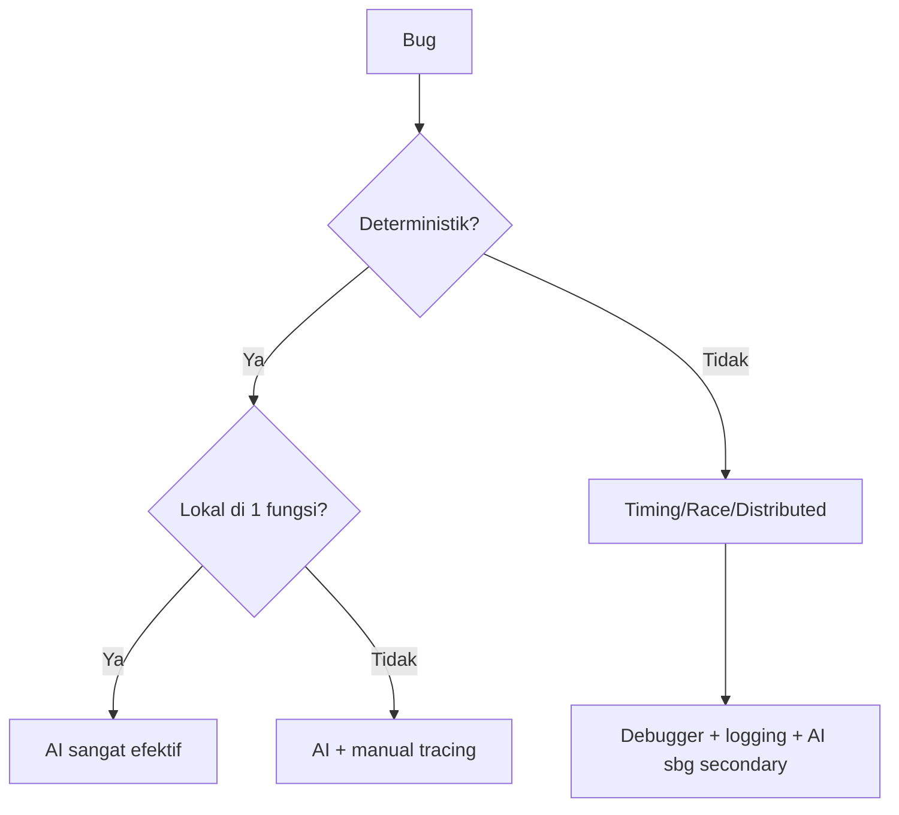
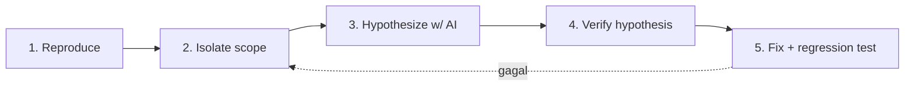

# Sesi 6 — Debugging & Error Analysis

Durasi: 90 menit
Modul: Hari 2 / Sesi 2 dari 4

## Learning Outcomes

Setelah sesi ini peserta mampu:

1. Menyusun prompt debugging yang menyertakan reproducible context (kode, input, expected vs actual, environment).
2. Menganalisis stack trace bersama AI hingga akar masalah, bukan sekadar menambal symptom.
3. Mengenali 3 kelas bug umum yang sering disalahdiagnosa AI: off-by-one, race condition, null/undefined reference.
4. Mengukur "kepercayaan diri" AI dan memvalidasinya dengan eksperimen kecil (minimal reproducible test).
5. Membedakan kapan AI cocok dipakai (bug deterministik & lokal) vs kapan harus pakai debugger tradisional (timing, distributed, memory).

## Konsep Inti

### 1. Anatomi Bug Report yang Baik untuk AI

Berbeda dengan manusia, AI tidak punya "intuisi" tentang environment Anda. Prompt debugging yang efektif WAJIB memuat:

| Elemen | Contoh |
|--------|--------|
| Expected behaviour | "Endpoint mengembalikan total = sum(items.price)" |
| Actual behaviour | "Mengembalikan total = sum(items.price) - price item terakhir" |
| Reproducible input | `POST /cart { items: [{price:10},{price:20}] }` |
| Stack trace / log | (paste lengkap) |
| Environment | Node 20.x, Postgres 15, Linux |
| Yang sudah dicoba | "Sudah cek validasi input, OK" |

Pola singkat: **EARTH** — Expected, Actual, Reproduction, Trace, Hypothesis.

### 2. Klasifikasi Bug & Strategi Debug



### 3. Membaca Stack Trace Bersama AI

Pola prompt:

```
Berikut stack trace dan kode terkait. Jangan langsung beri solusi.
1. Identifikasi frame mana yang merupakan akar (bukan rethrow).
2. Jelaskan invariant yang dilanggar.
3. Beri 3 hipotesis penyebab, urutkan dari paling mungkin.
4. Untuk tiap hipotesis: bagaimana cara memverifikasinya dalam < 5 menit.

<stack trace>
<kode terkait>
```

Pola ini memaksa AI berpikir bertahap, bukan menebak.

### 4. Tiga Bug Killer yang Sering Dimisdiagnosa AI

**a. Off-by-one**

Sering muncul di loop boundary, slice array, pagination. AI cenderung "membenarkan" kode yang salah karena pola visual familier. Mitigasi: minta AI menuliskan contoh konkret untuk n=0, n=1, n=2.

**b. Race condition**

AI tidak bisa "melihat" timing. Mitigasi: minta AI mengidentifikasi shared state + akses concurrent, bukan menebak bug-nya langsung.

**c. Null / undefined reference**

Mudah ditemukan AI di JavaScript/Python, tapi AI sering salah pada chain panjang (`a?.b?.c?.d`) — tidak tahu mana node yang actually nullable. Mitigasi: minta AI memetakan source of nullability tiap node.

### 5. Anti-pattern Prompt Debugging

| Anti-pattern | Mengapa Buruk |
|--------------|---------------|
| "Kenapa kode ini error?" tanpa konteks | AI menebak, jawaban acak |
| Paste 500 baris kode | Context window terbuang, retrieval menurun |
| Minta "fix" tanpa minta diagnosis | Solusi menambal symptom |
| Tidak menyertakan versi library | Solusi bisa untuk API yang berbeda |
| Menerima jawaban pertama tanpa verifikasi | False fix masuk ke main |

### 6. Workflow Debugging dengan AI (5 Langkah)



### 7. Kepercayaan Diri AI: Kalibrasi

Selalu akhiri prompt diagnosis dengan:

> Beri tingkat keyakinan (rendah/sedang/tinggi) untuk tiap hipotesis dan jelaskan apa yang membuat Anda yakin.

Latih peserta untuk **lebih curiga ketika AI sangat yakin**, karena over-confidence sering menyertai hallucination.

### 8. Kapan TIDAK Menggunakan AI

- Bug muncul intermittent (race, memory leak): pakai profiler.
- Bug di binary/native library: pakai debugger.
- Bug di sistem terdistribusi: pakai tracing (OpenTelemetry).
- Bug yang melibatkan data sensitif (jangan paste secret).

## Demo Live (15 menit)

Skenario: instruktur menyiapkan 1 bug deterministik off-by-one pada fungsi pagination.

Langkah:

1. **Reproduksi** bug di console — tunjukkan expected vs actual.
2. **Prompt buruk** terlebih dahulu: "Kenapa pagination salah?" — tunjukkan jawaban AI yang menebak.
3. **Prompt EARTH** lengkap — tunjukkan perbedaan kualitas diagnosis.
4. **Minta 3 hipotesis + verifikasi** — pilih hipotesis paling mungkin, buat unit test reproduksi.
5. **Fix + regression test** — tunjukkan fix yang behaviour-preserving.

## Hands-on Latihan

Lihat [`latihan-05-debugging-studi-kasus/`](./latihan-05-debugging-studi-kasus/).

3 skenario disediakan: off-by-one, race condition, null reference. Peserta wajib menyelesaikan minimal 2 dari 3.

## Wrap-up & Q&A

1. Apa beda diagnosis AI yang baik vs solusi yang menambal symptom?
2. Bagaimana Anda akan menulis prompt untuk bug intermittent?
3. Kapan Anda akan meninggalkan AI dan pindah ke debugger tradisional?
4. Mengapa kepercayaan diri tinggi dari AI justru perlu disikapi dengan hati-hati?
5. Apa peran regression test setelah bug dipatch?

## Bacaan Lanjutan

- "Debugging: The 9 Indispensable Rules" — David J. Agans
- "The Art of Debugging with GDB, DDD, and Eclipse" — Norman Matloff
- Julia Evans — Zines tentang debugging (`wizardzines.com`)
- Cursor Docs — "Chat & Composer for debugging"
- "Site Reliability Engineering" Bab 12 — Effective Troubleshooting
