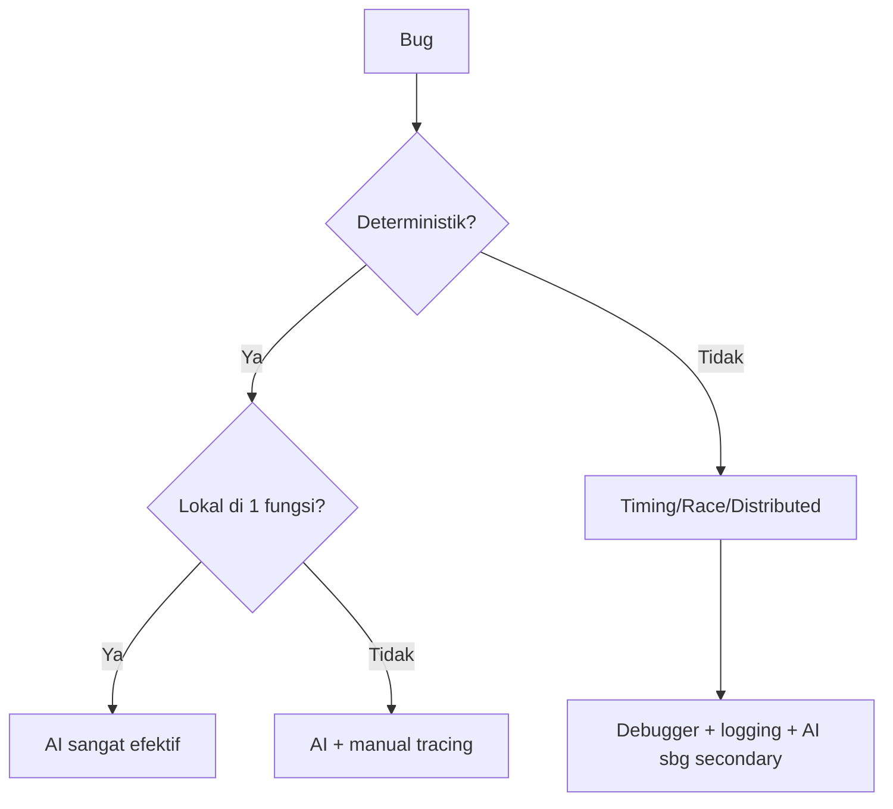
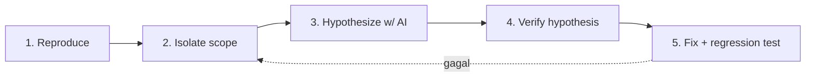

# Sesi 6 — Debugging & Error Analysis

Durasi: 90 menit
Modul: Hari 2 / Sesi 2 dari 4

## Learning Outcomes

Setelah sesi ini peserta mampu:

1. Menyusun prompt debugging yang menyertakan reproducible context (kode, input, expected vs actual, environment).
2. Menganalisis stack trace bersama AI hingga akar masalah, bukan sekadar menambal symptom.
3. Mengenali 3 kelas bug umum yang sering disalahdiagnosa AI: off-by-one, race condition, null/undefined reference.
4. Mengukur "kepercayaan diri" AI dan memvalidasinya dengan eksperimen kecil (minimal reproducible test).
5. Membedakan kapan AI cocok dipakai (bug deterministik & lokal) vs kapan harus pakai debugger tradisional (timing, distributed, memory).

## Konsep Inti

### 1. Anatomi Bug Report yang Baik untuk AI

Berbeda dengan manusia, AI tidak punya "intuisi" tentang environment Anda. Prompt debugging yang efektif WAJIB memuat:

| Fase | Elemen | Contoh |
|------|--------|--------|
| Input ke AI | **E**xpected behaviour | "Endpoint mengembalikan total = sum(items.price)" |
| Input ke AI | **A**ctual behaviour | "Mengembalikan total = sum(items.price) - price item terakhir" |
| Input ke AI | **R**eproducible input | `POST /cart { items: [{price:10},{price:20}] }` |
| Input ke AI | **T**race / log | (paste stack trace lengkap) |
| Input ke AI | Environment | Node 20.x, Postgres 15, Linux |
| Input ke AI | Yang sudah dicoba | "Sudah cek validasi input, OK" |
| Output dari AI | **H**ypothesis | 3 dugaan penyebab + tingkat keyakinan + cara verifikasi |

Pola singkat: **EARTH** — dipakai dalam 2 fase:

- **E-A-R-T (+ Environment + Tried)** = konteks yang Anda **kirim** ke AI.
- **H (Hypothesis)** = output yang Anda **minta** AI hasilkan, bukan yang Anda tulis sendiri di prompt.

#### Kenapa keenam elemen ini penting?

Bayangkan analogi ini: kalau Anda lapor bug ke rekan developer di sebelah Anda, dia bisa melihat layar, tahu project apa, kenal codebase. Cukup bilang "totalnya salah" — dia paham konteks. **AI tidak punya itu.** AI seperti konsultan freelance yang baru pertama kali Anda kontak via chat: tanpa konteks lengkap, ia akan menebak — dan tebakannya sering jadi hallucination.

Tiap elemen menutup satu celah tebakan:

- **Expected behaviour** — supaya AI tahu mana yang Anda anggap "benar". Tanpa ini, AI mungkin mengira behaviour sekarang sudah sesuai.
- **Actual behaviour** — bedakan spesifik dari expected. Hindari "salah" generik; tulis *salahnya seperti apa*.
- **Reproducible input** — data persis yang memicu bug, supaya AI bisa "menjalankan" skenario di kepalanya tanpa menebak input.
- **Stack trace / log** — sumber kebenaran paling kuat. Stack trace menunjuk baris persis tempat error meledak; tanpa ini AI menebak file yang bermasalah.
- **Environment** — bug yang sama bisa beda penyebab di Node 18 vs 20, atau Postgres 14 vs 15. Tanpa info versi, AI mungkin kasih solusi untuk versi yang salah.
- **Yang sudah dicoba** — supaya AI tidak menyarankan solusi yang sudah Anda buang. Hemat waktu, dan AI fokus ke hipotesis yang belum diuji.

**Contoh prompt lengkap (pola EARTH):**

```
[Expected] Endpoint /cart total = sum(items.price)
[Actual]   Total = sum kecuali item terakhir
[Input]    POST /cart {items:[{price:10},{price:20}]} → return 10, harusnya 30
[Log]      Tidak ada error, hanya hasil salah
[Env]      Node 20.x, Express 4, Postgres 15
[Sudah dicoba] Validasi input OK, nilai masuk ke fungsi sum() benar

Beri 3 hipotesis penyebab dengan tingkat keyakinan + cara verifikasinya.
```

Hasil prompt seperti ini jauh lebih akurat dibanding "kenapa total cart saya salah?".

### 2. Klasifikasi Bug & Strategi Debug



Tidak semua bug sebaiknya dilempar ke AI. Diagram di atas membantu Anda memutuskan **kapan AI efektif, kapan AI hanya alat bantu, dan kapan AI sebaiknya disingkirkan dulu**. Keputusannya dibagi dua pertanyaan berurutan.

#### Apa itu "deterministik"?

**Deterministik** = input yang sama + kondisi yang sama → hasilnya **selalu sama** (termasuk hasil yang salah). Bug-nya bisa Anda "putar ulang" kapan saja.

**Non-deterministik** = input sama, tapi hasilnya bisa beda-beda. Kadang benar, kadang salah, tanpa pola jelas.

Analogi:

- **Deterministik** seperti mesin fotokopi rusak — setiap kali fotokopi kertas yang sama, garis hitam selalu muncul di posisi yang sama. Bisa diulang sesuka hati.
- **Non-deterministik** seperti lampu yang kadang mati sendiri — Anda tidak tahu kapan akan terjadi lagi, sulit dipancing.

Contoh bug deterministik (selalu salah dengan cara sama):

```javascript
function sum(items) {
  let total = 0;
  for (let i = 0; i < items.length - 1; i++) {  // off-by-one
    total += items[i].price;
  }
  return total;
}
// sum([{price:10},{price:20}]) selalu return 10, tidak pernah 30.
```

Contoh bug non-deterministik (kadang benar, kadang salah):

```javascript
let counter = 0;
function increment() {
  let temp = counter;     // Request A baca 5, Request B juga baca 5
  counter = temp + 1;     // Keduanya tulis 6 (harusnya 7) — race condition
}
// 100 request bersamaan: kadang counter=100, kadang 97, kadang 98.
```

Ciri-ciri bug non-deterministik yang sering Anda dengar:

- "Aneh, tadi error, sekarang nggak"
- "Cuma muncul di production, local nggak pernah"
- "Cuma error kalau traffic tinggi"
- "Susah di-reproduce"

Sumber umum: race condition, memory leak, network timeout, nilai random/UUID, masalah tanggal/waktu.

**Tes cepat**: "Kalau saya jalankan ulang dengan input persis sama sekarang juga, bug-nya muncul lagi?" — Selalu muncul → deterministik. Kadang muncul → non-deterministik.

#### Pertanyaan 1: Bug-nya deterministik?

- ✅ **Ya** → lanjut ke pertanyaan 2.
- ❌ **Tidak** → langsung ke jalur **Timing/Race/Distributed** (lihat di bawah).

#### Pertanyaan 2 (kalau deterministik): Bug-nya lokal di 1 fungsi?

Lokal = penyebab dan gejala ada di file/fungsi yang sama (atau sangat dekat).

- ✅ **Ya, lokal** → **AI sangat efektif**. Cukup paste fungsi + EARTH context, AI biasanya menemukan penyebab dalam 1–2 prompt.
  *Contoh: off-by-one di loop pagination, salah operator, typo nama field.*

- ❌ **Tidak lokal** (lintas file/lintas modul) → **AI + manual tracing**. AI tetap berguna untuk hipotesis, tapi Anda perlu trace manual (grep, breakpoint, log) untuk validasi karena AI sering "kehilangan jejak" di codebase besar.
  *Contoh: data ter-mutate di service A, gejala muncul di service B; bug akibat config env var.*

#### Jalur ketiga: Timing/Race/Distributed

Strateginya: **Debugger + logging + AI sebagai secondary**.

Tools utama Anda: debugger (gdb/dlv/Chrome DevTools), profiler (untuk memory leak), atau tracing (OpenTelemetry, Jaeger). AI dipakai **setelah** Anda punya bukti konkret — misal: "ini stack trace dari thread yang deadlock, jelaskan invariant yang dilanggar."

Kalau langsung tanya AI "kenapa kadang race?", jawabannya akan generik dan sering ngawur, karena AI tidak punya akses ke runtime state.

#### Ringkasan strategi

| Tipe bug | Strategi | Peran AI |
|----------|----------|----------|
| Deterministik + lokal | Paste fungsi + EARTH | **Primary** — menemukan cepat |
| Deterministik + cross-file | EARTH + grep/trace manual | **Co-pilot** — kasih hipotesis, Anda validasi |
| Non-deterministik | Debugger / profiler / tracing | **Secondary** — interpretasi bukti yang sudah Anda kumpulkan |

**Aturan praktis**: sebelum prompt AI, tanya diri sendiri "bug ini di kotak mana di diagram?". Kalau jatuh di "Debugger + logging", jangan buru-buru lempar ke AI — kumpulkan bukti dulu.

### 3. Membaca Stack Trace Bersama AI

Pola prompt:

```
Berikut stack trace dan kode terkait. Jangan langsung beri solusi.
1. Identifikasi frame mana yang merupakan akar (bukan rethrow).
2. Jelaskan invariant yang dilanggar.
3. Beri 3 hipotesis penyebab, urutkan dari paling mungkin.
4. Untuk tiap hipotesis: bagaimana cara memverifikasinya dalam < 5 menit.

<stack trace>
<kode terkait>
```

Pola ini memaksa AI berpikir bertahap, bukan menebak.

### 4. Tiga Bug Killer yang Sering Dimisdiagnosa AI

**a. Off-by-one**

Sering muncul di loop boundary, slice array, pagination. AI cenderung "membenarkan" kode yang salah karena pola visual familier. Mitigasi: minta AI menuliskan contoh konkret untuk n=0, n=1, n=2.

**b. Race condition**

AI tidak bisa "melihat" timing. Mitigasi: minta AI mengidentifikasi shared state + akses concurrent, bukan menebak bug-nya langsung.

**c. Null / undefined reference**

Mudah ditemukan AI di JavaScript/Python, tapi AI sering salah pada chain panjang (`a?.b?.c?.d`) — tidak tahu mana node yang actually nullable. Mitigasi: minta AI memetakan source of nullability tiap node.

### 5. Anti-pattern Prompt Debugging

| Anti-pattern | Mengapa Buruk |
|--------------|---------------|
| "Kenapa kode ini error?" tanpa konteks | AI menebak, jawaban acak |
| Paste 500 baris kode | Context window terbuang, retrieval menurun |
| Minta "fix" tanpa minta diagnosis | Solusi menambal symptom |
| Tidak menyertakan versi library | Solusi bisa untuk API yang berbeda |
| Menerima jawaban pertama tanpa verifikasi | False fix masuk ke main |

### 6. Workflow Debugging dengan AI (5 Langkah)



### 7. Kepercayaan Diri AI: Kalibrasi

Selalu akhiri prompt diagnosis dengan:

> Beri tingkat keyakinan (rendah/sedang/tinggi) untuk tiap hipotesis dan jelaskan apa yang membuat Anda yakin.

Anda perlu **lebih curiga ketika AI sangat yakin**, karena over-confidence sering menyertai hallucination.

### 8. Kapan TIDAK Menggunakan AI

- Bug muncul intermittent (race, memory leak): pakai profiler.
- Bug di binary/native library: pakai debugger.
- Bug di sistem terdistribusi: pakai tracing (OpenTelemetry).
- Bug yang melibatkan data sensitif (jangan paste secret).

## Demo Live (15 menit)

Skenario: Anda akan diberikan 1 bug deterministik off-by-one pada fungsi pagination.

Langkah:

1. **Reproduksi** bug di console — tunjukkan expected vs actual.
2. **Prompt buruk** terlebih dahulu: "Kenapa pagination salah?" — tunjukkan jawaban AI yang menebak.
3. **Prompt EARTH** lengkap — tunjukkan perbedaan kualitas diagnosis.
4. **Minta 3 hipotesis + verifikasi** — pilih hipotesis paling mungkin, buat unit test reproduksi.
5. **Fix + regression test** — tunjukkan fix yang behaviour-preserving.

## Hands-on Latihan

Lihat [`latihan-05-debugging-studi-kasus/`](./latihan-05-debugging-studi-kasus/).

3 skenario disediakan: off-by-one, race condition, null reference. Anda wajib menyelesaikan minimal 2 dari 3.

## Wrap-up & Q&A

1. Apa beda diagnosis AI yang baik vs solusi yang menambal symptom?
2. Bagaimana Anda akan menulis prompt untuk bug intermittent?
3. Kapan Anda akan meninggalkan AI dan pindah ke debugger tradisional?
4. Mengapa kepercayaan diri tinggi dari AI justru perlu disikapi dengan hati-hati?
5. Apa peran regression test setelah bug dipatch?

## Bacaan Lanjutan

- "Debugging: The 9 Indispensable Rules" — David J. Agans
- "The Art of Debugging with GDB, DDD, and Eclipse" — Norman Matloff
- Julia Evans — Zines tentang debugging (`wizardzines.com`)
- Cursor Docs — "Chat & Composer for debugging"
- "Site Reliability Engineering" Bab 12 — Effective Troubleshooting
