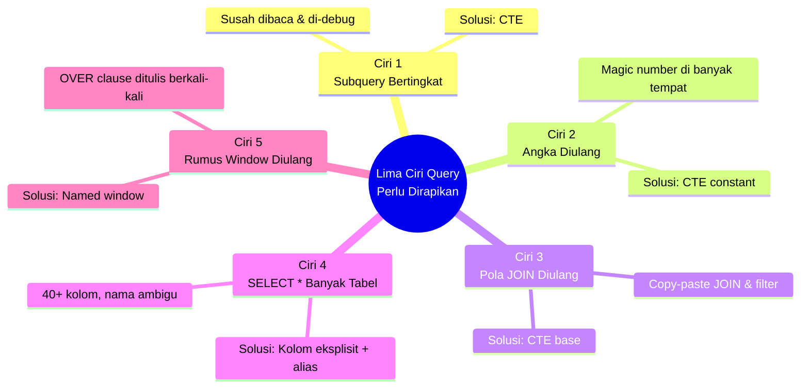

# Sesi 7 (SQL) — Refactoring: Merapikan Query Tanpa Mengubah Hasilnya

Durasi: 90 menit

## Konteks Sesi

Bayangkan Anda membuka file SQL yang digunakan oleh tim Finance. Query tersebut terdiri dari 100 baris, memiliki subquery 3 lapis, dan nilai threshold yang sama ditulis sebanyak 8 kali.

Hasilnya **benar**. Namun setiap kali ada perubahan kecil — misalnya menaikkan batas tier — Anda harus menyunting 8 tempat sekaligus. Satu bagian yang terlewat berpotensi menjadi bug.

Sesi ini melatih cara **merapikan query** tanpa mengubah hasilnya. Secara teknis, proses ini disebut **refactoring**.

---

## Yang Akan Anda Pelajari

1. Perbedaan **refactor** dan **rewrite** — dua istilah yang sering tertukar
2. **5 ciri** query yang perlu dirapikan (*code smell*)
3. **5 teknik** merapikan query (CTE, named window, view, dan sebagainya)
4. Cara meminta AI merapikan query **dengan batasan yang jelas**

---

## 1. Refactor ≠ Rewrite

**Analogi**: ruang tamu yang tidak tertata rapi. Ada dua pendekatan:

| Pendekatan | Yang Dilakukan | Risiko |
|------------|----------------|--------|
| **Refactor** | Tata ulang: pindah posisi furnitur, rapikan susunan | Rendah — objek tetap sama, susunannya berubah |
| **Rewrite** | Bongkar total, ganti furnitur baru | Tinggi — berisiko melewatkan sesuatu yang penting |

Prinsip yang sama berlaku untuk query SQL:

| Aspek | Refactor | Rewrite |
|-------|----------|---------|
| Hasil query | **Sama persis** | Dapat berbeda |
| Risiko | Rendah | Tinggi |
| Cocok untuk AI | Sangat sesuai (dengan aturan eksplisit) | Hanya jika spesifikasi lengkap tersedia |

**Aturan utama**: setelah refactor, baris, kolom, dan urutan output query **harus identik**.

---

## 2. Lima Ciri Query Perlu Dirapikan

*Code smell* adalah tanda peringatan — bukan berarti query langsung rusak, tetapi mengindikasikan adanya masalah yang akan menyulitkan pemeliharaan ke depannya.



### Ciri 1: Subquery Bertingkat-Tingkat

```sql
SELECT name,
  (SELECT tier FROM customers WHERE id =
     (SELECT id FROM customers WHERE name =
        (SELECT name FROM customers WHERE ...)
     )
  ) AS tier
FROM ...
```

**Masalah**: 3 lapis subquery untuk sebuah lookup sederhana. Sulit dibaca dan sulit di-debug. Setiap perubahan mengharuskan penelusuran melewati tiga tingkat.

**Solusi**: gunakan **CTE** (`WITH ... AS`). CTE dapat dipahami sebagai "tabel temporer yang diberi nama".

```sql
WITH top_spenders AS (
  SELECT customer_id, SUM(total) AS spending
  FROM orders
  WHERE status IN ('paid', 'shipped', 'delivered')
  GROUP BY customer_id
)
SELECT c.name, t.spending, c.tier
FROM top_spenders t
JOIN customers c ON c.id = t.customer_id;
```

Versi ini sedikit lebih panjang, namun **jauh** lebih mudah dibaca dan dimodifikasi.

### Ciri 2: Angka Sama Ditulis Berkali-Kali

```sql
CASE
  WHEN spending >= 5000000 THEN 'platinum'
  WHEN spending >= 2500000 THEN 'gold'
  WHEN spending >= 1000000 THEN 'silver'
  ELSE 'regular'
END,
CASE
  WHEN tier='regular' AND spending >= 1000000 THEN 'UPGRADE'
  WHEN tier='silver'  AND spending >= 2500000 THEN 'UPGRADE'
  WHEN tier='gold'    AND spending >= 5000000 THEN 'UPGRADE'
  ...
```

Nilai threshold 5 juta / 2,5 juta / 1 juta muncul **8 kali**. Apabila tim marketing meminta perubahan nilai tersebut, Anda harus menyunting 8 tempat sekaligus. Satu bagian yang terlewat akan menghasilkan bug.

**Solusi**: definisikan threshold dalam satu CTE constant.

```sql
WITH thresholds AS (
  SELECT 'platinum' AS tier, 5000000 AS min_spending UNION ALL
  SELECT 'gold',     2500000 UNION ALL
  SELECT 'silver',   1000000 UNION ALL
  SELECT 'regular',  0
)
-- Threshold hanya didefinisikan di satu tempat.
-- Perubahan nilai cukup dilakukan sekali.
```

### Ciri 3: Pola JOIN Diulang-Ulang

```sql
SELECT 'revenue', city, SUM(oi.line_total)
FROM customers c JOIN orders o ON ... JOIN order_items oi ON ...
WHERE o.status IN ('paid','shipped','delivered') AND o.created_at >= '2026-01-01'
GROUP BY city

UNION ALL

SELECT 'order_count', city, COUNT(DISTINCT o.id)
FROM customers c JOIN orders o ON ... JOIN order_items oi ON ...
WHERE o.status IN ('paid','shipped','delivered') AND o.created_at >= '2026-01-01'
GROUP BY city
-- ...diulang 3–4 kali
```

Blok JOIN dan filter yang identik diduplikasi sebanyak 3 kali. Perubahan pada satu bagian mengharuskan perubahan pada seluruh duplikatnya.

**Solusi**: buat satu CTE base, kemudian hitung seluruh metrik dari sumber yang sama.

```sql
WITH base AS (
  SELECT c.city, o.id AS order_id, c.id AS customer_id, oi.line_total
  FROM customers c
  JOIN orders o ON o.customer_id = c.id
  JOIN order_items oi ON oi.order_id = o.id
  WHERE o.status IN ('paid','shipped','delivered')
    AND o.created_at >= '2026-01-01'
)
SELECT city,
  SUM(line_total)             AS revenue,
  COUNT(DISTINCT order_id)    AS order_count,
  COUNT(DISTINCT customer_id) AS unique_customers
FROM base
GROUP BY city;
```

Filter hanya perlu didefinisikan di satu tempat. Output tetap identik.

### Ciri 4: `SELECT *` pada Banyak Tabel

```sql
SELECT o.*, c.*, oi.*, p.*, s.*
FROM orders o LEFT JOIN customers c ON ... LEFT JOIN order_items oi ON ...
LEFT JOIN payments p ON ... LEFT JOIN shipments s ON ...
WHERE o.id = 14;
```

**Masalah**:
1. Menghasilkan **40+ kolom**, sebagian besar tidak diperlukan
2. Nama kolom **ambigu** — kolom `status` ada di tabel orders, payments, dan shipments. Kolom mana yang dimaksud?
3. Jika terdapat 2 payment per order, baris hasil akan menjadi duplikat

**Solusi**: pilih kolom secara eksplisit dengan alias yang deskriptif.

```sql
SELECT
  o.id             AS order_id,
  o.status         AS order_status,
  o.total          AS order_total,
  c.name           AS customer_name,
  p.status         AS payment_status,
  s.status         AS shipment_status
FROM orders o
LEFT JOIN customers c ON c.id = o.customer_id
LEFT JOIN payments p  ON p.order_id = o.id
LEFT JOIN shipments s ON s.order_id = o.id
WHERE o.id = 14;
```

Setiap kolom `status` kini memiliki identitas yang jelas.

### Ciri 5: Rumus Window Ditulis Berkali-Kali

```sql
SUM(...)   OVER (PARTITION BY customer ORDER BY month)
AVG(...)   OVER (PARTITION BY customer ORDER BY month)
COUNT(...) OVER (PARTITION BY customer ORDER BY month)
-- Definisi frame "PARTITION BY customer ORDER BY month" ditulis 3 kali
```

**Solusi**: gunakan **named window**.

```sql
SUM(...)   OVER w,
AVG(...)   OVER w,
COUNT(...) OVER w
...
WINDOW w AS (PARTITION BY customer ORDER BY month);
```

Frame didefinisikan satu kali. Perubahan pada definisi window akan berlaku untuk seluruh fungsi yang mereferensikannya.

---

## 3. Aturan Emas Refactor yang Aman

**Merefactor query yang sudah berjalan berisiko jika dilakukan tanpa prosedur yang tepat.** Ikuti urutan berikut:

```
1. BASELINE      → jalankan query asli, simpan hasilnya sebagai acuan
2. IDENTIFY      → tentukan code smell mana yang akan diatasi
3. REFACTOR      → ubah struktur query
4. VERIFY        → bandingkan hasil baru dengan baseline
5. COMMIT        → satu smell = satu commit
```

Cara memverifikasi bahwa **hasil tetap identik**:

```sql
-- Verifikasi 1: jumlah baris harus sama
SELECT COUNT(*) FROM (<query asli>) t;      -- contoh: 5
SELECT COUNT(*) FROM (<query refactor>) t;  -- harus 5

-- Verifikasi 2: total nilai utama harus sama
SELECT SUM(revenue) FROM (<query asli>) t;      -- contoh: 12.500.000
SELECT SUM(revenue) FROM (<query refactor>) t;  -- harus 12.500.000

-- Verifikasi 3: periksa 3 baris pertama secara manual
```

Apabila terdapat perbedaan, lakukan rollback dan ulangi refactor dengan lebih teliti.

---

## 4. Meminta AI Merapikan Query dengan Batasan yang Jelas

**Pola yang perlu dihindari**:
> "Bersihkan query ini" → AI cenderung melakukan rewrite total, sehingga hasilnya berpotensi berbeda.

**Pola yang tepat — berikan aturan eksplisit**:

```
@file 01_subquery_hell.sql

Refactor query ini dengan aturan berikut:
1. Hasil HARUS sama persis (baris, kolom, dan urutan identik)
2. Target: gunakan CTE (WITH ... AS)
3. Tidak boleh mengubah klausa WHERE
4. Tidak boleh mengubah ORDER BY atau LIMIT
5. Tidak boleh menambah atau menghapus kolom output

Berikan:
- Query versi refactor
- 2 query verifikasi: COUNT(*) dan SUM(...)
- 1 paragraf penjelasan mengapa versi baru lebih baik
```

Aturan nomor 1 dan 5 adalah yang **paling kritis** — keduanya paling sering diabaikan oleh AI.

---

## 5. Mengukur Dampak Refactor

Refactor yang berhasil dapat diukur secara objektif:

| Yang Diukur | Sebelum | Sesudah |
|-------------|---------|---------|
| Jumlah baris kode | 30 | 18 |
| Kedalaman subquery | 3 lapis | 0 (diganti CTE) |
| Repetisi nilai atau pola | 8 tempat | 1 tempat |
| Performa EXPLAIN | — | Sama atau lebih baik |
| Kemudahan dibaca | Rendah | Meningkat secara signifikan |

Refactor dianggap **tidak berhasil** apabila:
- Jumlah baris kode meningkat drastis tanpa alasan yang kuat
- Hasil EXPLAIN menunjukkan performa yang lebih lambat
- Output query berbeda dari versi aslinya — kondisi ini berarti yang dilakukan adalah *rewrite*, bukan *refactor*

---

## 6. Anti-Pattern yang Perlu Dihindari

| ❌ Tidak Disarankan | ✅ Praktik yang Tepat |
|---------------------|----------------------|
| "Bersihkan query ini" (terlalu samar) | Berikan aturan eksplisit dan terukur |
| Refactor sekaligus mengubah behavior | Pisahkan menjadi 2 commit yang berbeda |
| Tidak menjalankan baseline terlebih dahulu | Wajib jalankan dan simpan output baseline |
| Melewati review diff dari AI | Baca diff baris per baris sebelum diterima |
| Memperbaiki 5 masalah sekaligus | Satu *smell* = satu commit |
| Mengganti CTE dengan subquery "agar lebih ringkas" | Keterbacaan lebih penting daripada jumlah baris |

---

## Demo Live (15 menit)

Buka `sql-playground/queries/sesi-07-refactor/01_subquery_hell.sql`. Ikuti langkah bersama fasilitator:

1. **Baseline**: jalankan query, catat 5 baris hasil dan total kolom revenue
2. **Identify**: subquery scalar 3 lapis untuk lookup tier
3. **Refactor**: ekstrak menjadi CTE
4. **Verify**: COUNT dan SUM harus cocok dengan baseline
5. **Commit**: `refactor(01): subquery → CTE`
6. Ulangi proses jika masih terdapat *smell* lain

---

## Lanjut ke Latihan

[`latihan-06-refactor-legacy/`](./latihan-06-refactor-legacy/)

---

## Ringkasan

- **Refactor = merapikan tanpa mengubah hasil**. Rewrite = perombakan total dengan risiko tinggi.
- **5 code smell SQL**: subquery bertingkat, magic number, duplikasi JOIN, `SELECT *`, pengulangan window function.
- **5 teknik merapikan**: CTE, named window, view, pemilihan kolom eksplisit, CTE constant untuk threshold.
- **Urutan kerja yang aman**: baseline → identify → refactor → verify → commit.
- Saat meminta AI, gunakan **aturan eksplisit** — terutama "hasil harus sama persis".
- Ukur keberhasilan refactor: jumlah baris berkurang, nesting berkurang, performa EXPLAIN tidak memburuk, dan output tetap identik.
