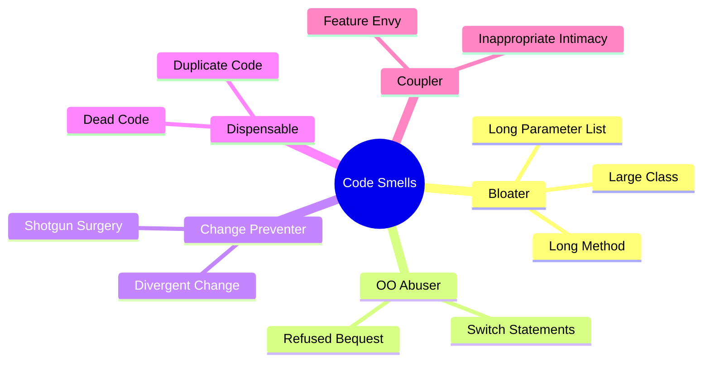
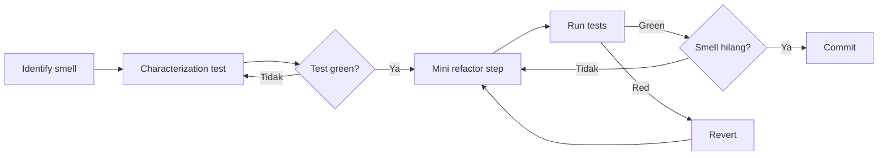

# Sesi 7 — Refactoring & Code Quality

Durasi: 90 menit
Modul: Hari 2 / Sesi 3 dari 4

## Learning Outcomes

Setelah sesi ini peserta mampu:

1. Mengidentifikasi code smell pada kode legacy menggunakan checklist + AI sebagai second opinion.
2. Menerapkan refactoring behaviour-preserving (extract function, rename, decompose conditional, replace temp with query) dengan AI sebagai akselerator.
3. Menulis characterization test sebelum refactor untuk kode yang minim test.
4. Menyesuaikan output AI ke coding standard tim (linter, style guide, naming convention).
5. Mengukur dampak refactor: readability, kompleksitas siklomatik, coverage, ukuran fungsi.

## Konsep Inti

### 1. Refactor ≠ Rewrite

Refactor: mengubah struktur internal **tanpa mengubah behaviour eksternal**. Rewrite: membangun ulang. AI sering didorong ke rewrite (lebih "bersih" terlihat), tapi rewrite tanpa test = roulette.

| Aspek | Refactor | Rewrite |
|-------|----------|---------|
| Behaviour | Identik | Bisa berbeda |
| Risiko | Rendah (dengan test) | Tinggi |
| Reversible | Ya, per langkah | Sulit |
| Cocok untuk AI | Sangat | Hanya bila spec lengkap |

#### Analogi: rumah Anda

- **Refactor = renovasi.** Anda atur ulang furniture, cat ulang dinding, ganti gagang pintu. Rumah tetap rumah yang sama: jumlah kamar, posisi pintu, fungsi tiap ruangan tidak berubah. Penghuni tetap bisa tinggal seperti biasa.
- **Rewrite = bongkar total.** Anda robohkan rumah lama, bangun rumah baru dari nol. Mungkin lebih indah, tapi penghuni harus mengungsi, dan ada risiko detail penting yang dulu Anda suka hilang tanpa Anda sadari.

#### Contoh kode

Kondisi awal — fungsi hitung diskon yang berantakan:

```javascript
function hitungHarga(produk, member) {
  let harga = produk.harga;
  if (member === true) {
    if (produk.kategori === "elektronik") {
      harga = harga - (harga * 0.1);
    } else {
      harga = harga - (harga * 0.05);
    }
  }
  return harga;
}
```

**Refactor — sama behaviour, lebih rapi:**

```javascript
const DISKON_MEMBER = {
  elektronik: 0.1,
  default: 0.05,
};

function hitungHarga(produk, member) {
  if (!member) return produk.harga;
  const diskon = DISKON_MEMBER[produk.kategori] ?? DISKON_MEMBER.default;
  return produk.harga * (1 - diskon);
}
```

- Struktur lebih bersih (lookup table + early return), mudah ditambah kategori baru.
- Tapi behaviour eksternal **identik**: `hitungHarga({harga:100, kategori:"elektronik"}, true)` tetap 90, kategori lain tetap 95. Test lama harus tetap hijau tanpa diubah.

**Rewrite (tanpa sadar) — terlihat lebih bersih, tapi behaviour berubah:**

```javascript
function hitungHarga(produk, member) {
  const diskonMember = member ? 0.1 : 0;
  return produk.harga * (1 - diskonMember);
}
```

- Sekilas lebih elegan, tapi member yang beli kategori non-elektronik (mis. baju): dulu return 95, sekarang return 90. **Logika kategori hilang total.**
- Kalau tidak ada test, perubahan ini lolos ke production → kerugian harga ke pelanggan.

#### Aturan praktis

| Kalau Anda... | Itu... |
|---|---|
| Ganti nama variabel `x` → `priceAfterTax` | Refactor |
| Pecah fungsi 50 baris jadi 3 fungsi kecil | Refactor (kalau output sama) |
| Ganti `if-else` panjang jadi lookup table | Refactor (kalau hasil mapping sama) |
| Hilangkan 1 cabang `if` karena "kayaknya nggak perlu" | **Rewrite** (behaviour berubah) |
| Tulis ulang dari nol dengan library baru | **Rewrite** |
| Tambah fitur sambil "merapikan" | **Rewrite** (campur dua hal) |

**Tes 1 kalimat**: kalau Anda jalankan test suite yang ada (atau cek manual dengan input lama), hasilnya **persis sama** sebelum dan sesudah? Ya → refactor. Tidak / tidak yakin → rewrite (atau refactor yang gagal).

#### Kenapa AI sering "kebablasan" ke rewrite

Kalau Anda minta AI "rapikan kode ini", AI sering mengganti algoritma sekalian, menghilangkan edge case yang dianggap aneh (padahal disengaja), atau menambah validasi yang sebenarnya behaviour change. Karena itu prompt refactor yang aman selalu memuat batasan eksplisit:

> Refactor kode ini **tanpa mengubah behaviour eksternal**. Pertahankan semua edge case. Jangan tambah/hapus cabang logika.

### 2. Code Smell Checklist



AI sangat baik mendeteksi: Long Method, Duplicate Code, Dead Code. AI sering miss: Feature Envy, Divergent Change (karena butuh konteks evolusi).

#### Apa itu "code smell"?

Code smell = **tanda di kode yang menunjukkan ada masalah desain, belum tentu bug**. Mirip bau aneh di kulkas — belum tentu busuk, tapi patut diperiksa. Daftar di mindmap berasal dari buku klasik *Refactoring* (Martin Fowler), dikelompokkan jadi 5 kategori berdasarkan jenis masalahnya. Tujuan checklist: Anda punya **kosakata bersama** untuk berdiskusi dengan AI atau rekan tim — alih-alih bilang "kodenya kayaknya jelek", Anda bilang "fungsi ini Long Method" dan langsung dipahami.

#### Penjelasan 5 kategori

**1. Bloater — kode yang membengkak**

Sesuatu yang terlalu besar untuk dipahami.

| Smell | Apa artinya | Contoh |
|---|---|---|
| Long Method | Fungsi terlalu panjang (umumnya > 50 baris) | `processOrder()` 200 baris |
| Large Class | Satu class punya terlalu banyak tanggung jawab | `UserService` dengan 30 method |
| Long Parameter List | Argumen fungsi terlalu banyak | `createUser(nama, email, alamat, kota, kodepos, telp, ...)` |

*Tanda di kode*: Anda harus scroll lama untuk membaca 1 fungsi/class.

**2. OO Abuser — salah pakai konsep OOP**

Pakai object-oriented tapi tidak sesuai prinsipnya.

| Smell | Apa artinya | Contoh |
|---|---|---|
| Switch Statements | `switch`/`if-else` panjang untuk cek tipe | `if (type=="admin") {...} else if (type=="guest") {...}` — harusnya polymorphism |
| Refused Bequest | Subclass tidak pakai method warisan parent | `class Penguin extends Bird` tapi tidak pakai `fly()` |

*Tanda di kode*: pakai `extends` tapi banyak method di-override jadi kosong / throw error.

**3. Change Preventer — kode yang sulit diubah**

Perubahan kecil memaksa Anda menyentuh banyak tempat.

| Smell | Apa artinya | Contoh |
|---|---|---|
| Divergent Change | 1 class harus diubah untuk banyak alasan berbeda | `Report` diubah saat ganti format PDF, saat ganti query DB, dan saat ganti subject email |
| Shotgun Surgery | 1 perubahan kecil → ubah banyak file | Tambah field "phone" → ubah 12 file di User, Form, Validation, Export |

*Tanda di kode*: PR Anda selalu menyentuh 10+ file padahal fitur-nya kecil.

**4. Dispensable — kode yang harusnya tidak ada**

Sesuatu yang bisa dihapus tanpa kehilangan apa pun.

| Smell | Apa artinya | Contoh |
|---|---|---|
| Dead Code | Kode yang tidak pernah dipanggil | Fungsi `oldCalculateTax()` tanpa caller |
| Duplicate Code | Kode sama persis di banyak tempat | Validasi email muncul di 5 fungsi berbeda |

*Tanda di kode*: Anda hapus fungsi → test tetap hijau. Atau Anda copy-paste 4 baris dari file lain.

**5. Coupler — komponen yang terlalu lengket**

Bagian kode terlalu saling tergantung.

| Smell | Apa artinya | Contoh |
|---|---|---|
| Feature Envy | Method class A lebih sering pakai data class B daripada data sendiri | `Order.calculateTotal()` ambil semua data dari `Cart.items` — seharusnya jadi method `Cart` |
| Inappropriate Intimacy | 2 class saling tahu detail internal masing-masing | `UserController` akses `db.connection.pool` langsung |

*Tanda di kode*: ganti satu class bikin class lain rusak.

#### Ringkasan kemampuan deteksi AI

| Kategori | Inti masalah | AI bisa deteksi? |
|---|---|---|
| Bloater | Terlalu besar | ✅ Ya |
| OO Abuser | Salah pakai OOP | ⚠️ Sebagian |
| Change Preventer | Sulit diubah | ❌ Butuh history |
| Dispensable | Harusnya tidak ada | ✅ Ya |
| Coupler | Terlalu erat | ⚠️ Butuh konteks |

Untuk smell tipe **AI-miss** (Change Preventer + sebagian Coupler), pakai `git log` + diskusi tim sebagai sumber utama, bukan AI.

#### Prompt audit yang efektif

```
Audit file ini dan identifikasi code smell dari kategori berikut:
Bloater, OO Abuser, Dispensable, Coupler.

Untuk tiap smell yang ditemukan, beri:
- Nama smell (mis. "Long Method")
- Lokasi (line range)
- Alasan kenapa ini smell
- Saran refactor (extract method, lookup table, dll)

Jangan langsung refactor — saya yang memutuskan.
```

Perhatikan: "Change Preventer" sengaja tidak dimasukkan ke prompt karena butuh konteks evolusi yang AI tidak punya.

### 3. Characterization Test (Michael Feathers)

Untuk kode tanpa test, **jangan refactor langsung**. Pola:

1. Pilih fungsi target.
2. Beri input acak / contoh produksi.
3. Jalankan kode AS-IS, catat output.
4. Tulis test yang assert output tersebut (meski output-nya "salah secara domain").
5. Sekarang Anda punya safety net untuk refactor.

Prompt AI:

```
Berikut fungsi X. Hasilkan 8 characterization test dengan variasi:
- 2 happy path
- 2 edge boundary
- 2 error path
- 2 nilai random terdokumentasi
Untuk tiap test, jalankan mental simulation dan tulis expected output.
Tandai [VERIFY] untuk yang Anda tidak yakin.
```

### 4. Katalog Refactoring Aman (Top 6 untuk AI)

| Refactor | AI Effectiveness | Catatan |
|----------|------------------|---------|
| Extract Function | Sangat tinggi | Cek parameter & side-effect |
| Rename | Tinggi | Hati-hati shadowing |
| Inline Variable | Tinggi | Pastikan tidak dipakai di scope lain |
| Decompose Conditional | Tinggi | Verifikasi cabang else |
| Replace Magic Number with Constant | Tinggi | Cek penamaan domain |
| Move Function | Sedang | AI bisa lupa update import |

### 5. Workflow Refactor Berbantuan AI



Aturan: 1 langkah refactor = 1 commit. AI memudahkan tapi godaan "refactor besar sekali jalan" harus ditahan.

### 6. Menjaga Coding Standard

AI default sering menghasilkan style yang inconsistent dengan codebase. Strategi:

- Tambahkan instruksi style di prompt: "Ikuti ESLint config di .eslintrc, snake_case untuk fungsi internal, JSDoc untuk public API."
- Pakai `.cursorrules` di root project — diterapkan otomatis ke semua prompt.
- Selalu jalankan linter setelah refactor AI.

Contoh `.cursorrules`:

```
- Bahasa: TypeScript strict mode
- Naming: camelCase fungsi, PascalCase tipe
- No default export
- Setiap fungsi public wajib JSDoc + contoh
- Maks 30 baris per fungsi
```

### 7. Mengukur Dampak Refactor

| Metrik | Sebelum | Sesudah | Tool |
|--------|---------|---------|------|
| Cyclomatic complexity | — | — | `lizard`, ESLint `complexity` |
| LOC per fungsi | — | — | linter |
| Coverage | — | — | Jest/Pytest |
| Maintainability Index | — | — | SonarQube |

Tanpa metrik, refactor jadi opini. AI bagus untuk menghitung complexity bersama Anda.

### 8. Anti-pattern AI Refactoring

- "Bersihkan kode ini" (terlalu vague) → AI rewrite total.
- Refactor + ubah behaviour dalam 1 langkah.
- Tidak baca diff AI sebelum apply.
- Apply ke file tanpa test.
- Mengganti library version saat refactor (dua perubahan tercampur).

## Demo Live (15 menit)

Skenario: "spaghetti controller" 200 baris dengan validasi, business logic, dan DB call tercampur.

Langkah:

1. **Identifikasi smell** — prompt AI: "Daftar code smell di file ini, urutkan dari paling berdampak."
2. **Characterization test** — generate 5 test, jalankan, semua green.
3. **Extract Function** — pisahkan validasi ke fungsi sendiri, commit.
4. **Decompose Conditional** — pisahkan business logic, commit.
5. **Verify** — semua test masih green, complexity turun.

## Hands-on Latihan

Lihat [`latihan-06-refactor-legacy/`](./latihan-06-refactor-legacy/).

## Wrap-up & Q&A

1. Apa beda refactor dengan rewrite, dan kapan masing-masing dipilih?
2. Mengapa characterization test krusial sebelum refactor AI?
3. Bagaimana memastikan AI mengikuti coding standard tim?
4. Metrik apa yang Anda akan pakai untuk membuktikan refactor sukses?
5. Apa risiko terbesar refactor berbantuan AI di production codebase?

## Bacaan Lanjutan

- Martin Fowler — "Refactoring: Improving the Design of Existing Code" (2nd ed.)
- Michael Feathers — "Working Effectively with Legacy Code"
- Kent Beck — "Tidy First?"
- "Clean Code" — Robert C. Martin (Bab 3 & 17)
- Cursor Docs — "Cursor Rules"
- SourceMaking — Catalog of refactorings: https://sourcemaking.com/refactoring
