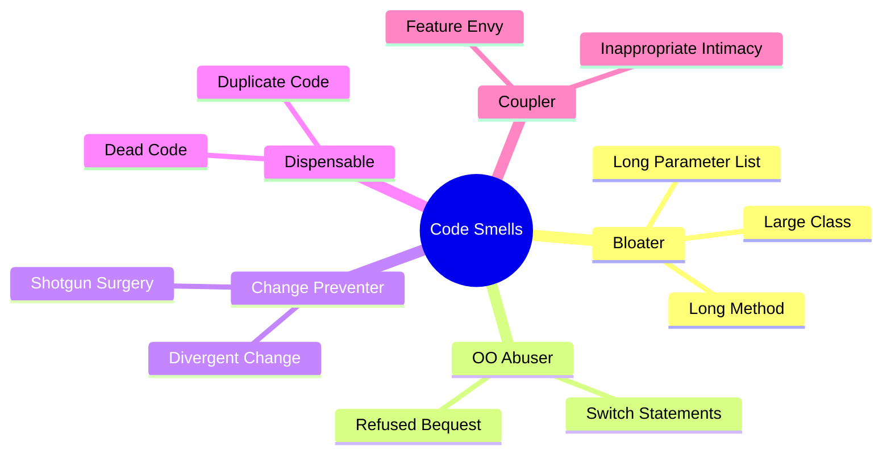
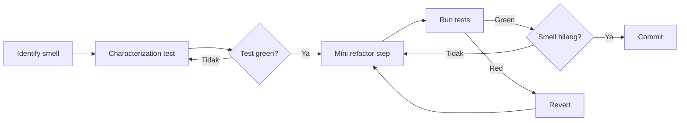

# Sesi 7 — Refactoring & Code Quality

Durasi: 90 menit
Modul: Hari 2 / Sesi 3 dari 4

## Learning Outcomes

Setelah sesi ini peserta mampu:

1. Mengidentifikasi code smell pada kode legacy menggunakan checklist + AI sebagai second opinion.
2. Menerapkan refactoring behaviour-preserving (extract function, rename, decompose conditional, replace temp with query) dengan AI sebagai akselerator.
3. Menulis characterization test sebelum refactor untuk kode yang minim test.
4. Menyesuaikan output AI ke coding standard tim (linter, style guide, naming convention).
5. Mengukur dampak refactor: readability, kompleksitas siklomatik, coverage, ukuran fungsi.

## Konsep Inti

### 1. Refactor ≠ Rewrite

Refactor: mengubah struktur internal **tanpa mengubah behaviour eksternal**. Rewrite: membangun ulang. AI sering didorong ke rewrite (lebih "bersih" terlihat), tapi rewrite tanpa test = roulette.

| Aspek | Refactor | Rewrite |
|-------|----------|---------|
| Behaviour | Identik | Bisa berbeda |
| Risiko | Rendah (dengan test) | Tinggi |
| Reversible | Ya, per langkah | Sulit |
| Cocok untuk AI | Sangat | Hanya bila spec lengkap |

### 2. Code Smell Checklist



AI sangat baik mendeteksi: Long Method, Duplicate Code, Dead Code. AI sering miss: Feature Envy, Divergent Change (karena butuh konteks evolusi).

### 3. Characterization Test (Michael Feathers)

Untuk kode tanpa test, **jangan refactor langsung**. Pola:

1. Pilih fungsi target.
2. Beri input acak / contoh produksi.
3. Jalankan kode AS-IS, catat output.
4. Tulis test yang assert output tersebut (meski output-nya "salah secara domain").
5. Sekarang Anda punya safety net untuk refactor.

Prompt AI:

```
Berikut fungsi X. Hasilkan 8 characterization test dengan variasi:
- 2 happy path
- 2 edge boundary
- 2 error path
- 2 nilai random terdokumentasi
Untuk tiap test, jalankan mental simulation dan tulis expected output.
Tandai [VERIFY] untuk yang Anda tidak yakin.
```

### 4. Katalog Refactoring Aman (Top 6 untuk AI)

| Refactor | AI Effectiveness | Catatan |
|----------|------------------|---------|
| Extract Function | Sangat tinggi | Cek parameter & side-effect |
| Rename | Tinggi | Hati-hati shadowing |
| Inline Variable | Tinggi | Pastikan tidak dipakai di scope lain |
| Decompose Conditional | Tinggi | Verifikasi cabang else |
| Replace Magic Number with Constant | Tinggi | Cek penamaan domain |
| Move Function | Sedang | AI bisa lupa update import |

### 5. Workflow Refactor Berbantuan AI



Aturan: 1 langkah refactor = 1 commit. AI memudahkan tapi godaan "refactor besar sekali jalan" harus ditahan.

### 6. Menjaga Coding Standard

AI default sering menghasilkan style yang inconsistent dengan codebase. Strategi:

- Tambahkan instruksi style di prompt: "Ikuti ESLint config di .eslintrc, snake_case untuk fungsi internal, JSDoc untuk public API."
- Pakai `.cursorrules` di root project — diterapkan otomatis ke semua prompt.
- Selalu jalankan linter setelah refactor AI.

Contoh `.cursorrules`:

```
- Bahasa: TypeScript strict mode
- Naming: camelCase fungsi, PascalCase tipe
- No default export
- Setiap fungsi public wajib JSDoc + contoh
- Maks 30 baris per fungsi
```

### 7. Mengukur Dampak Refactor

| Metrik | Sebelum | Sesudah | Tool |
|--------|---------|---------|------|
| Cyclomatic complexity | — | — | `lizard`, ESLint `complexity` |
| LOC per fungsi | — | — | linter |
| Coverage | — | — | Jest/Pytest |
| Maintainability Index | — | — | SonarQube |

Tanpa metrik, refactor jadi opini. AI bagus untuk menghitung complexity bersama Anda.

### 8. Anti-pattern AI Refactoring

- "Bersihkan kode ini" (terlalu vague) → AI rewrite total.
- Refactor + ubah behaviour dalam 1 langkah.
- Tidak baca diff AI sebelum apply.
- Apply ke file tanpa test.
- Mengganti library version saat refactor (dua perubahan tercampur).

## Demo Live (15 menit)

Skenario: "spaghetti controller" 200 baris dengan validasi, business logic, dan DB call tercampur.

Langkah:

1. **Identifikasi smell** — prompt AI: "Daftar code smell di file ini, urutkan dari paling berdampak."
2. **Characterization test** — generate 5 test, jalankan, semua green.
3. **Extract Function** — pisahkan validasi ke fungsi sendiri, commit.
4. **Decompose Conditional** — pisahkan business logic, commit.
5. **Verify** — semua test masih green, complexity turun.

## Hands-on Latihan

Lihat [`latihan-06-refactor-legacy/`](./latihan-06-refactor-legacy/).

## Wrap-up & Q&A

1. Apa beda refactor dengan rewrite, dan kapan masing-masing dipilih?
2. Mengapa characterization test krusial sebelum refactor AI?
3. Bagaimana memastikan AI mengikuti coding standard tim?
4. Metrik apa yang Anda akan pakai untuk membuktikan refactor sukses?
5. Apa risiko terbesar refactor berbantuan AI di production codebase?

## Bacaan Lanjutan

- Martin Fowler — "Refactoring: Improving the Design of Existing Code" (2nd ed.)
- Michael Feathers — "Working Effectively with Legacy Code"
- Kent Beck — "Tidy First?"
- "Clean Code" — Robert C. Martin (Bab 3 & 17)
- Cursor Docs — "Cursor Rules"
- SourceMaking — Catalog of refactorings: https://sourcemaking.com/refactoring
