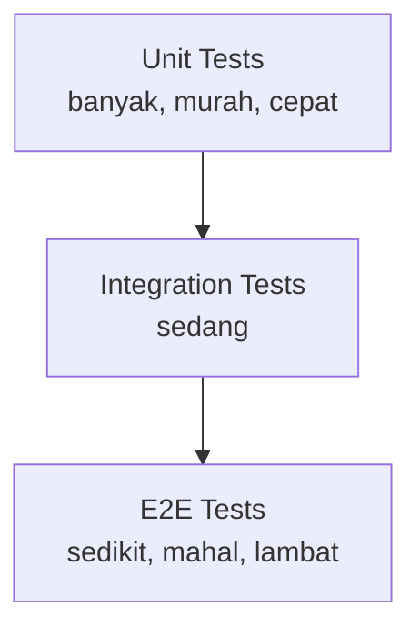
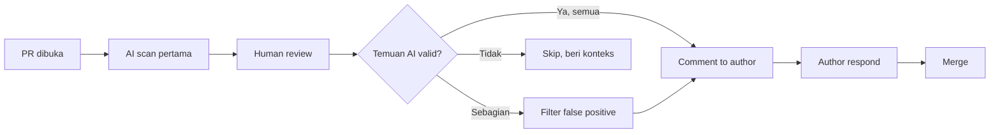

# Sesi 8 — Testing & Code Review dengan AI

Durasi: 90 menit
Modul: Hari 2 / Sesi 4 dari 4

## Learning Outcomes

Setelah sesi ini peserta mampu:

1. Men-generate unit test berkualitas (bukan sekadar coverage) menggunakan AI: happy path, edge case, error path, property-based.
2. Mengevaluasi quality of test (assert kuat, isolasi, deterministik) — bukan hanya kuantitas.
3. Melakukan code review berbantuan AI pada pull request fiktif: mengidentifikasi bug, code smell, dan technical debt.
4. Membedakan true positive vs false positive temuan AI dan menyusun komentar review yang konstruktif.
5. Menyusun checklist code review yang menggabungkan kekuatan AI (volume) dan manusia (judgement).

## Konsep Inti

### 1. Test yang Buruk vs Test yang Baik

| Aspek | Test Buruk | Test Baik |
|-------|------------|-----------|
| Assertion | `expect(result).toBeDefined()` | `expect(result).toEqual({...})` |
| Isolasi | Bergantung urutan | Independen, paralel-safe |
| Determinisme | Pakai `Date.now()` real | Inject clock |
| Naming | `test1`, `should work` | `returns total including 11% tax when items present` |
| Cakupan | Hanya happy path | Happy + edge + error |
| Maintainability | Banyak duplikasi setup | Helper / factory |

AI bisa menghasilkan SEMUA jenis test ini. Tugas Anda: filter & pandu.

### 2. Test Pyramid (Ulang)



AI paling produktif di lapis **unit**. Untuk integration & E2E, AI berguna untuk skenario, kurang untuk infra.

### 3. Pola Prompt Test Generation

**Pola "AAA Explicit"**:

```
Generate unit test untuk fungsi `calculateTotal(items, customerTier)`.
Format setiap test:
- // Arrange
- // Act
- // Assert
Cakupan:
1. Happy path (2 test)
2. Edge boundary: empty items, single item, qty=0
3. Error path: null input, invalid tier
4. Property: total selalu >= 0
Test framework: <jest/pytest/junit>.
Naming: should_<expected>_when_<condition>.
```

**Pola "Counter-Example"**:

```
Berikut fungsi X. Beri 5 input yang Anda yakin akan memecahkan fungsi ini.
Untuk tiap input, jelaskan kenapa. Lalu tulis test-nya.
```

Pola counter-example sangat efektif untuk menemukan edge case yang manusia lupa.

### 4. False Positive AI

AI sering meng-generate test yang:

- Hanya assert `not null` (lemah).
- Re-test bahasa, bukan fungsi (`expect(2+2).toBe(4)`).
- Test internal implementasi, bukan behaviour.
- Mock terlalu banyak sehingga test tidak verify apa-apa.
- Snapshot test besar tanpa makna.

Wajib review tiap test sebelum commit.

### 5. AI Code Review: Apa yang AI Baik & Buruk

| Baik | Buruk |
|------|-------|
| Code smell mekanis (panjang, duplikasi) | Trade-off arsitektur |
| Style consistency | Domain logic correctness |
| Potensi null/undefined | Race condition di sistem terdistribusi |
| Magic number | Konteks bisnis |
| Security pattern (SQL injection, XSS) | Threat model holistik |
| Generate test missing | Prioritas vs deadline |

### 6. Workflow Code Review Berbantuan AI



Aturan: AI **tidak boleh** auto-comment di PR tanpa filter manusia. False positive merusak trust author.

### 7. Checklist Code Review (Template)

- [ ] Behaviour change terdeskripsikan di PR description?
- [ ] Test baru / update test mencerminkan behaviour change?
- [ ] Ada migration / breaking change?
- [ ] Error handling lengkap?
- [ ] Logging cukup tapi tidak bocor data sensitif?
- [ ] Performance: ada N+1 query? big-O regression?
- [ ] Security: input sanitization? authz check?
- [ ] Naming + style konsisten?
- [ ] Dokumentasi (jika public API) di-update?
- [ ] Backward compatibility (jika public)?

Tiap baris dapat di-delegasikan ke AI sebagai prompt awal, lalu manusia verifikasi.

### 8. Technical Debt: AI sebagai Detektor

Prompt:

```
Berdasarkan diff PR ini dan kode terkait, identifikasi technical debt yang
sedang ditambahkan atau dikurangi. Untuk tiap debt:
- Klasifikasi: design / code / test / docs / infra
- Estimasi cost-of-delay
- Apakah dapat ditangani di PR ini atau wajib ticket terpisah
```

### 9. Etika & Komunikasi Review

- Komentar AI yang di-relay manusia: tandai sumbernya ("AI flagged this, I confirmed it valid").
- Jangan paste komentar AI mentah-mentah.
- Hindari nada akusatif ("kode Anda salah"); ganti dengan "behaviour ini berbeda dari test X — apakah disengaja?".

## Demo Live (15 menit)

Skenario: PR fiktif menambah endpoint `POST /refund` dengan 3 file changed, 1 test ditulis author.

Langkah:

1. **AI scan pertama** — prompt review checklist, dapatkan list temuan.
2. **Filter** — instruktur tunjukkan 1 false positive (AI salah baca dependency), diskusi kenapa.
3. **Generate missing tests** — minta AI buat 5 test edge case yang belum ada.
4. **Validasi 2 test** — apply, jalankan, lihat green/red.
5. **Susun komentar PR** — konversi temuan jadi 3 komentar konstruktif.

## Hands-on Latihan

Lihat [`latihan-07-testing-review/`](./latihan-07-testing-review/).

## Wrap-up & Q&A

1. Apa indikator test "berkualitas" selain coverage?
2. Kapan komentar AI di PR bisa membahayakan budaya review tim?
3. Bagaimana membedakan true positive vs false positive temuan AI?
4. Aspek review apa yang tidak boleh didelegasikan ke AI?
5. Bagaimana technical debt dilaporkan agar actionable, bukan sekadar daftar?

## Bacaan Lanjutan

- Kent Beck — "Test-Driven Development by Example"
- "Software Engineering at Google" — Bab 11 (Testing), Bab 19 (Critique)
- Google Engineering Practices — Code Review: https://google.github.io/eng-practices/review/
- "Working Effectively with Unit Tests" — Jay Fields
- Martin Fowler — "Mocks Aren't Stubs"
- Cursor Docs — Composer & Background Agent untuk review
