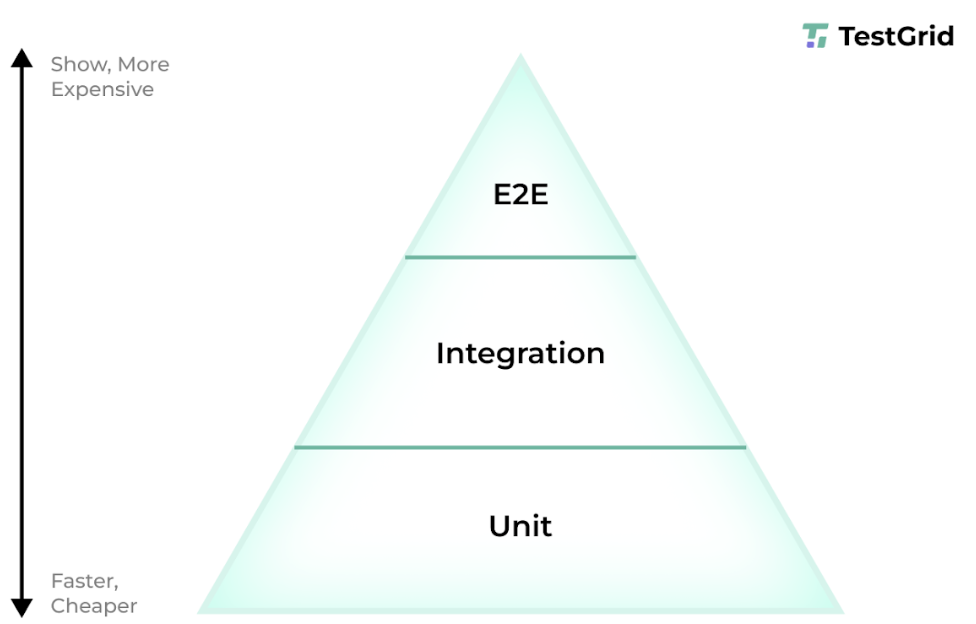
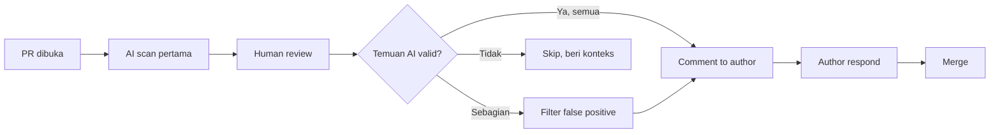

# Sesi 8 — Testing & Code Review dengan AI

Durasi: 90 menit
Modul: Hari 2 / Sesi 4 dari 4

## Learning Outcomes

Setelah sesi ini peserta mampu:

1. Men-generate unit test berkualitas (bukan sekadar coverage) menggunakan AI: happy path, edge case, error path, property-based.
2. Mengevaluasi quality of test (assert kuat, isolasi, deterministik) — bukan hanya kuantitas.
3. Melakukan code review berbantuan AI pada pull request fiktif: mengidentifikasi bug, code smell, dan technical debt.
4. Membedakan true positive vs false positive temuan AI dan menyusun komentar review yang konstruktif.
5. Menyusun checklist code review yang menggabungkan kekuatan AI (volume) dan manusia (judgement).

## Konsep Inti

### 1. Test yang Buruk vs Test yang Baik

| Aspek | Test Buruk | Test Baik |
|-------|------------|-----------|
| Assertion | `expect(result).toBeDefined()` | `expect(result).toEqual({...})` |
| Isolasi | Bergantung urutan | Independen, paralel-safe |
| Determinisme | Pakai `Date.now()` real | Inject clock |
| Naming | `test1`, `should work` | `returns total including 11% tax when items present` |
| Cakupan | Hanya happy path | Happy + edge + error |
| Maintainability | Banyak duplikasi setup | Helper / factory |

AI bisa menghasilkan SEMUA jenis test ini. Tugas Anda: filter & pandu.

### 2. Test Pyramid



#### Apa yang dibaca dari gambar

Dua sumbu yang harus dibaca:

- **Ke atas** (Unit → Integration → E2E): **slower, more expensive** — test makin lambat, makin mahal di-maintain, makin sering flaky.
- **Ke bawah** (E2E → Integration → Unit): **faster, cheaper** — test makin cepat, makin murah, makin stabil.

Karena itu **bentuknya piramida, bukan persegi**: porsi terbesar harus di lapis Unit.

#### Tiga Lapis: Apa, Cepat-Mahalnya, Contoh

| Lapis | Yang dicek | Seberapa cepat jalan | Contoh di project DevNotes |
|-------|------------|----------------------|-----------------------------|
| **Unit** | Satu fungsi kecil saja. Bagian luar (database, API) dipalsukan supaya fungsi diuji sendirian. | Sangat cepat (sepersekian detik) | `validateNoteInput()`, `formatTimestamp()`, helper response |
| **Integration** | Beberapa bagian dipakai bareng-bareng (mis. handler API benar-benar menulis ke database test) | Sedang (beberapa detik) | `POST /api/notes` → tulis ke Supabase test → baca lagi, pastikan datanya benar |
| **E2E** | Aplikasi lengkap dipakai seperti user beneran: buka browser → klik → submit → cek hasilnya di database asli | Lambat (puluhan detik per test) | Login magic link → buat note → cek note muncul di halaman list |

> 📖 **Istilah cepat:**
> - **Flaky** = test yang hasilnya tidak konsisten. Hari ini lulus, besok gagal, padahal kodenya sama. Penyebab tersering: nunggu sesuatu yang belum siap (animasi, request jaringan, data).
> - **Jarang pecah** = test yang tetap lulus meski bagian lain di kode berubah. Indikator test ditulis pada **behaviour**, bukan pada **detail implementasi**.
> - **Mock / dipalsukan** = mengganti dependency asli (mis. database) dengan versi tiruan supaya test cepat dan tidak butuh infra.

#### Rasio Sehat (rule of thumb)

| Lapis | Porsi suite | Kenapa segitu |
|-------|-------------|---------------|
| Unit | ~70% | Cepat → developer mau jalankan tiap save |
| Integration | ~20% | Mahal tapi nangkap bug "antar modul" |
| E2E | ~10% | Mahal & flaky → hanya untuk *critical user journey* |

Bukan dogma. Project kecil bisa Unit 90% / E2E 10%. Yang penting: **piramida, bukan terbalik**.

#### Tiga Anti-Pola yang Sering Muncul (apalagi dengan AI)

1. **Ice-cream cone** — banyak E2E, sedikit unit. Suite jalan 20 menit, satu tombol berubah → 30 test merah. AI yang diminta "test fitur ini" sering jatuh ke sini karena E2E "kelihatan lebih meyakinkan".
2. **Hourglass** — banyak unit + banyak E2E, integration kosong. Bug bocor di sambungan antar modul (mis. handler kirim shape data salah ke DB) yang unit test tidak nangkap dan E2E baru ketahuan saat demo.
3. **Cupcake** — semua test ditulis sebagai unit tapi mock-nya sampai ke DB & HTTP. Lulus semua, tapi tidak verify apa-apa nyata. Anti-pola favorit AI yang malas.

#### Peran AI per Lapis

| Lapis | AI bagus untuk… | AI lemah untuk… |
|-------|-----------------|------------------|
| Unit | Generate test AAA dari signature fungsi, brainstorm edge case, property test | — |
| Integration | Skenario "alur" (urutan call), data seed | Setup infra (test container, fixture DB), teardown bersih |
| E2E | Skenario user journey dalam bahasa Gherkin/plain | Selector stabil, wait strategy, debug flaky test |

Aturan praktis: **makin tinggi lapis, makin banyak AI butuh review manusia**. Di unit, AI bisa hampir mandiri. Di E2E, AI hanya partner brainstorm — eksekusi tetap manusia.

#### Kapan Pakai Lapis Mana?

- Logika murni (kalkulasi, validasi, format) → **Unit**.
- Kontrak antar modul (handler ↔ service ↔ DB) → **Integration**.
- Alur kritis yang kalau pecah pengguna komplain (login, checkout, submit form utama) → **E2E**.

Pertanyaan filter sebelum tulis test: *"Kalau test ini pecah, apa yang sebenarnya rusak?"* Kalau jawabannya "satu fungsi" → Unit. "Kontrak modul" → Integration. "Pengalaman user" → E2E.

AI paling produktif di lapis **unit**. Untuk integration & E2E, AI berguna untuk skenario, kurang untuk infra.

### 3. Pola AAA (Arrange–Act–Assert)

Pola **AAA** adalah cara membagi isi satu test jadi **3 blok berurutan**. Tujuannya: setiap test mudah dibaca dalam 5 detik karena strukturnya selalu sama.

#### Tiga Blok

| Blok | Artinya | Yang dilakukan |
|------|---------|----------------|
| **Arrange** | Siapkan | Bikin data, setup state awal, siapkan mock/dependency |
| **Act** | Lakukan | Panggil **satu** fungsi yang sedang dites |
| **Assert** | Cek | Verifikasi hasilnya sesuai harapan |

#### Contoh Konkret (DevNotes)

```ts
test('createNote should reject when title is empty', () => {
  // Arrange — siapkan input
  const input = { title: '', content: 'Belajar testing' };
  const fakeDb = { insert: jest.fn() };

  // Act — jalankan fungsi yang dites
  const result = createNote(input, fakeDb);

  // Assert — cek hasilnya
  expect(result.ok).toBe(false);
  expect(result.error).toBe('TITLE_REQUIRED');
  expect(fakeDb.insert).not.toHaveBeenCalled();
});
```

Tanpa AAA, test yang sama bisa jadi spaghetti yang sulit dibaca:

```ts
test('test1', () => {
  expect(createNote({ title: '', content: 'x' }, { insert: jest.fn() }).ok).toBe(false);
});
```

#### Kenapa AAA Penting?

1. **Mudah dibaca** — reviewer langsung tahu "ini setup, ini aksi, ini ekspektasi".
2. **Mudah debug saat merah** — kalau test gagal, langsung kelihatan di blok mana masalahnya.
3. **Mendorong test fokus** — 1 test = 1 Act. Kalau mau panggil 2 fungsi di Act, itu sinyal **harus dipecah jadi 2 test**.
4. **Cocok untuk AI** — kalau prompt minta format AAA eksplisit, output AI jauh lebih konsisten (lihat section 4).

#### Aturan Praktis

- **1 Act per test.** Kalau ada 2 panggilan fungsi di Act, pecah jadi 2 test.
- **Arrange seperlunya.** Setup berlebihan = test rapuh. Kalau Arrange > 10 baris, pikir ulang: butuh helper/factory.
- **Assert minimal tapi bermakna.** Cek hal yang benar-benar penting, bukan semua field.
- **Komentar `// Arrange`, `// Act`, `// Assert`** boleh ditulis eksplisit di awal (terutama untuk peserta baru) — nanti hilang sendiri saat sudah jadi kebiasaan.

#### Varian: GWT (Given–When–Then)

Konsep yang sama, beda nama:

| AAA | GWT | Sering dipakai di |
|-----|-----|-------------------|
| Arrange | **Given** (kondisi awal) | Unit test |
| Act | **When** (kejadian) | BDD, Cucumber, integration test |
| Assert | **Then** (hasil) | E2E dengan bahasa bisnis |

Pilih yang konsisten di project Anda. AAA lebih populer di unit test JS/TS; GWT lebih sering di test BDD.

### 4. Pola Prompt Test Generation

**Pola "AAA Explicit"**:

```
Generate unit test untuk fungsi `calculateTotal(items, customerTier)`.
Format setiap test:
- // Arrange
- // Act
- // Assert
Cakupan:
1. Happy path (2 test)
2. Edge boundary: empty items, single item, qty=0
3. Error path: null input, invalid tier
4. Property: total selalu >= 0
Test framework: <jest/pytest/junit>.
Naming: should_<expected>_when_<condition>.
```

**Contoh output AI (Jest)** — kalau prompt di atas dipakai dengan asumsi `calculateTotal` menerima `items: { price, qty }[]` dan `customerTier: 'regular' | 'gold' | 'platinum'` (diskon 0/10/20%):

```ts
import { calculateTotal } from './calculateTotal';

describe('calculateTotal', () => {
  // === 1. Happy path ===

  test('should_return_subtotal_when_regular_customer', () => {
    // Arrange
    const items = [
      { price: 10000, qty: 2 },
      { price: 5000, qty: 1 },
    ];

    // Act
    const result = calculateTotal(items, 'regular');

    // Assert
    expect(result).toBe(25000); // 20000 + 5000, no discount
  });

  test('should_apply_20_percent_discount_when_platinum_customer', () => {
    // Arrange
    const items = [{ price: 100000, qty: 1 }];

    // Act
    const result = calculateTotal(items, 'platinum');

    // Assert
    expect(result).toBe(80000); // 100000 - 20%
  });

  // === 2. Edge boundary ===

  test('should_return_zero_when_items_empty', () => {
    // Arrange
    const items: { price: number; qty: number }[] = [];

    // Act
    const result = calculateTotal(items, 'regular');

    // Assert
    expect(result).toBe(0);
  });

  test('should_return_item_price_when_single_item', () => {
    // Arrange
    const items = [{ price: 7500, qty: 1 }];

    // Act
    const result = calculateTotal(items, 'regular');

    // Assert
    expect(result).toBe(7500);
  });

  test('should_skip_item_when_qty_is_zero', () => {
    // Arrange
    const items = [
      { price: 10000, qty: 0 },
      { price: 5000, qty: 1 },
    ];

    // Act
    const result = calculateTotal(items, 'regular');

    // Assert
    expect(result).toBe(5000);
  });

  // === 3. Error path ===

  test('should_throw_when_items_is_null', () => {
    // Arrange
    const items = null as any;

    // Act + Assert (error path: Act dan Assert digabung)
    expect(() => calculateTotal(items, 'regular')).toThrow('items required');
  });

  test('should_throw_when_tier_invalid', () => {
    // Arrange
    const items = [{ price: 1000, qty: 1 }];

    // Act + Assert
    expect(() => calculateTotal(items, 'diamond' as any)).toThrow('invalid tier');
  });

  // === 4. Property test ===

  test('should_never_return_negative_total', () => {
    // Arrange — generate 50 input acak
    const tiers = ['regular', 'gold', 'platinum'] as const;
    for (let i = 0; i < 50; i++) {
      const items = Array.from({ length: Math.floor(Math.random() * 5) }, () => ({
        price: Math.floor(Math.random() * 100000),
        qty: Math.floor(Math.random() * 10),
      }));
      const tier = tiers[Math.floor(Math.random() * tiers.length)];

      // Act
      const result = calculateTotal(items, tier);

      // Assert — invariant: total tidak boleh negatif
      expect(result).toBeGreaterThanOrEqual(0);
    }
  });
});
```

Catatan untuk reviewer:

- Test **error path** menggabungkan Act + Assert dalam satu `expect(() => ...).toThrow()` — ini boleh, karena yang dites memang "panggilan ini melempar error".
- Test **property** memakai loop sederhana (50 iterasi). Untuk versi yang lebih kuat, pakai library seperti `fast-check` (property-based testing) — tapi loop pun cukup untuk pelatihan ini.
- Naming `should_<expected>_when_<condition>` membuat output `npm test` membaca seperti spek: *"should return zero when items empty"*.

**Pola "Counter-Example"**:

```
Berikut fungsi X. Beri 5 input yang Anda yakin akan memecahkan fungsi ini.
Untuk tiap input, jelaskan kenapa. Lalu tulis test-nya.
```

Pola counter-example sangat efektif untuk menemukan edge case yang manusia lupa.

### 5. False Positive AI

AI sering meng-generate test yang:

- Hanya assert `not null` (lemah).
- Re-test bahasa, bukan fungsi (`expect(2+2).toBe(4)`).
- Test internal implementasi, bukan behaviour.
- Mock terlalu banyak sehingga test tidak verify apa-apa.
- Snapshot test besar tanpa makna.

Wajib review tiap test sebelum commit.

### 6. AI Code Review: Apa yang AI Baik & Buruk

| Baik | Buruk |
|------|-------|
| Code smell mekanis (panjang, duplikasi) | Trade-off arsitektur |
| Style consistency | Domain logic correctness |
| Potensi null/undefined | Race condition di sistem terdistribusi |
| Magic number | Konteks bisnis |
| Security pattern (SQL injection, XSS) | Threat model holistik |
| Generate test missing | Prioritas vs deadline |

### 7. Workflow Code Review Berbantuan AI



Aturan: AI **tidak boleh** auto-comment di PR tanpa filter manusia. False positive merusak trust author.

### 8. Checklist Code Review (Template)

- [ ] Behaviour change terdeskripsikan di PR description?
- [ ] Test baru / update test mencerminkan behaviour change?
- [ ] Ada migration / breaking change?
- [ ] Error handling lengkap?
- [ ] Logging cukup tapi tidak bocor data sensitif?
- [ ] Performance: ada N+1 query? big-O regression?
- [ ] Security: input sanitization? authz check?
- [ ] Naming + style konsisten?
- [ ] Dokumentasi (jika public API) di-update?
- [ ] Backward compatibility (jika public)?

Tiap baris dapat di-delegasikan ke AI sebagai prompt awal, lalu manusia verifikasi.

### 9. Technical Debt: AI sebagai Detektor

Prompt:

```
Berdasarkan diff PR ini dan kode terkait, identifikasi technical debt yang
sedang ditambahkan atau dikurangi. Untuk tiap debt:
- Klasifikasi: design / code / test / docs / infra
- Estimasi cost-of-delay
- Apakah dapat ditangani di PR ini atau wajib ticket terpisah
```

### 10. Etika & Komunikasi Review

- Komentar AI yang di-relay manusia: tandai sumbernya ("AI flagged this, I confirmed it valid").
- Jangan paste komentar AI mentah-mentah.
- Hindari nada akusatif ("kode Anda salah"); ganti dengan "behaviour ini berbeda dari test X — apakah disengaja?".

## Demo Live (15 menit)

Skenario: PR fiktif menambah endpoint `POST /refund` dengan 3 file changed, 1 test ditulis author.

Langkah:

1. **AI scan pertama** — prompt review checklist, dapatkan list temuan.
2. **Filter** — Anda akan melihat 1 false positive (AI salah baca dependency), lalu diskusikan kenapa.
3. **Generate missing tests** — minta AI buat 5 test edge case yang belum ada.
4. **Validasi 2 test** — apply, jalankan, lihat green/red.
5. **Susun komentar PR** — konversi temuan jadi 3 komentar konstruktif.

## Hands-on Latihan

Lihat [`latihan-07-testing-review/`](./latihan-07-testing-review/).

## Wrap-up & Q&A

1. Apa indikator test "berkualitas" selain coverage?
2. Kapan komentar AI di PR bisa membahayakan budaya review tim?
3. Bagaimana membedakan true positive vs false positive temuan AI?
4. Aspek review apa yang tidak boleh didelegasikan ke AI?
5. Bagaimana technical debt dilaporkan agar actionable, bukan sekadar daftar?

## Bacaan Lanjutan

- Kent Beck — "Test-Driven Development by Example"
- "Software Engineering at Google" — Bab 11 (Testing), Bab 19 (Critique)
- Google Engineering Practices — Code Review: https://google.github.io/eng-practices/review/
- "Working Effectively with Unit Tests" — Jay Fields
- Martin Fowler — "Mocks Aren't Stubs"
- Cursor Docs — Composer & Background Agent untuk review
