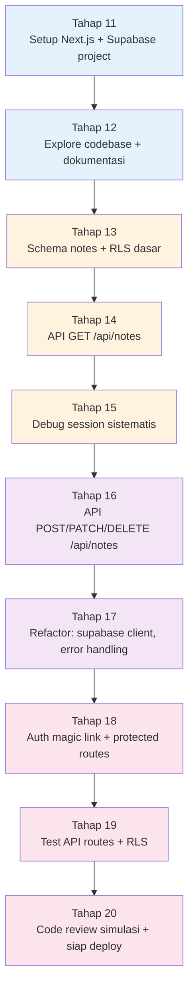

# Perjalanan Project Hari 2 — DevNotes Backend (Next.js + Supabase)

Hari 2 dirancang sebagai **satu perjalanan linear** membangun backend aplikasi **DevNotes** dari nol menggunakan Next.js App Router + Supabase. Setiap tahap menambahkan kemampuan baru ke project yang sama.

BRD lengkap DevNotes: [`../project-brd.md`](../project-brd.md). Pastikan Anda sudah baca **Section 1 (Latar Belakang), Section 4 (Ruang Lingkup), Section 7 (Model Data), Section 11 (Mockup)**.

> Catatan: project Hari 2-3 (DevNotes) **terpisah** dari project Hari 1 (portfolio). Anda memulai folder baru di awal Sesi 5.

---

## Peta 10 Tahap (Hari 2)



Warna menandakan sesi: **biru** = Sesi 5, **oranye** = Sesi 6, **ungu** = Sesi 7, **pink** = Sesi 8.

---

## Tabel Tahap

| #  | Tahap                                              | Output yang Anda tambahkan ke `devnotes/`                                                  | Sesi | FR (BRD) |
| -- | -------------------------------------------------- | ------------------------------------------------------------------------------------------ | ---- | -------- |
| 11 | **Setup Next.js + Supabase project**               | `devnotes/` folder dengan Next.js App Router; akun Supabase + project baru ter-create      | Sesi 5 | (setup) |
| 12 | **Explore codebase + dokumentasi**                 | Dokumentasi `docs/architecture.md` hasil eksplorasi Next.js template + Supabase docs via AI | Sesi 5 | NFR-03 |
| 13 | **Schema notes + RLS dasar**                       | Migration SQL untuk tabel `notes` di Supabase + RLS policy SELECT public                   | Sesi 6 | FR-08 |
| 14 | **API GET /api/notes**                             | `app/api/notes/route.ts` (GET list public notes) + halaman home minimal yang konsumsi      | Sesi 6 | FR-01 |
| 15 | **Debug session sistematis**                       | Refleksi `submissions/<nama>/debug-log.md` berisi 3 bug yang ditemukan + diagnose + fix    | Sesi 6 | (skill) |
| 16 | **API POST/PATCH/DELETE /api/notes**               | Endpoint full CRUD di `app/api/notes/[id]/route.ts` dengan validasi input                  | Sesi 7 | FR-04, FR-06 |
| 17 | **Refactor: supabase client, error handling**      | `lib/supabase.ts` (server/client split), `lib/api-response.ts` (response standar)          | Sesi 7 | NFR-03 |
| 18 | **Auth magic link + protected routes**             | Login route + middleware proteksi `POST/PATCH/DELETE` (cek `auth.uid()`)                   | Sesi 8 | FR-03, FR-08 |
| 19 | **Test API routes + RLS**                          | `__tests__/api-notes.test.ts` (Vitest) — happy path + RLS deny case + auth scenarios       | Sesi 8 | (skill) |
| 20 | **Code review simulasi + siap deploy**             | PR simulasi (branch + GitHub PR) dengan AI review comments + checklist siap deploy Vercel  | Sesi 8 | (skill) |

---

## Pengelompokan per Sesi

| Sesi  | Materi (baca)                              | Tahap (kerjakan)  | Lokasi file                                                                                                          |
| ----- | ------------------------------------------ | ----------------- | -------------------------------------------------------------------------------------------------------------------- |
| **5** | Code Understanding & Documentation         | **Tahap 11–12**   | [`Sesi-05-Code-Understanding-Documentation/latihan-04-eksplorasi-codebase/`](./Sesi-05-Code-Understanding-Documentation/latihan-04-eksplorasi-codebase/) |
| **6** | Debugging & Error Analysis                 | **Tahap 13–15**   | [`Sesi-06-Debugging-Error-Analysis/latihan-05-debugging-studi-kasus/`](./Sesi-06-Debugging-Error-Analysis/latihan-05-debugging-studi-kasus/)             |
| **7** | Refactoring & Code Quality                 | **Tahap 16–17**   | [`Sesi-07-Refactoring-Code-Quality/latihan-06-refactor-legacy/`](./Sesi-07-Refactoring-Code-Quality/latihan-06-refactor-legacy/)                         |
| **8** | Testing & Code Review                      | **Tahap 18–20**   | [`Sesi-08-Testing-Code-Review/latihan-07-testing-review/`](./Sesi-08-Testing-Code-Review/latihan-07-testing-review/)                                    |

---

## Checkpoint per Tahap

| Tahap | Bukti lulus (commit minimal)                                                                                  |
| ----- | ------------------------------------------------------------------------------------------------------------- |
| 11    | `next dev` jalan di `localhost:3000`; Supabase project terlihat di dashboard; commit `chore: init Next.js + Supabase` |
| 12    | `docs/architecture.md` berisi: struktur folder Next.js, alur data, dependency utama, link ke Supabase docs    |
| 13    | Tabel `notes` ada di Supabase (SQL editor); RLS aktif; bisa SELECT public note via SQL editor                 |
| 14    | `curl http://localhost:3000/api/notes` return JSON array notes; halaman home tampilkan list                  |
| 15    | `debug-log.md` punya minimal 3 entry bug (gejala → diagnosis → fix → pelajaran)                              |
| 16    | `curl POST /api/notes` create note; `curl PATCH /api/notes/[id]` update; `curl DELETE` hapus — semua return status sesuai |
| 17    | `lib/supabase.ts` punya 2 export (server, browser); `lib/api-response.ts` dipakai konsisten di semua route   |
| 18    | Bisa login dengan magic link; POST tanpa auth → 401; POST sebagai user lain → 403 (RLS)                      |
| 19    | `npm test` semua hijau; minimum 6 test (happy + auth + RLS deny per operation)                              |
| 20    | Branch `feat/api-complete` ada di GitHub; PR description ditulis via Cursor; checklist deploy siap          |

---

## Skenario "Tertinggal"

Hari 2 lebih padat karena pertama kali pegang Supabase. Kalau Anda **tidak selesai 1 tahap**:

1. **Catat di refleksi**: tahap terakhir yang selesai.
2. **Lanjut ke materi Sesi berikutnya** secara konseptual.
3. **Tahap minimum untuk masuk Hari 3**: idealnya selesai sampai **Tahap 18** (auth + 1 round CRUD). Tahap 19-20 (test + deploy) boleh menyusul.

Yang penting di akhir Hari 2: **BE Anda sudah bisa di-curl dari terminal** dengan auth jalan. FE Hari 3 butuh ini.

---

## Output Akhir Hari 2 (akhir Tahap 20)

Folder `devnotes/` Anda berisi:

```
devnotes/
├── README.md                          ← cara setup + ENV vars
├── package.json                       ← Next.js 15 + @supabase/supabase-js
├── .env.local                         ← (TIDAK di-commit) SUPABASE_URL + ANON_KEY + SERVICE_KEY
├── .env.example                       ← template untuk peserta lain
├── app/
│   ├── api/
│   │   └── notes/
│   │       ├── route.ts               ← GET (list), POST (create)
│   │       └── [id]/route.ts          ← GET, PATCH, DELETE
│   ├── login/page.tsx                 ← magic link UI
│   ├── auth/callback/route.ts         ← exchangeCodeForSession
│   └── page.tsx                       ← home minimal (akan disempurnakan di Hari 3)
├── lib/
│   ├── supabase.ts                    ← createServerClient + createBrowserClient
│   └── api-response.ts                ← ok(), error(), notFound() helpers
├── __tests__/
│   └── api-notes.test.ts              ← Vitest test
├── docs/
│   └── architecture.md                ← dokumentasi arsitektur
├── supabase/
│   └── migrations/
│       └── 0001_notes_with_rls.sql    ← schema + RLS policy
└── submissions/<nama>/
    └── debug-log.md
```

Di Hari 3, BE ini akan Anda **konsumsi dengan FE Next.js** (halaman feed, dashboard, editor, detail) dan deploy final ke Vercel.

---

## Catatan Penting

- **Akun Supabase**: free tier cukup untuk pelatihan. Daftar di <https://supabase.com> dengan GitHub login (1 menit).
- **Vercel deploy**: tidak wajib di Hari 2 — kita pakai `localhost:3000`. Deploy nanti di Hari 3 Sesi 9.
- **Tools tambahan yang dipakai**: `curl` atau Postman/Insomnia untuk test API, Supabase SQL Editor untuk inspect data.
