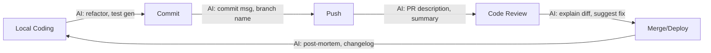

# Sesi 09 — Advanced Workflow: Git & Kolaborasi Tim AI-Assisted

**Durasi**: 90 menit
**Sesi ke**: 09 dari 12
**Format**: Materi (40 menit) + Demo (15 menit) + Hands-on Lab (30 menit) + Wrap-up (5 menit)

---

## 1. Learning Outcomes

Setelah sesi ini, peserta mampu:

1. **Menggunakan Cursor untuk menghasilkan commit message, PR description, dan changelog** yang konsisten dengan konvensi tim (Conventional Commits, Keep a Changelog).
2. **Memanfaatkan Cursor di alur code review** — meminta AI menjelaskan diff, mengidentifikasi smell, dan mengusulkan perbaikan sebelum diajukan ke reviewer manusia.
3. **Mendesain konvensi kolaborasi tim AI-assisted** — pembagian peran, aturan attribution, dan sinkronisasi konteks (rules file, project notes) lintas anggota.

---

## 2. Konsep Inti

### 2.1 Posisi Cursor dalam Developer Loop

Cursor bukan pengganti git atau code reviewer — Cursor adalah *accelerator* di setiap titik handoff antar tahap. Memahami posisi ini menentukan ROI integrasi.



### 2.2 Tiga Lapisan Integrasi Git

| Lapisan | Aksi | Tool Cursor |
|---------|------|-------------|
| **Pra-commit** | Stage perubahan, validasi diff | Chat dengan `@Git` context |
| **Commit** | Generate commit message, split commit | Cmd-K + diff context |
| **Pasca-commit** | PR description, release notes | Composer + `@Branches` |

### 2.3 Konvensi Conventional Commits + AI

Format standar:

```
<type>(<scope>): <subject>

<body>

<footer>
```

Prompt ringkas yang produktif:

> "Buat commit message Conventional Commits untuk diff yang sudah di-stage. Scope = `auth`. Tambahkan body 2 kalimat menjelaskan *why*, bukan *what*."

### 2.4 PR Review yang Diperkaya AI

Empat pertanyaan wajib untuk Cursor sebelum approve PR orang lain:

1. *"Ringkas perubahan PR ini dalam 5 bullet untuk reviewer non-domain."*
2. *"Identifikasi potensi regresi pada modul X yang tidak tercover diff."*
3. *"Cek apakah ada secret, credential, atau URL internal yang ter-commit."*
4. *"Sarankan test case tambahan untuk edge case yang belum diuji."*

### 2.5 Kolaborasi Tim AI-Assisted

Tiga prinsip yang harus disepakati tim:

1. **Single source of context** — file `.cursorrules` / `cursor/rules` dimiliki repo, bukan individu, dan di-review seperti kode biasa.
2. **Attribution yang jujur** — kode hasil generate boleh masuk repo, tetapi commit author tetap manusia yang bertanggung jawab atas review.
3. **Shared prompt library** — simpan prompt yang terbukti efektif di `docs/prompts/` agar onboarding anggota baru cepat.

### 2.6 Matriks Pembagian Peran

| Peran | Tugas Utama | Penggunaan Cursor |
|-------|-------------|-------------------|
| Tech Lead | Set rules, review konvensi | Audit kualitas prompt tim |
| Senior Dev | Mentor, review PR | Generate explanation untuk junior |
| Mid Dev | Implementasi fitur | Refactor, test generation |
| Junior Dev | Implementasi guided | Belajar pola dari saran AI |

---

## 3. Demo Live (15 menit)

**Skenario**: Anda baru saja menyelesaikan endpoint baru `POST /api/orders` di repo demo. Saatnya commit, push, buka PR.

**Langkah 1 — Generate commit message dari diff**
- Buka panel Source Control di Cursor.
- Cmd-K → `Generate commit message in Conventional Commits style, scope: orders, include short body explaining the why.`
- Tinjau hasil, edit bila perlu, commit.

**Langkah 2 — Buat branch name yang konsisten**
- Tanya chat: `Suggest a branch name following our convention <type>/<ticket>-<slug> for ticket MM-142 about order creation.`
- Apply via terminal AI.

**Langkah 3 — Generate PR description**
- Pilih semua commit di branch (`@Branches main..HEAD`).
- Prompt: `Tulis PR description dengan section: Context, Changes, Test Plan, Screenshots placeholder. Tandai breaking change bila ada.`

**Langkah 4 — Review PR rekan tim**
- Buka diff PR rekan.
- Prompt: `Identifikasi 3 risiko regresi tertinggi dari perubahan ini dan jelaskan alasannya.`

---

## 4. Hands-on Latihan

**Lokasi latihan**: [`./latihan-08-git-workflow/`](./latihan-08-git-workflow/README.md)

**Briefing singkat**: Anda bekerja pada repo demo `cursor-orders-api`. Tugas: (1) buat feature branch, (2) implement endpoint sederhana, (3) generate commit + PR description via Cursor, (4) simulasikan code review dengan rekan sebelah.

**Durasi latihan**: 30 menit.

---

## 5. Wrap-up & Q&A

Pertanyaan diskusi:

1. Apa risiko terbesar bila commit message di-generate AI tanpa direview?
2. Bagaimana membedakan PR description yang ditulis manusia vs AI — perlukah ditandai?
3. Kapan sebaiknya AI **tidak** dilibatkan dalam code review (PR sensitif, keamanan, dsb)?
4. Bagaimana strategi sinkronisasi `.cursorrules` antar anggota tim yang punya gaya berbeda?
5. Apa metrik keberhasilan adopsi Cursor di tim Anda selama 90 hari pertama?

---

## 6. Bacaan Lanjutan

- *Conventional Commits 1.0.0* — https://www.conventionalcommits.org/
- *Keep a Changelog* — https://keepachangelog.com/
- GitHub — *About pull request reviews*.
- Cursor Docs — *Rules for AI*, *Codebase Indexing*, *Composer*.
- Buku: *Accelerate* (Forsgren, Humble, Kim) — bab DORA metrics sebagai baseline pengukuran ROI AI tooling.
