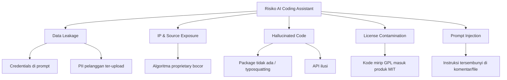
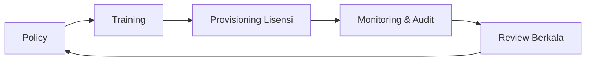

# Sesi 10 — Security, Ethics & Governance dalam Penggunaan AI Coding Assistant

**Durasi**: 90 menit
**Sesi ke**: 10 dari 12
**Format**: Materi (35 menit) + Studi Kasus Diskusi (30 menit) + Demo Mitigasi (15 menit) + Wrap-up (10 menit)

---

## 1. Learning Outcomes

Setelah sesi ini, peserta mampu:

1. **Mengidentifikasi 5 kategori risiko utama** penggunaan AI coding assistant di lingkungan enterprise (data leakage, IP exposure, prompt injection, hallucinated dependency, license contamination).
2. **Mengevaluasi mode deployment Cursor** (cloud default, Privacy Mode, self-hosted endpoint) dan memilih sesuai klasifikasi data perusahaan.
3. **Menerapkan kontrol teknis** untuk mencegah kebocoran: `.cursorignore`, secret scanning, network policy, dan code redaction.
4. **Menyusun kebijakan internal** (do/don't list, training mandatory, audit log) yang dapat diadopsi tim mereka pasca pelatihan.
5. **Menavigasi dimensi etis** — atribusi, bias, ketergantungan, dan dampak pada profesi developer junior.

---

## 2. Konsep Inti

### 2.1 Peta Risiko AI Coding Assistant



#### Cara Membaca Peta

Peta ini mengelompokkan **semua risiko AI coding assistant** ke dalam **5 kategori utama** (cabang level-1) dengan **contoh konkret** di cabang level-2. Tujuannya: saat insiden terjadi, Anda bisa langsung tunjuk kategorinya — itu menentukan **tim mana yang menangani** dan **kontrol mana yang gagal**.

| Sumber risiko | Yang dijaga | Arah aliran |
|---------------|-------------|-------------|
| **Data Leakage** | Data perusahaan / pelanggan | **Keluar** dari sistem Anda ke provider AI |
| **IP & Source Exposure** | Aset intelektual / source code | **Keluar** ke pihak ketiga (training/log) |
| **Hallucinated Code** | Integritas dependency & API | **Masuk** ke kode Anda (saran AI yang salah) |
| **License Contamination** | Kepatuhan lisensi | **Masuk** (snippet hasil training AI) |
| **Prompt Injection** | Kendali atas AI | **Manipulasi** AI lewat input tersembunyi |

> 📌 **Pola pikir kunci**: 3 risiko pertama (Data, IP, Hallucinated) sering muncul karena **kelalaian internal**. 2 terakhir (License, Prompt Injection) muncul karena **input dari luar** yang tidak kita kontrol. Treatment-nya beda — Section 2.4 & 2.5 bahas detailnya.

#### Kenapa Dipetakan Begini?

- **Mempermudah triase.** "Code yang AI sarankan tidak jalan" → kategori H (Hallucinated). "Customer ID muncul di error log Cursor" → kategori D (Data Leakage). Tanpa peta, semua jadi "AI bermasalah".
- **Memetakan ke kontrol existing.** Tiap kategori punya kontrol mitigasi yang sudah dikenal industri (lihat tabel di Section 2.2 & 2.4). Anda tidak perlu reinvent — tinggal pasang.
- **Mencegah blind spot.** Banyak organisasi hanya fokus di Data Leakage (paling visible) dan lupa Hallucinated Code (paling sering) atau Prompt Injection (paling baru, paling tidak disiapkan).

#### Yang Paling Sering vs Paling Berbahaya

| Frekuensi | Severity terburuk | Kategori |
|-----------|-------------------|----------|
| 🔥 Sering harian | Sedang (bug, waktu terbuang) | **Hallucinated Code** |
| Sering mingguan | Tinggi (kebocoran credential) | **Data Leakage** |
| Sesekali | **Sangat tinggi** (tuntutan hukum, perpaja IP) | **IP Exposure**, **License** |
| Jarang tapi naik | Tinggi (AI dipakai untuk eksfiltrasi) | **Prompt Injection** |

Aturan: investasikan kontrol di kuadran kanan-atas (severity tinggi) lebih dulu, meski frekuensinya rendah. Recovery cost-nya yang menentukan, bukan probabilitas.

### 2.2 Lima Kategori Risiko — Penjelasan Singkat

| # | Risiko | Contoh Nyata | Dampak |
|---|--------|--------------|--------|
| 1 | **Data Leakage** | Prompt berisi connection string production | Credential bocor ke log provider |
| 2 | **IP & Source Exposure** | Modul billing core diupload sebagai konteks | Hilangnya rahasia dagang |
| 3 | **Hallucinated Dependency** | AI sarankan `npm install reqwests` (typosquat) | Supply chain attack |
| 4 | **License Contamination** | Snippet GPL-3 masuk produk komersial | Konsekuensi hukum |
| 5 | **Prompt Injection** | Komentar di file open-source berisi instruksi | AI lakukan aksi tidak diinginkan |

### 2.3 Model Deployment & Klasifikasi Data

| Mode | Data ke Cloud? | Retensi | Cocok Untuk |
|------|----------------|---------|-------------|
| Cursor Default | Ya | Sesuai ToS | Proyek open-source, internal non-sensitif |
| **Privacy Mode** | Tidak disimpan | Zero retention | Mayoritas proyek enterprise |
| **Business / Enterprise** | Kontrak terpisah | SSO, audit log | Regulated industry |
| Self-hosted Model | Tidak keluar | Penuh kontrol | Data setara TOP SECRET |

> **Aturan praktis**: Klasifikasi data perusahaan menentukan mode, bukan sebaliknya. Jangan menurunkan klasifikasi data hanya agar bisa pakai cloud default.

### 2.4 Perlindungan Source Code

**Lapisan teknis**:

1. **`.cursorignore`** — daftar file/folder yang tidak boleh diindeks (mirror `.gitignore` minimal, lalu tambah `secrets/`, `*.pem`, `prod-config/`).
2. **Pre-commit secret scanner** — `gitleaks`, `trufflehog` jalan otomatis sebelum push.
3. **Network egress policy** — Cursor hanya boleh menghubungi endpoint resmi; blokir endpoint eksperimental.
4. **SSO + audit log** — siapa pakai Cursor versi apa, kapan.
5. **DLP integration** — bagi enterprise dengan tooling DLP eksisting.

**Lapisan organisasi**:

- Training wajib sebelum aktivasi lisensi.
- Policy ditandatangani digital.
- Insiden reporting channel khusus.

### 2.5 Data Sensitif: Apa yang Tidak Boleh Masuk Prompt

| Kategori | Contoh | Alternatif |
|----------|--------|------------|
| Credentials | API key, password, JWT | Gunakan `<REDACTED>` atau dummy |
| PII | Email/HP pelanggan, NIK, KTP | Anonimkan dengan placeholder |
| Health / Financial | Rekam medis, saldo, no kartu | Tidak pernah; lokal saja |
| Trade Secret | Algoritma scoring, formula pricing | Diskusi konsep, bukan implementasi |
| Customer Code | Kode milik klien | Pakai snippet yang disanitasi |

### 2.6 Hallucinated Dependency & Supply Chain

Pola umum:
- AI menyarankan `pip install <nama mirip>` yang ternyata tidak ada → typosquatter publikasikan paket berbahaya dengan nama itu.
- Mitigasi: selalu verifikasi paket di registry resmi sebelum install; gunakan `npm audit signatures`, `pip-audit`.

### 2.7 Etika Penggunaan

Empat dimensi yang perlu disepakati:

1. **Atribusi & tanggung jawab** — penulis commit tetap manusia, AI adalah alat. Tidak menulis "Co-Authored-By: AI" kecuali kebijakan perusahaan mengaturnya.
2. **Bias model** — model bisa mereplikasi pola buruk dari training data; reviewer manusia tetap final gate.
3. **Ketergantungan & deskilling** — junior bisa kehilangan kesempatan belajar fundamental bila terlalu cepat menggantungkan AI.
4. **Dampak lingkungan** — inferensi punya energy footprint; gunakan secukupnya.

### 2.8 Kebijakan Internal Enterprise — Komponen Wajib

1. Scope: tools yang disetujui (Cursor, Copilot, dst).
2. Klasifikasi data + matriks mode deployment.
3. Daftar do/don't penggunaan AI coding assistant.
4. Proses reporting insiden.
5. Audit & review berkala (minimal 6 bulan).
6. Sanksi pelanggaran.

### 2.9 Governance Framework Singkat



#### Apa Itu Governance Framework?

**Governance framework** = kerangka *siklus* aktivitas yang memastikan penggunaan AI coding assistant di organisasi tetap **aman, patuh, dan terukur** seiring waktu. Bukan dokumen sekali tulis, tapi **loop** yang berputar terus.

Disebut **singkat** karena hanya 5 tahap inti — sengaja dipangkas supaya tim kecil pun bisa mulai tanpa overhead. Framework besar (NIST AI RMF, ISO/IEC 42001) bisa dipakai nanti saat organisasi sudah matang.

#### Tahap-tahap dan Penanggung Jawab

| Tahap | Apa yang dilakukan | Output konkret | Owner |
|-------|--------------------|----------------|-------|
| **1. Policy** | Tulis aturan main: tools yang disetujui, klasifikasi data, do/don't (Section 2.8) | Dokumen "AI Usage Policy v1" yang disetujui pimpinan | CISO + Legal |
| **2. Training** | Bekali tim memahami policy + cara aman pakai AI (mirror materi Sesi 10) | Sesi onboarding 1–2 jam, kuis kelulusan | People Ops + Engineering Lead |
| **3. Provisioning Lisensi** | Sediakan akun resmi (mode yang sesuai klasifikasi data), SSO, hak akses | Daftar lisensi terdaftar, akses ter-link ke SSO | IT / Procurement |
| **4. Monitoring & Audit** | Cek log pemakaian, scan secret leak, telusuri pelanggaran | Dashboard pemakaian, laporan insiden bulanan | Security Ops |
| **5. Review Berkala** | Evaluasi: policy masih relevan? tools baru muncul? insiden baru? | Notulen review tiap 6 bulan + update policy | CISO + Engineering Lead |

Setelah Review (5), output-nya **kembali memicu update Policy** (1) — itulah kenapa diagramnya loop, bukan garis lurus.

#### Kenapa Harus Loop, Bukan Sekali Jalan?

- **Tools cepat berubah.** Cursor rilis fitur baru tiap bulan; Copilot, Codeium, dsb. Policy yang ditulis tahun lalu mungkin sudah tidak cocok.
- **Threat landscape berkembang.** Prompt injection baru muncul 2023; sekarang sudah jadi vektor serius. Tanpa review, policy tertinggal.
- **Tim berubah.** Karyawan baru tidak otomatis tahu policy — training harus berulang, bukan event sekali.
- **Insiden = bahan belajar.** Tiap insiden internal/industri harus disuntik ke siklus berikutnya.

#### Kalau Salah Satu Tahap Putus

| Tahap yang lemah | Akibat |
|-------------------|--------|
| Policy tidak ada | Tim improvisasi sendiri → keputusan tidak konsisten, sulit audit |
| Training dilewati | Policy ada tapi tidak dipahami → pelanggaran tidak disengaja |
| Provisioning bocor | Tim pakai akun pribadi/free tier → data perusahaan ke tier non-enterprise |
| Monitoring nihil | Tidak tahu ada insiden sampai ramai di media |
| Review tidak jalan | Framework jadi "shelfware" — ada di drive, tidak relevan dengan kenyataan |

#### Roadmap Minimal 90 Hari (untuk organisasi yang baru mulai)

| Bulan | Fokus | Deliverable |
|-------|-------|-------------|
| **1** | Policy v0.1 + pilih tools resmi | Draft policy 5 halaman + daftar tools disetujui |
| **2** | Training pilot ke 1 tim + provisioning SSO | 1 sesi training + 10 lisensi enterprise aktif |
| **3** | Monitoring dasar (gitleaks di CI) + audit pertama | Dashboard insiden + revisi policy v0.2 |

Setelah 90 hari, organisasi punya **versi minimum** dari semua 5 tahap — siap di-iterate setiap 6 bulan.

<!-- STACK-PLACEHOLDER: Sesuaikan contoh `.cursorignore` dengan stack mayoritas peserta (Node, Python, Go, Java) -->

Contoh `.cursorignore` baseline:

```
# Secrets & config
.env
.env.*
secrets/
*.pem
*.key
config/production/

# Customer data dumps
data/dumps/
fixtures/real/

# Build & cache
node_modules/
dist/
.next/
```

---

## 3. Wrap-up & Q&A

1. Apa beda risiko Cursor cloud default dengan Privacy Mode dari sisi praktis tim Anda?
2. Bila menemukan rekan paste credential ke prompt — apa langkah pertama?
3. Bagaimana cara mendeteksi hallucinated dependency sebelum di-install?
4. Apakah developer junior boleh pakai Cursor sejak hari pertama? Argumentasi.
5. Komponen kebijakan apa yang akan paling sulit diadopsi tim Anda dan mengapa?

---

## 4. Bacaan Lanjutan

- OWASP — *Top 10 for LLM Applications*.
- NIST AI RMF 1.0 — *Risk Management Framework for AI*.
- Cursor Docs — *Privacy & Security*, *Privacy Mode*.
- GitHub Blog — *Preventing secret leaks*.
- ENISA — *Securing Machine Learning Algorithms*.
- Samsung internal memo (April 2023) — laporan media tentang larangan generative AI internal pasca insiden.
- *AI and the Future of Work* — laporan WEF.
