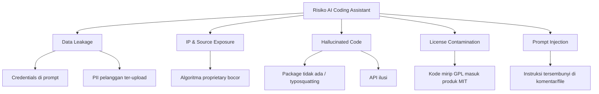
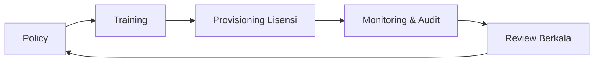

# Sesi 10 — Security, Ethics & Governance dalam Penggunaan AI Coding Assistant

**Durasi**: 90 menit
**Sesi ke**: 10 dari 12
**Format**: Materi (35 menit) + Studi Kasus Diskusi (30 menit) + Demo Mitigasi (15 menit) + Wrap-up (10 menit)

---

## 1. Learning Outcomes

Setelah sesi ini, peserta mampu:

1. **Mengidentifikasi 5 kategori risiko utama** penggunaan AI coding assistant di lingkungan enterprise (data leakage, IP exposure, prompt injection, hallucinated dependency, license contamination).
2. **Mengevaluasi mode deployment Cursor** (cloud default, Privacy Mode, self-hosted endpoint) dan memilih sesuai klasifikasi data perusahaan.
3. **Menerapkan kontrol teknis** untuk mencegah kebocoran: `.cursorignore`, secret scanning, network policy, dan code redaction.
4. **Menyusun kebijakan internal** (do/don't list, training mandatory, audit log) yang dapat diadopsi tim mereka pasca pelatihan.
5. **Menavigasi dimensi etis** — atribusi, bias, ketergantungan, dan dampak pada profesi developer junior.

---

## 2. Konsep Inti

### 2.1 Peta Risiko AI Coding Assistant



### 2.2 Lima Kategori Risiko — Penjelasan Singkat

| # | Risiko | Contoh Nyata | Dampak |
|---|--------|--------------|--------|
| 1 | **Data Leakage** | Prompt berisi connection string production | Credential bocor ke log provider |
| 2 | **IP & Source Exposure** | Modul billing core diupload sebagai konteks | Hilangnya rahasia dagang |
| 3 | **Hallucinated Dependency** | AI sarankan `npm install reqwests` (typosquat) | Supply chain attack |
| 4 | **License Contamination** | Snippet GPL-3 masuk produk komersial | Konsekuensi hukum |
| 5 | **Prompt Injection** | Komentar di file open-source berisi instruksi | AI lakukan aksi tidak diinginkan |

### 2.3 Model Deployment & Klasifikasi Data

| Mode | Data ke Cloud? | Retensi | Cocok Untuk |
|------|----------------|---------|-------------|
| Cursor Default | Ya | Sesuai ToS | Proyek open-source, internal non-sensitif |
| **Privacy Mode** | Tidak disimpan | Zero retention | Mayoritas proyek enterprise |
| **Business / Enterprise** | Kontrak terpisah | SSO, audit log | Regulated industry |
| Self-hosted Model | Tidak keluar | Penuh kontrol | Data setara TOP SECRET |

> **Aturan praktis**: Klasifikasi data perusahaan menentukan mode, bukan sebaliknya. Jangan menurunkan klasifikasi data hanya agar bisa pakai cloud default.

### 2.4 Perlindungan Source Code

**Lapisan teknis**:

1. **`.cursorignore`** — daftar file/folder yang tidak boleh diindeks (mirror `.gitignore` minimal, lalu tambah `secrets/`, `*.pem`, `prod-config/`).
2. **Pre-commit secret scanner** — `gitleaks`, `trufflehog` jalan otomatis sebelum push.
3. **Network egress policy** — Cursor hanya boleh menghubungi endpoint resmi; blokir endpoint eksperimental.
4. **SSO + audit log** — siapa pakai Cursor versi apa, kapan.
5. **DLP integration** — bagi enterprise dengan tooling DLP eksisting.

**Lapisan organisasi**:

- Training wajib sebelum aktivasi lisensi.
- Policy ditandatangani digital.
- Insiden reporting channel khusus.

### 2.5 Data Sensitif: Apa yang Tidak Boleh Masuk Prompt

| Kategori | Contoh | Alternatif |
|----------|--------|------------|
| Credentials | API key, password, JWT | Gunakan `<REDACTED>` atau dummy |
| PII | Email/HP pelanggan, NIK, KTP | Anonimkan dengan placeholder |
| Health / Financial | Rekam medis, saldo, no kartu | Tidak pernah; lokal saja |
| Trade Secret | Algoritma scoring, formula pricing | Diskusi konsep, bukan implementasi |
| Customer Code | Kode milik klien | Pakai snippet yang disanitasi |

### 2.6 Hallucinated Dependency & Supply Chain

Pola umum:
- AI menyarankan `pip install <nama mirip>` yang ternyata tidak ada → typosquatter publikasikan paket berbahaya dengan nama itu.
- Mitigasi: selalu verifikasi paket di registry resmi sebelum install; gunakan `npm audit signatures`, `pip-audit`.

### 2.7 Etika Penggunaan

Empat dimensi yang perlu disepakati:

1. **Atribusi & tanggung jawab** — penulis commit tetap manusia, AI adalah alat. Tidak menulis "Co-Authored-By: AI" kecuali kebijakan perusahaan mengaturnya.
2. **Bias model** — model bisa mereplikasi pola buruk dari training data; reviewer manusia tetap final gate.
3. **Ketergantungan & deskilling** — junior bisa kehilangan kesempatan belajar fundamental bila terlalu cepat menggantungkan AI.
4. **Dampak lingkungan** — inferensi punya energy footprint; gunakan secukupnya.

### 2.8 Kebijakan Internal Enterprise — Komponen Wajib

1. Scope: tools yang disetujui (Cursor, Copilot, dst).
2. Klasifikasi data + matriks mode deployment.
3. Daftar do/don't (lihat `studi-kasus-kebocoran-data.md`).
4. Proses reporting insiden.
5. Audit & review berkala (minimal 6 bulan).
6. Sanksi pelanggaran.

### 2.9 Governance Framework Singkat



<!-- STACK-PLACEHOLDER: Sesuaikan contoh `.cursorignore` dengan stack mayoritas peserta (Node, Python, Go, Java) -->

Contoh `.cursorignore` baseline:

```
# Secrets & config
.env
.env.*
secrets/
*.pem
*.key
config/production/

# Customer data dumps
data/dumps/
fixtures/real/

# Build & cache
node_modules/
dist/
.next/
```

---

## 3. Studi Kasus & Diskusi (30 menit)

Lihat dokumen pendamping: [`studi-kasus-kebocoran-data.md`](./studi-kasus-kebocoran-data.md).

Format: 3 kelompok membahas kasus berbeda (10 menit), lalu sharing silang (20 menit).

## 4. Demo Mitigasi (15 menit)

**Skenario**: Repo demo sengaja diberi file `.env` dengan token palsu dan dataset `customers.csv` berisi PII dummy.

**Langkah 1** — Coba prompt biasa: "Refactor query di seluruh repo". Tunjukkan bahwa AI bisa membaca `.env` jika tidak di-ignore.

**Langkah 2** — Tambahkan `.cursorignore`, restart indexing.

**Langkah 3** — Pasang pre-commit hook `gitleaks` (`pre-commit run --all-files`).

**Langkah 4** — Tunjukkan Privacy Mode toggle di settings.

**Langkah 5** — Audit: cek log Cursor untuk memastikan file sensitif tidak masuk konteks.

---

## 5. Wrap-up & Q&A

1. Apa beda risiko Cursor cloud default dengan Privacy Mode dari sisi praktis tim Anda?
2. Bila menemukan rekan paste credential ke prompt — apa langkah pertama?
3. Bagaimana cara mendeteksi hallucinated dependency sebelum di-install?
4. Apakah developer junior boleh pakai Cursor sejak hari pertama? Argumentasi.
5. Komponen kebijakan apa yang akan paling sulit diadopsi tim Anda dan mengapa?

---

## 6. Bacaan Lanjutan

- OWASP — *Top 10 for LLM Applications*.
- NIST AI RMF 1.0 — *Risk Management Framework for AI*.
- Cursor Docs — *Privacy & Security*, *Privacy Mode*.
- GitHub Blog — *Preventing secret leaks*.
- ENISA — *Securing Machine Learning Algorithms*.
- Samsung internal memo (April 2023) — laporan media tentang larangan generative AI internal pasca insiden.
- *AI and the Future of Work* — laporan WEF.
