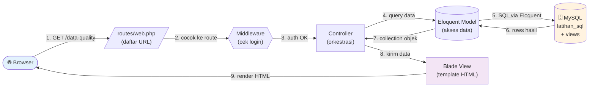

# Sesi 10 (Bagian 1) — Setup Laravel + Connect ke MySQL

Durasi: ~45 menit (Bagian 1 dari Sesi 10. Bagian 2: `materi-laravel-2-data-quality.md`)

## Bayangkan Skenario Ini

Anda baru menyelesaikan 25 query SQL di Hari 2. Atasan datang: *"Bagus query-nya. Sekarang tolong bikin halaman web yang menampilkan ini, supaya tim non-teknis bisa lihat tanpa harus jalankan SQL sendiri."*

Anda punya 3 pilihan:
1. Pakai dashboard tool no-code (Metabase) — cepat tapi tidak fleksibel
2. Bikin app dari nol (Laravel) — lebih lama tapi fully custom & portable
3. Hire orang lain (terlalu lama)

Hari 3 melatih opsi #2: **bangun aplikasi Laravel** yang menampilkan data Hari 2.

---

## Yang Akan Anda Pelajari

1. Install Laravel (paling mudah pakai Laravel Herd)
2. Konfigurasi koneksi ke MySQL existing (`latihan_sql`)
3. Bikin Eloquent Model yang baca dari View SQL
4. Setup project dengan struktur yang clean

---

## Arsitektur yang Akan Dibangun

Sebelum masuk ke teknis, pahami **bagaimana request mengalir** dari browser sampai ke database lalu kembali ke layar pengguna. Ini "anatomi" aplikasi Laravel yang akan Anda bangun di Hari 3:



### Penjelasan 9 Langkah

| # | Aktor | Yang Terjadi | File yang Anda Sentuh |
|---|-------|--------------|----------------------|
| 1 | **Browser** | User ketik URL atau klik link | — |
| 2 | **Router** | Cocokkan URL dengan daftar route, teruskan ke method Controller | `routes/web.php` |
| 3 | **Middleware** | Cek otorisasi (auth, csrf, dst.). Kalau gagal, redirect | (otomatis) |
| 4 | **Controller** | Method dipanggil. Orkestrasi: panggil Model, siapkan data | `app/Http/Controllers/*.php` |
| 5 | **Model** | Eloquent generate query SQL → kirim ke DB | `app/Models/*.php` |
| 6 | **Database** | Eksekusi query → balas baris hasil | (view di MySQL) |
| 7 | **Model** | Convert baris jadi objek Collection | (otomatis Eloquent) |
| 8 | **Controller** | Terima data, kirim ke View dengan `compact()` atau `view(..., $data)` | (lanjutan langkah 4) |
| 9 | **Blade View** | Render template Blade → HTML → kirim ke browser | `resources/views/**/*.blade.php` |

### Yang Penting Diingat

| Konsep | Inti |
|--------|------|
| **Tiap halaman = 4 file** | Route + Controller + Model + Blade |
| **Eloquent = abstraksi SQL** | Tidak perlu nulis SELECT/JOIN manual untuk kasus umum |
| **Blade = template HTML** | Bisa loop, conditional, tapi logic tetap di Controller |
| **Middleware = penjaga** | Cek dulu sebelum Controller dijalankan |

Setelah paham alur ini, langkah selanjutnya jadi jelas: Sesi 9 fokus ke **Model + Database**, Sesi 10 lanjut ke **Controller + Blade**, Sesi 11 perkaya tampilan, Sesi 12 tambah Middleware auth.

---

## 1. Kenapa Laravel?

Laravel adalah framework PHP yang sangat populer untuk membangun aplikasi web. Cocok untuk workshop ini karena:

| Kelebihan | Manfaat di Workshop |
|-----------|---------------------|
| **Convention over Configuration** | Banyak hal sudah tersedia tanpa setup ribet |
| **Eloquent ORM** | Akses database dengan sintaks objek (mirip method chaining) |
| **Blade Templating** | Sintaks template intuitif, mirip HTML biasa |
| **Composer + Artisan** | Tools lengkap untuk bikin model, migration, controller dengan 1 perintah |
| **AI Cursor lihai PHP** | Generate code Laravel sangat akurat |

Tidak butuh setup file webpack/build complex. Dengan 5 perintah, sudah bisa bikin halaman.

---

## 2. Install Laravel Herd (Cross-platform)

**Laravel Herd** adalah aplikasi gratis yang bundle PHP + Composer + Node + DB. Tersedia untuk **macOS dan Windows**. Setup 5 menit.

### Langkah Install

#### macOS

1. Buka <https://herd.laravel.com> → klik **Download for Mac**
2. Drag `Herd.app` ke `/Applications`
3. Buka Herd → ikuti wizard setup (~2 menit)

#### Windows

1. Buka <https://herd.laravel.com/windows> → klik **Download for Windows**
2. Run installer `Herd-x.x.x-setup.exe`
3. Ikuti wizard install → **restart komputer** kalau diminta
4. Buka **PowerShell** atau **Command Prompt** baru

### Verifikasi (Sama di Mac & Windows)

Buka terminal (Terminal di Mac, PowerShell di Windows), jalankan:

```bash
php --version
# → PHP 8.3.x atau 8.2.x

composer --version
# → Composer 2.x

laravel --version
# → Laravel Installer 5.x
```

Kalau tiga perintah di atas jalan, install berhasil.

> 💡 **Alternatif Windows**: XAMPP juga bisa (familiar untuk peserta Indonesia). Download dari <https://www.apachefriends.org>, lalu install Composer terpisah dari <https://getcomposer.org/download>. Tapi versi PHP XAMPP kadang lawas (cek `php --version` setelah install).
>
> 💡 **Alternatif macOS**: `brew install php@8.3 composer` lalu `composer global require laravel/installer`.

---

## 3. Buat Project Laravel Baru

### macOS

```bash
# Pindah ke folder kerja
cd ~/Projek/mm_cursor

# Bikin project baru
laravel new dashboard-app
cd dashboard-app
```

### Windows (PowerShell)

```powershell
# Pindah ke folder kerja (sesuaikan dengan tempat Anda menyimpan project)
cd C:\Users\$env:USERNAME\Projects

# Atau buat folder dulu kalau belum ada
mkdir Projects -Force; cd Projects

# Bikin project baru
laravel new dashboard-app
cd dashboard-app
```

### Pilihan Saat Ditanya (Mac & Windows)

```
- Starter Kit?     → None
- Tests?           → No (boleh PHPUnit nanti)
- Database?        → MySQL
- Run migration?   → No
```

### Jalankan (Sama di Mac & Windows)

```bash
php artisan serve
```

Buka <http://localhost:8000>. Welcome page Laravel muncul. ✓

> ⚠️ Pastikan port 8000 tidak dipakai. Kalau bentrok, pakai `php artisan serve --port=8001`.

---

## 4. Konfigurasi Koneksi ke `latihan_sql`

Buka file `.env` di root project. Cari bagian database, edit jadi:

```
DB_CONNECTION=mysql
DB_HOST=127.0.0.1
DB_PORT=3306
DB_DATABASE=latihan_sql
DB_USERNAME=root
DB_PASSWORD=password_mysql_anda
```

Test koneksi:

```bash
php artisan tinker
```

Di prompt tinker, ketik:

```php
DB::table('customers')->count();
```

Output harus angka (jumlah customer di Hari 2). Kalau muncul **13**, koneksi sukses ✓.

Keluar tinker: `exit`.

---

## 5. Konsep Eloquent Model

**Eloquent** adalah ORM (Object-Relational Mapper) Laravel. Tujuannya: akses data tanpa nulis SQL panjang.

Tanpa Eloquent:
```php
$customers = DB::select("SELECT * FROM customers WHERE tier = 'gold'");
foreach ($customers as $c) { echo $c->name; }
```

Dengan Eloquent:
```php
$customers = Customer::where('tier', 'gold')->get();
foreach ($customers as $c) { echo $c->name; }
```

Lebih ringkas, lebih mudah dibaca.

### Membuat Model untuk Table

```bash
php artisan make:model Customer
```

Akan ter-generate `app/Models/Customer.php`:

```php
<?php

namespace App\Models;

use Illuminate\Database\Eloquent\Model;

class Customer extends Model
{
    // Default: assume table 'customers' (plural lowercase)
    // Default: assume primary key 'id'
    // Default: timestamps (created_at, updated_at) ada
}
```

Karena tabel kita namanya `customers` (plural), Eloquent otomatis tahu. Tanpa konfigurasi apapun, sudah bisa dipakai.

---

## 6. Eloquent Model untuk View

Untuk view SQL (mis. `v_assertion_t1_subtotal_mismatch`), ada 2 hal yang harus disesuaikan dari Model default:

```php
<?php

namespace App\Models;

use Illuminate\Database\Eloquent\Model;

class AssertionT1 extends Model
{
    protected $table = 'v_assertion_t1_subtotal_mismatch';  // nama view
    public $timestamps = false;                              // view tidak punya created_at/updated_at
}
```

Setelah itu pakai seperti Model biasa:

```php
// Jumlah pelanggar
$failed_count = AssertionT1::count();

// Detail pelanggar, sorted by severity
$details = AssertionT1::orderByRaw('ABS(difference) DESC')->get();
```

---

## 7. Konvensi Penamaan

Aturan emas: **konsisten supaya Eloquent magic jalan otomatis**.

| Hal | Konvensi | Contoh |
|-----|----------|--------|
| Nama tabel di DB | plural lowercase | `customers`, `orders` |
| Nama Model di PHP | singular PascalCase | `Customer`, `Order` |
| Nama view di DB | prefix + snake_case | `v_assertion_t1_*`, `v_reporting_*` |
| Nama Model untuk View | PascalCase deskriptif | `AssertionT1`, `MonthlyRevenue` |
| Primary key | `id` | `id` |
| Foreign key | `{singular}_id` | `customer_id`, `order_id` |

Saat Anda bikin model dengan `php artisan make:model Customer`, Laravel langsung tahu mau ke table `customers`.

---

## 8. Struktur Folder Laravel (yang Akan Kita Pakai)

```
dashboard-app/
├── app/
│   ├── Http/
│   │   └── Controllers/         <- Sesi 10: DataQualityController.php
│   └── Models/                  <- Sesi 9: 11 Model untuk view
├── database/
│   └── migrations/              <- (jarang dipakai, schema sudah ada di MySQL)
├── resources/
│   └── views/                   <- Sesi 10: Blade template dashboard
├── routes/
│   └── web.php                  <- Sesi 10: definisikan URL → Controller
├── public/                      <- assets statis (favicon, dst.)
├── .env                         <- konfigurasi DB (jangan commit)
├── .env.example                 <- template .env
└── composer.json                <- dependencies PHP
```

Untuk Hari 3, **kita hanya menyentuh 4 folder utama**:
- `app/Models/` — definisi data
- `app/Http/Controllers/` — logic per halaman
- `resources/views/` — tampilan HTML
- `routes/web.php` — peta URL

Tidak perlu paham seluruh struktur Laravel untuk hari ini.

---

## 9. AI Cursor + Laravel = Powerful Combo

Cursor sangat lihai Laravel. Beberapa prompt yang sering dipakai:

```
@file app/Models/Customer.php

Bikin Model AssertionT1 yang map ke view v_assertion_t1_subtotal_mismatch.
View ini punya kolom: order_id, header_subtotal, detail_sum, difference.
Read-only (tidak ada save/update).
```

Atau:

```
Saya mau bikin Controller untuk dashboard data quality.
Endpoint: GET /data-quality
Tampilkan 10 badge (T1-T10) dengan status PASS/FAIL berdasarkan jumlah row di tiap view.
View Eloquent Model sudah ada di app/Models/AssertionT1.php sampai T10.

Bikin:
1. Controller dengan method index()
2. Blade template index.blade.php
3. Route di routes/web.php
```

AI generate 80% code, Anda review + adjust 20%. Itu sudah saya buktikan di workshop sebelumnya.

---

## 10. Anti-Pattern di Laravel + AI

| ❌ Hindari | ✅ Lakukan |
|-----------|-----------|
| Bikin Migration untuk schema yang sudah ada | Schema dari Hari 2 — Migration tidak perlu |
| Bikin Model dengan `$fillable = []` semua kolom | View read-only, tidak perlu `$fillable` |
| Pakai raw `DB::select` di semua tempat | Pakai Eloquent Model untuk konsistensi |
| Terima output AI tanpa cek nama tabel/kolom | Verifikasi dulu: bandingkan dengan schema |
| Lupa set `$timestamps = false` untuk view | Selalu set untuk view (tidak ada created_at) |

---

## Demo Live (15 menit)

1. Install Laravel Herd
2. `laravel new dashboard-app`
3. Edit `.env` untuk koneksi `latihan_sql`
4. `php artisan tinker` → `DB::table('customers')->count()`
5. Bikin `app/Models/Customer.php` manual
6. `php artisan tinker` → `App\Models\Customer::count()`
7. Bikin `app/Models/AssertionT1.php` (dengan `protected $table` + `$timestamps = false`)
8. `php artisan tinker` → `App\Models\AssertionT1::count()` → harus dapat 11

---

## Lanjut ke Latihan

[`latihan-08-laravel-setup/`](./latihan-08-laravel-setup/)

---

## Ringkasan 1 Halaman

- **Laravel** = framework PHP untuk web app, cocok untuk full-stack ringan.
- **Laravel Herd** = cara termudah install di Mac (PHP + Composer + lainnya bundled).
- **`laravel new`** = scaffold project baru.
- **`.env`** = config (DB credentials), tidak di-commit ke git.
- **Eloquent Model** = akses data tanpa SQL panjang.
- **Model untuk View** = perlu `protected $table` + `$timestamps = false`.
- **Konvensi**: tabel plural lowercase, Model singular PascalCase.
- **AI Cursor** sangat lihai Laravel — pakai prompt spesifik dengan @file Model untuk context.
