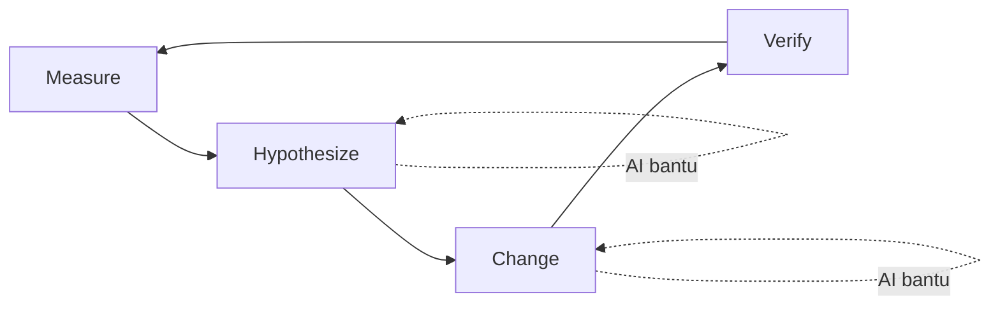
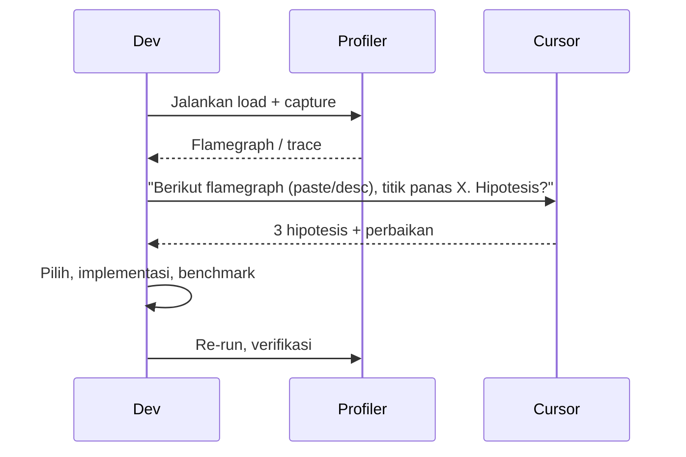

# Sesi 11 — Best Practices & Performance Optimization dengan AI

**Durasi**: 90 menit
**Sesi ke**: 11 dari 12
**Format**: Materi (35 menit) + Demo (25 menit) + Mini-Lab (25 menit) + Wrap-up (5 menit)

---

## 1. Learning Outcomes

Setelah sesi ini, peserta mampu:

1. **Menerapkan praktik terbaik** prompt engineering untuk tugas performance tuning dan optimasi sistem.
2. **Menggunakan Cursor sebagai partner analisis** dalam profiling, bottleneck identification, dan hipotesis perbaikan — bukan sebagai eksekutor buta.
3. **Mendesain strategi scalability & reliability** (caching, queueing, indexing, circuit breaker) dengan akselerasi AI pada langkah desain dan implementasi.
4. **Menghindari 5 anti-pattern** umum saat memakai AI untuk optimasi (premature optimization, mikro-tuning tanpa profil, dsb).
5. **Mengukur dampak** perubahan via metrik objektif (p95, throughput, error rate) sebelum & sesudah.

---

## 2. Konsep Inti

### 2.1 Filosofi: AI sebagai Akselerator Hipotesis



AI **paling bernilai** di tahap *Hypothesize* dan *Change*. AI **tidak boleh menggantikan** *Measure* dan *Verify* yang berbasis data lapangan.

### 2.2 Anti-Pattern: 5 Hal yang Harus Dihindari

| # | Anti-Pattern | Mengapa Buruk | Pengganti |
|---|--------------|---------------|-----------|
| 1 | "Buatkan kode tercepat untuk X" tanpa profil | AI mengoptimasi cabang yang bukan bottleneck | Profil dulu, lokasi titik panas baru tanya |
| 2 | Micro-tuning loop yang dijalankan 100 kali/hari | ROI sangat kecil | Fokus path 1M+/hari |
| 3 | Refactor masal tanpa benchmark | Tidak ada bukti perbaikan | Benchmark before/after |
| 4 | Trust output "ini O(n log n)" tanpa verifikasi | AI bisa salah analisis kompleksitas | Validasi manual + tes empiris |
| 5 | Caching agresif tanpa invalidation strategy | Bug data stale lebih mahal dari latency saved | Definisikan TTL/invalidation lebih dulu |

### 2.3 Praktik Terbaik Prompt untuk Performance

**Anatomi prompt performance yang baik**:

```
[KONTEKS]   Endpoint X dipanggil ~1.200 RPS, p95 saat ini 850ms target 250ms.
[DATA]      Flamegraph menunjukkan 62% waktu di fungsi parseInvoice().
[KENDALA]   Tidak boleh ubah skema DB. Memory budget naik max 10%.
[PERMINTAAN] Sarankan 3 hipotesis penyebab + perbaikan ranked by risk.
[FORMAT]    Markdown, kolom: hipotesis, perbaikan, risiko, effort.
```

### 2.4 Tujuh Pola Optimasi Klasik (dipercepat AI)

| Pola | Sasaran | Kapan Cocok |
|------|---------|-------------|
| **Caching (read-through)** | Mengurangi DB load | Read >> Write, data toleran stale |
| **Batching** | Mengurangi overhead per call | Banyak request kecil |
| **Indexing** | Mempercepat query | Query dengan WHERE/JOIN pada kolom hot |
| **Async / Queueing** | Decouple latency | Operasi tidak harus sinkron |
| **Connection pooling** | Hindari handshake cost | Banyak short-lived call ke DB |
| **N+1 elimination** | Kurangi roundtrip | ORM lazy loading |
| **Memoization** | Hindari komputasi ulang | Pure function, input kecil |

### 2.5 Scalability — Pertanyaan ke AI yang Produktif

- *"Identifikasi titik di kode ini yang menjadi single point of failure bila RPS 10x."*
- *"Sarankan strategi horizontal scaling untuk service ini, perhatikan state yang ada."*
- *"Analisis: bagian mana yang stateful dan harus dipindah ke storage eksternal?"*

### 2.6 Reliability — Cursor untuk Resilience Patterns

| Pattern | Pertanyaan ke AI |
|---------|------------------|
| Retry + backoff | "Tambahkan retry eksponensial untuk client X dengan jitter, max 3 attempts." |
| Circuit breaker | "Bungkus pemanggilan ke Y dengan circuit breaker (resilience4j/opossum), threshold 50% error dalam 30 detik." |
| Timeout | "Audit semua HTTP call yang tidak punya timeout eksplisit, tampilkan listnya." |
| Bulkhead | "Pisahkan pool koneksi untuk endpoint critical dan non-critical." |
| Graceful degradation | "Bila service rekomendasi down, return empty list bukan 500." |

### 2.7 Profiling-First Workflow



### 2.8 Studi Kasus Enterprise (Ringkas)

**Kasus A — E-commerce checkout p95 dari 1.4s ke 380ms**

- Profiler menunjukkan 70% waktu di rendering halaman thank-you (server-side, ambil rekomendasi).
- AI bantu identifikasi: panggilan ke service rekomendasi sinkron, tidak ada timeout.
- Perbaikan: pindahkan rekomendasi ke client-side fetch + circuit breaker.
- Hasil: p95 turun 73%, conversion naik 4.2%.

**Kasus B — Pipeline ETL nightly dari 6 jam ke 75 menit**

- Bottleneck: query yang full table scan setiap iterasi.
- AI sarankan composite index + pre-aggregate ke tabel staging.
- Hasil: 4.8x lebih cepat, biaya compute turun 60%.

**Kasus C — Service authentication crash setiap deploy**

- Investigasi: connection pool tidak di-warm, request awal timeout.
- AI bantu generate warm-up routine + readiness probe yang akurat.
- Hasil: error rate deploy day turun dari 2.1% ke 0.04%.

<!-- STACK-PLACEHOLDER: Sesuaikan studi kasus dengan stack mayoritas peserta. Untuk data engineer, ganti dengan kasus Spark/Airflow. -->

### 2.9 Mengukur Dampak

Wajib sebelum merge perubahan performance:

1. **Baseline metric** (p50, p95, p99, throughput, error rate).
2. **Hypothesis statement** ("perubahan ini akan menurunkan p95 endpoint X minimal 30%").
3. **Test methodology** (load test tool, durasi, profil traffic).
4. **Result + delta vs baseline**.
5. **Side effect check** (memory, CPU, downstream load).

---

## 3. Demo Live (25 menit)

**Skenario**: Service `/api/dashboard` p95 5.2s, target 1s.

**Langkah 1** — Profil dengan clinic.js / py-spy / pprof, capture flamegraph.

**Langkah 2** — Tempel ringkasan flamegraph ke Cursor:
> "Flamegraph: 48% di getUserStats (sequential DB queries), 22% di renderJSON. Sarankan 3 hipotesis perbaikan dengan estimasi dampak."

**Langkah 3** — Pilih hipotesis terkuat (N+1 query). Minta Cursor:
> "Refactor getUserStats agar fetch dalam satu query JOIN. Tunjukkan before/after."

**Langkah 4** — Tambahkan cache layer Redis dengan TTL 60 detik. Diskusikan invalidation strategy.

**Langkah 5** — Re-run load test, bandingkan metrik. Tunjukkan reporting akhir.

---

## 4. Mini-Lab (25 menit)

**Skenario**: Repo demo `slow-dashboard` (disediakan).
**Tugas**:

1. Jalankan load test (k6 / autocannon) → catat baseline.
2. Identifikasi 2 bottleneck dengan bantuan Cursor.
3. Implementasi 1 perbaikan.
4. Re-run load test → catat hasil.
5. Tulis 1 paragraf "perubahan + dampak + risiko".

Submit hasil ke shared channel kelas.

---

## 5. Wrap-up & Q&A

1. Mengapa "measure first" tidak boleh dilewati meski AI bisa "menebak" bottleneck?
2. Apa risiko caching yang sering dilupakan pemula?
3. Bagaimana memvalidasi klaim AI tentang Big-O kompleksitas?
4. Kapan optimasi cukup? (definisi *good enough*)
5. Apa metrik favorit Anda untuk reliability dan mengapa?

---

## 6. Bacaan Lanjutan

- *Site Reliability Engineering* — Google (bab SLI/SLO/Error Budget).
- *Designing Data-Intensive Applications* — Martin Kleppmann.
- *Release It!* — Michael Nygard (resilience patterns).
- Brendan Gregg — *Systems Performance*, dan blog tentang flamegraph.
- Google Cloud — *The Four Golden Signals*.
- Cursor Docs — *Long context workflows for codebase analysis*.
