# Sesi 12 — Capstone Project: Brief & Panduan

**Durasi**: 180 menit
**Format**: Tim 3–4 orang
**Tujuan**: Mendemonstrasikan kemampuan end-to-end AI-assisted development pada studi kasus mendekati realita kerja.

---

## 1. Brief Lengkap

Anda dan tim adalah skuad kecil yang ditugaskan menyelesaikan **satu masalah engineering konkret** dalam waktu terbatas. Anda bebas memilih satu dari 5 opsi proyek di [`opsi-project.md`](./opsi-project.md). Pilihan harus sesuai mayoritas latar belakang tim (backend-heavy, data-heavy, dst).

Selama capstone Anda wajib menggunakan Cursor di **minimal 4 dari 5 aktivitas berikut**:

1. **Code generation** (komponen baru / endpoint / pipeline).
2. **Debugging** dengan AI sebagai partner hipotesis.
3. **Refactoring** dengan justifikasi yang Anda tuliskan.
4. **Testing** (unit / integration) yang di-generate lalu disempurnakan.
5. **Documentation** (README, ADR, atau API doc).

Anda juga wajib menerapkan minimal **2 praktik dari Sesi 09–11**:

- Conventional Commits + PR description AI-assisted.
- `.cursorignore` + secret scan pre-commit.
- Baseline metrik + perbaikan terukur.
- Resilience pattern (retry / timeout / circuit breaker).

---

## 2. Aturan Tim

- **Komposisi**: 3–4 orang, idealnya campuran peran (1 lead, 1–2 implementer, 1 QA/presenter).
- **Pembagian peran wajib**:
  - **Tech Lead / Architect** — menyusun rencana, memutuskan trade-off.
  - **Builder(s)** — implementasi utama.
  - **Reviewer / QA** — uji coba, test, dokumentasi.
  - **Presenter** — bisa merangkap, fokus menyiapkan demo & slide.
- **Aturan etis**:
  - Tidak menggunakan data klien / data internal asli.
  - Hanya pakai dataset/dummy yang disediakan fasilitator.
  - Setiap commit penting harus dijelaskan saat presentasi.
- **Aturan teknis**:
  - Repo wajib di GitHub (public/private, asal fasilitator bisa akses).
  - Minimal 1 PR yang di-review antar anggota tim.
  - Minimal 1 workflow CI berjalan.
  - `.cursorrules` & `.cursorignore` ada dan masuk repo.

---

## 3. Timeline 180 Menit

```mermaid
gantt
    title Timeline Capstone (180 menit)
    dateFormat  HH:mm
    axisFormat  %H:%M
    section Planning
    Kickoff & pemilihan opsi      :a1, 15:00, 10m
    Brainstorm + arsitektur       :a2, after a1, 15m
    Penugasan + setup repo        :a3, after a2, 5m
    section Eksekusi
    Sprint 1 (build)              :b1, after a3, 45m
    Mid-checkpoint fasilitator    :b2, after b1, 5m
    Sprint 2 (integrate + test)   :b3, after b2, 45m
    Polishing + dokumentasi       :b4, after b3, 25m
    section Presentasi
    Setup demo                    :c1, after b4, 5m
    Presentasi tim (per 7 menit)  :c2, after c1, 25m
```

### Rincian per Fase

#### Fase 1 — Planning (30 menit)

| Menit | Aktivitas | Output |
|-------|-----------|--------|
| 0–10 | Pilih opsi, baca requirement, pastikan paham | Opsi terpilih + risiko awal |
| 10–25 | Brainstorm arsitektur dengan Cursor sebagai partner | Diagram + daftar komponen |
| 25–30 | Bagi tugas, setup repo & `.cursorrules` | Issue/task list di Kanban |

#### Fase 2 — Eksekusi (120 menit)

| Menit | Aktivitas | Output |
|-------|-----------|--------|
| 30–75 | Sprint 1: build kerangka berfungsi (happy path) | Endpoint/pipeline minimum jalan |
| 75–80 | Checkpoint fasilitator (sync 5') | Lampu hijau / koreksi arah |
| 80–125 | Sprint 2: integrasi, edge case, test, CI | Test pass, CI hijau |
| 125–150 | Polishing, dokumentasi, dry-run demo | README + skrip demo |

#### Fase 3 — Presentasi (30 menit)

Setiap tim presentasi **maksimal 7 menit** + 2 menit Q&A. Lihat [`template-presentasi.md`](./template-presentasi.md).

---

## 4. Deliverable yang Harus Dipresentasikan

Wajib (semua):

1. **Repo Git** dengan README jelas, struktur rapi, CI workflow.
2. **Demo live atau video pendek (≤3 menit)** menunjukkan solusi berjalan.
3. **Slide presentasi** 5–7 slide sesuai template.
4. **Daftar penggunaan AI**: ringkasan 4–6 prompt kunci + pelajaran.
5. **Refleksi tim** 1 paragraf: apa yang bekerja, apa yang tidak, apa yang akan diubah.

Bonus (mempengaruhi nilai presentasi):

- Diagram arsitektur (mermaid).
- ADR (Architecture Decision Record) singkat 1 halaman.
- Benchmark before/after (untuk opsi yang relevan).

---

## 5. Kriteria Penilaian

Detail di [`rubrik-penilaian.md`](./rubrik-penilaian.md). Bobot ringkas:

| Dimensi | Bobot |
|---------|-------|
| Functionality | 30% |
| AI Utilization | 30% |
| Code Quality | 20% |
| Presentation | 20% |

---

## 6. Tips dari Fasilitator

- **Mulai dari yang berjalan**, bukan dari yang sempurna. Sprint 1 = happy path; sprint 2 = perbaiki.
- **Commit kecil, sering** — memudahkan rollback bila Cursor mengarahkan ke jalan buntu.
- **Jangan paste rahasia** — capstone bukan alasan menurunkan standar keamanan.
- **Catat prompt yang berhasil** — itu deliverable berharga, jangan hilang di chat history.
- **Latihan presentasi 5 menit sebelum maju** — jeda singkat ini selalu membayar.

---

## 7. Checklist Final Sebelum Presentasi

- [ ] Repo public/shared & link siap dibagikan.
- [ ] README minimal: deskripsi, cara jalankan, screenshot.
- [ ] CI workflow hijau pada commit terakhir.
- [ ] Demo sudah dicoba dari laptop yang akan dipresentasikan.
- [ ] Slide sudah final (PDF backup).
- [ ] Setiap anggota tahu bagian mana yang akan dia ceritakan.
- [ ] Daftar prompt + refleksi tim ditulis di repo (`docs/CAPSTONE.md`).
