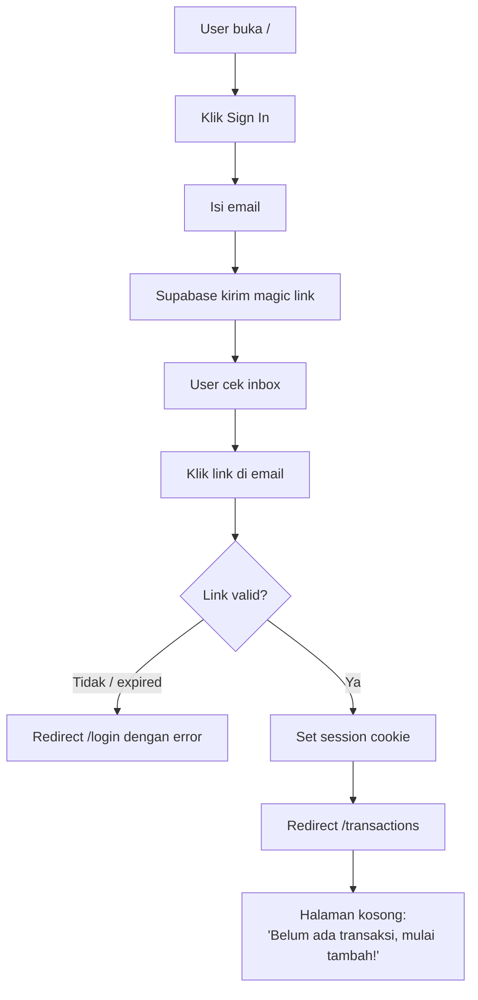
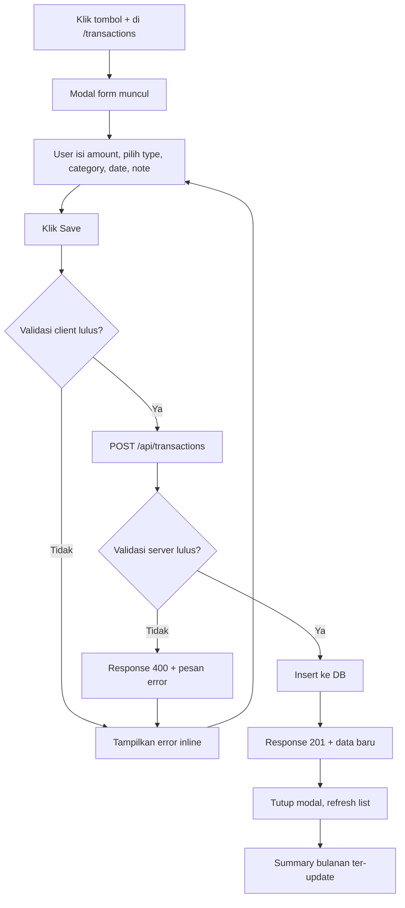
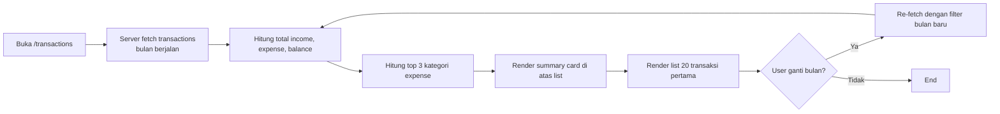
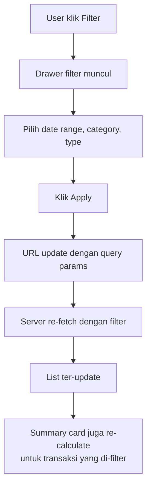

# BRD — Finance Tracker Sederhana

**Versi**: 1.0
**Status**: Draft (untuk review fasilitator)
**Dokumen referensi**: dipakai di Hari 2–3 pelatihan AI Cursor sebagai studi kasus

---

## 1. Latar Belakang

Banyak orang ingin mengelola keuangan pribadi tapi enggan pakai aplikasi besar (Money Lover, Wallet, dst.) yang punya iklan, sinkronisasi cloud yang rumit, atau fitur berlebihan. Kebutuhan dasarnya sederhana: **mencatat pemasukan & pengeluaran**, **melihat ringkasan bulanan**, dan **tahu kemana uang lari**.

**Finance Tracker** adalah aplikasi web minimalis untuk mencatat transaksi keuangan pribadi: 1 user, 1 kalender, 2 jenis transaksi (income / expense), kategori sederhana, dan ringkasan saldo.

### 1.1 Kenapa Studi Kasus Ini Cocok untuk Pelatihan

- **Domain familiar** — semua peserta paham konsep "pemasukan/pengeluaran", tidak perlu jelaskan domain.
- **Scope terkendali** — 1 entitas inti (transaction) + 1 entitas pendukung (category). Cukup untuk 4 sesi Hari 2 tanpa nyasar.
- **Banyak peluang bug realistis** — perhitungan saldo, timezone, format currency, race condition di update.
- **Banyak peluang refactor** — handler CRUD mudah membengkak, validasi tersebar.

---

## 2. Stakeholder & User Persona

### 2.1 Stakeholder

| Pihak | Kepentingan |
|-------|-------------|
| **End user** (Anda sendiri) | Aplikasi simpel, cepat, data privasi terjaga |
| **Developer** (peserta pelatihan) | Codebase yang mudah dipahami, dimaintain, ditest |
| **Fasilitator pelatihan** | Materi yang konsisten lintas peserta |

### 2.2 Persona Utama

**Nama**: Rama, 28, software engineer di Jakarta
**Konteks**: gajian tiap awal bulan, sering jajan di luar, tidak punya catatan rutin. Setiap akhir bulan bingung kenapa saldo cepat habis.
**Goal**: tahu **berapa total yang habis tiap kategori** per bulan, tanpa harus jadi *accountant*.
**Frustrasi dengan aplikasi lain**: terlalu banyak iklan, butuh login dari banyak tempat, ribet input.

---

## 3. Scope

### 3.1 In Scope (MVP — yang dibangun starter)

1. **Auth**: login dengan magic link (email-based).
2. **Catat transaksi**: tambah, edit, hapus transaksi dengan field amount, type (income/expense), category, date, note.
3. **Lihat transaksi**: list semua transaksi user, urut tanggal terbaru, pagination.
4. **Kategori**: 8 kategori default tidak bisa dihapus (food, transport, entertainment, shopping, bills, health, salary, other). User boleh tambah kategori custom.
5. **Ringkasan bulanan**: total income, total expense, balance bulan berjalan. Breakdown per kategori (text-based, belum chart).
6. **Filter**: filter transaksi by date range + by category.

### 3.2 Out of Scope (jangan dibangun di MVP)

- Multi-currency / konversi forex
- Recurring transaction / scheduled payment
- Budget per kategori dengan alarm
- Export CSV / PDF
- Sinkronisasi rekening bank (open banking API)
- Mobile app native
- Multi-user sharing (family budget)
- Chart visualisasi (kalau peserta mau eksplor di luar, silakan)
- Receipt scanning / OCR
- Notifikasi push / email reminder

---

## 4. Functional Requirements

### FR-01 — Auth Magic Link
User dapat sign in dengan email; sistem mengirim magic link yang valid 1 jam; klik link → session aktif sampai logout atau 7 hari.

### FR-02 — Add Transaction
User dapat menambah transaksi dengan:
- **amount** (number ≥ 0.01, presisi 2 desimal)
- **type** (income | expense)
- **category** (1 dari list default atau custom)
- **date** (tanggal transaksi, default hari ini)
- **note** (optional, max 500 char)

Validasi inline: amount harus angka positif; date tidak boleh > hari ini + 1 (toleransi timezone); category wajib.

### FR-03 — Edit Transaction
User dapat mengedit semua field transaksi miliknya. Tidak ada history audit (out of scope).

### FR-04 — Delete Transaction
User dapat menghapus transaksi miliknya dengan konfirmasi (dialog "Yakin hapus?").

### FR-05 — List Transactions
- Default tampilan: 20 transaksi terbaru, urut `date DESC, created_at DESC`.
- Pagination next/prev.
- Tiap baris: tanggal, kategori (warna pill), amount (warna hijau income, merah expense), note (truncated).

### FR-06 — Summary Bulanan
Di top halaman list:
- **Total Income** bulan ini
- **Total Expense** bulan ini
- **Balance** (income − expense)
- Toggle "Bulan ini / Bulan lalu / Pilih bulan"
- Breakdown per kategori (3 expense terbesar bulan ini)

### FR-07 — Filter Transactions
User dapat filter list dengan:
- **Date range** (from-to)
- **Category** (multi-select)
- **Type** (income/expense/all)

Filter combinable (AND).

### FR-08 — Manage Custom Category
User dapat:
- Tambah kategori custom (name + warna hex)
- Hapus kategori custom (hanya kalau tidak ada transaksi yang pakai)
- Kategori default 8 buah **tidak bisa** dihapus/diedit

---

## 5. Non-Functional Requirements

| ID | Aspek | Target |
|----|-------|--------|
| NFR-01 | **Performance** | Load `/transactions` < 1 detik untuk 500 transaksi |
| NFR-02 | **Privacy** | Data user terisolasi dengan RLS; tidak ada user yang bisa baca transaksi user lain |
| NFR-03 | **Accuracy** | Sum income/expense bulanan presisi 2 desimal, no floating-point error |
| NFR-04 | **Accessibility** | Lulus Lighthouse A11y ≥ 90; form punya label; warna hijau/merah punya icon pendamping untuk colorblind |
| NFR-05 | **Responsive** | Desktop ≥ 1024px optimal, mobile ≥ 360px jalan (boleh stack vertikal) |
| NFR-06 | **Browser support** | Chrome / Edge / Firefox versi 2 terakhir; Safari 17+ |

---

## 6. Model Data

### 6.1 Entitas

```
┌────────────────┐         ┌────────────────┐
│   user (auth)  │1───────*│  transaction   │
└────────────────┘         └────────────────┘
                                   *│
                                    │
                                    │
                                   1▼
                           ┌────────────────┐
                           │    category    │
                           └────────────────┘
```

### 6.2 Schema Detail

```sql
-- table category
create table category (
  id uuid primary key default gen_random_uuid(),
  user_id uuid references auth.users(id) on delete cascade, -- null = default kategori
  name text not null,
  color text not null default '#6b7280',  -- hex code
  is_default boolean not null default false,
  created_at timestamptz not null default now(),
  unique (user_id, name)  -- nama unik per user
);

-- 8 kategori default (user_id = null)
insert into category (name, color, is_default) values
  ('Food', '#f97316', true),
  ('Transport', '#3b82f6', true),
  ('Entertainment', '#a855f7', true),
  ('Shopping', '#ec4899', true),
  ('Bills', '#ef4444', true),
  ('Health', '#10b981', true),
  ('Salary', '#22c55e', true),
  ('Other', '#6b7280', true);

-- table transaction
create table transaction (
  id uuid primary key default gen_random_uuid(),
  user_id uuid not null references auth.users(id) on delete cascade,
  category_id uuid not null references category(id),
  amount numeric(12, 2) not null check (amount > 0),
  type text not null check (type in ('income', 'expense')),
  date date not null,
  note text default '' check (char_length(note) <= 500),
  created_at timestamptz not null default now(),
  updated_at timestamptz not null default now()
);

create index transaction_user_date_idx on transaction(user_id, date desc);
create index transaction_user_category_idx on transaction(user_id, category_id);
```

### 6.3 Aturan Konsistensi

- `amount` selalu **positif** — `type` yang menentukan tanda. Hindari amount negatif untuk expense (sumber bug klasik).
- `date` adalah tanggal transaksi (kapan duit dikeluarkan), bukan tanggal input — bisa beda.
- `category.user_id IS NULL` = kategori default global; kategori custom selalu punya `user_id`.

---

## 7. Flow Process

### 7.1 Flow: User Sign In Pertama Kali



### 7.2 Flow: Tambah Transaksi



### 7.3 Flow: Lihat Summary Bulanan



### 7.4 Flow: Filter & Search



---

## 8. Mockup (Wireframe ASCII)

### 8.1 Halaman `/transactions` (Desktop)

```
┌───────────────────────────────────────────────────────────────────────────┐
│  💰 Finance Tracker                              [rama@email.com] [Logout]│
├───────────────────────────────────────────────────────────────────────────┤
│                                                                           │
│   Ringkasan Juni 2026                                  [< Bulan Lalu ▼ >] │
│   ┌─────────────────┐  ┌─────────────────┐  ┌─────────────────┐           │
│   │ INCOME          │  │ EXPENSE         │  │ BALANCE         │           │
│   │  Rp 12,000,000  │  │  Rp  8,750,000  │  │ + Rp 3,250,000  │           │
│   └─────────────────┘  └─────────────────┘  └─────────────────┘           │
│                                                                           │
│   Top Kategori Bulan Ini:                                                 │
│   🍔 Food: Rp 3,200,000  ·  🛒 Shopping: Rp 1,800,000  ·  🚗 Transport: Rp│
│                                                                           │
├───────────────────────────────────────────────────────────────────────────┤
│   Transaksi                                  [Filter ⏷]  [+ Tambah Baru]  │
├───────────────────────────────────────────────────────────────────────────┤
│   Tgl     Kategori        Catatan                          Jumlah         │
│  ─────────────────────────────────────────────────────────────────────    │
│   05 Jun  🍔 Food         Makan siang gojek                 - 45,000      │
│   05 Jun  🚗 Transport    Top up Gopay                     - 200,000      │
│   04 Jun  💰 Salary       Gaji Juni                     + 12,000,000      │
│   03 Jun  🎬 Entertain    Netflix bulanan                  - 169,000      │
│   ...                                                                     │
│  ─────────────────────────────────────────────────────────────────────    │
│                                            [< Sebelumnya]  [Berikutnya >] │
└───────────────────────────────────────────────────────────────────────────┘
```

### 8.2 Modal Tambah Transaksi

```
┌─────────────────────────────────────────────┐
│  Tambah Transaksi                       [✕] │
├─────────────────────────────────────────────┤
│                                             │
│  Jenis:    ( ) Pemasukan   (●) Pengeluaran  │
│                                             │
│  Jumlah:   Rp [_______________________]     │
│            ↑ wajib > 0                      │
│                                             │
│  Kategori: [ Food                    ▼ ]    │
│                                             │
│  Tanggal:  [ 05 / 06 / 2026             ]   │
│                                             │
│  Catatan:  ┌─────────────────────────────┐  │
│            │                             │  │
│            │ (opsional, max 500 char)    │  │
│            └─────────────────────────────┘  │
│                                             │
│                       [ Batal ]  [ Simpan ] │
└─────────────────────────────────────────────┘
```

### 8.3 Halaman `/transactions` (Mobile, ≤ 768px)

```
┌──────────────────────────┐
│ ☰ 💰 Finance      [Avatar]│
├──────────────────────────┤
│  Juni 2026     [<] [>]   │
│  ┌─────────────────────┐ │
│  │ INCOME              │ │
│  │ Rp 12,000,000       │ │
│  └─────────────────────┘ │
│  ┌─────────────────────┐ │
│  │ EXPENSE             │ │
│  │ Rp 8,750,000        │ │
│  └─────────────────────┘ │
│  ┌─────────────────────┐ │
│  │ BALANCE             │ │
│  │ + Rp 3,250,000      │ │
│  └─────────────────────┘ │
├──────────────────────────┤
│  Transaksi      [Filter] │
│                          │
│  05 Jun · 🍔 Food        │
│  Makan siang gojek       │
│                 -45,000  │
│  ─────────────────────── │
│  05 Jun · 🚗 Transport   │
│  Top up Gopay            │
│                -200,000  │
│  ─────────────────────── │
│  ...                     │
│                          │
│         [ + Tambah ]     │ ← FAB float bottom-right
└──────────────────────────┘
```

### 8.4 Halaman Filter (Drawer)

```
┌────────────────────────────────────┐
│  Filter Transaksi             [✕]  │
├────────────────────────────────────┤
│                                    │
│  Tanggal Dari: [ 01 / 06 / 2026 ]  │
│  Tanggal Sampai: [ 30 / 06 / 2026] │
│                                    │
│  Jenis:                            │
│   (●) Semua  ( ) Income  ( ) Expense│
│                                    │
│  Kategori (centang yang ditampilkan)│
│   [✓] Food                         │
│   [✓] Transport                    │
│   [ ] Entertainment                │
│   [ ] Shopping                     │
│   [✓] Bills                        │
│   ...                              │
│                                    │
│       [ Reset ]    [ Terapkan ]    │
└────────────────────────────────────┘
```

---

## 9. Tech Assumption

- **Stack**: Next.js 14 (App Router) + TypeScript + Supabase (Postgres + Auth + RLS) + Tailwind CSS.
- **Deployment**: Vercel (frontend) + Supabase (backend, free tier cukup).
- **Format currency**: pakai `Intl.NumberFormat('id-ID', { style: 'currency', currency: 'IDR' })`.
- **Date library**: `date-fns` (lightweight, no moment).
- **No state library** (Zustand/Redux): React state + URL search params + server fetch cukup untuk MVP.

---

## 10. Risiko & Mitigasi

| Risiko | Likelihood | Dampak | Mitigasi |
|--------|-----------|--------|----------|
| Floating point error di sum amount | Tinggi | Tinggi | Pakai `numeric(12, 2)` di DB; di JS pakai string atau cents (×100) saat hitung |
| Timezone bug saat group by date | Tinggi | Sedang | Simpan `date` sebagai `DATE` (bukan `timestamptz`); query pakai `date_trunc('month', date)` |
| User salah pilih type (income vs expense) | Sedang | Sedang | UI default `expense` (lebih sering); konfirmasi visual kuat (warna + ikon) |
| Race condition di edit/delete | Rendah | Rendah | Disable button saat in-flight; toast feedback success/error |
| Magic link tidak masuk inbox | Sedang | Tinggi (blocking) | Pesan jelas "cek folder spam"; tombol "Kirim ulang" dengan throttle 60 detik |

---

## 11. Definisi Selesai (Definition of Done)

Starter dianggap selesai kalau:

- [ ] Semua FR-01 s.d. FR-08 jalan di lokal.
- [ ] RLS aktif: user A tidak bisa baca/edit transaksi user B (test manual).
- [ ] Summary bulanan akurat (test manual dengan 10 transaksi: hand-count vs UI).
- [ ] Responsive: desktop & mobile (DevTools 360px) tidak pecah.
- [ ] `README.md` peserta jelas: dari `git clone` sampai `/transactions` punya data, < 10 menit.
- [ ] Tidak ada error di DevTools console pada happy path.
- [ ] `pnpm build` lulus tanpa warning TypeScript.

---

## 12. Lampiran

- **Schema lengkap**: lihat `supabase/migrations/0001_init.sql` di starter (akan dibuat di Phase 2).
- **API contract**: lihat `docs/api.md` di starter (akan dibuat di Phase 2).
- **Component list**: lihat `docs/components.md` di starter (akan dibuat di Phase 2).
