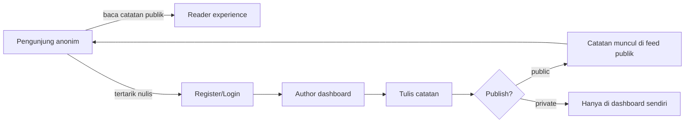
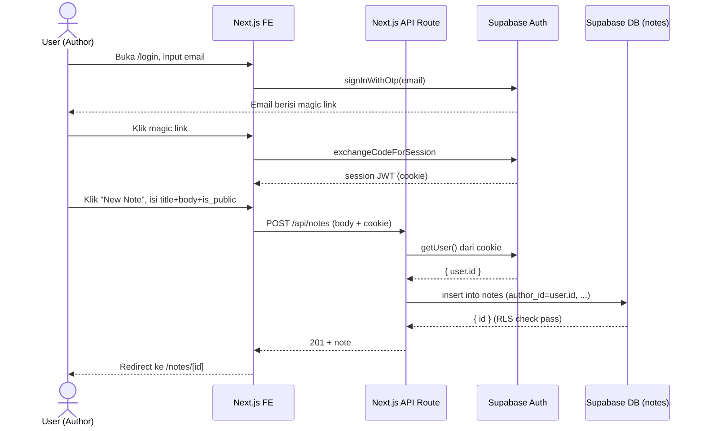
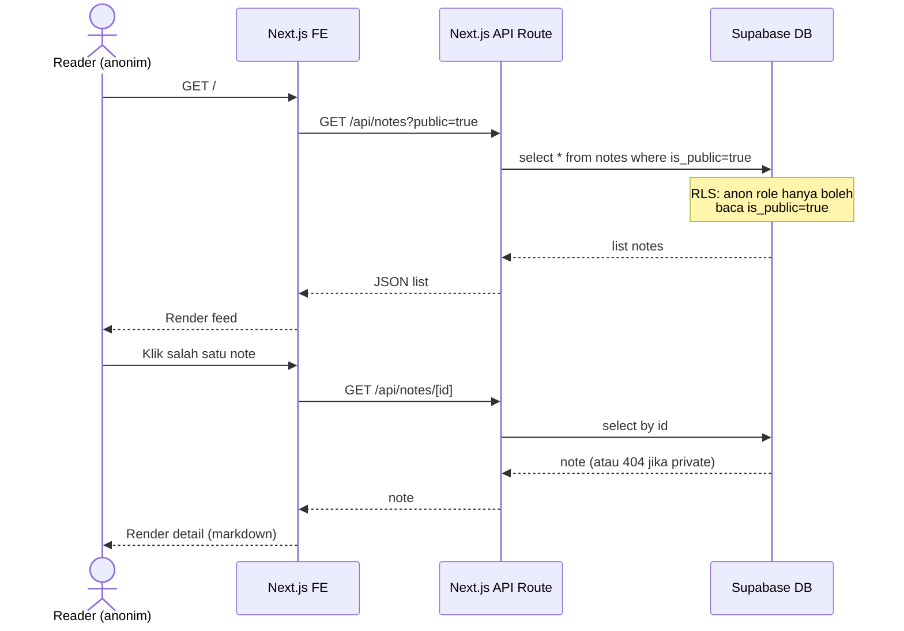
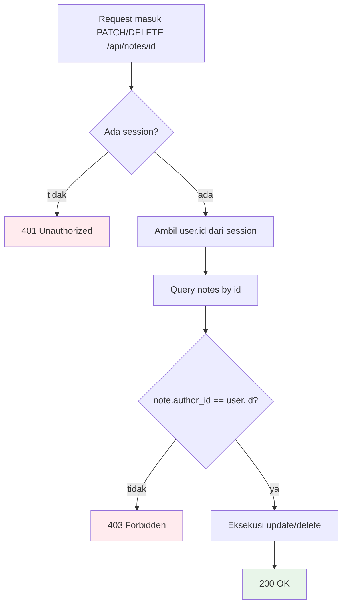
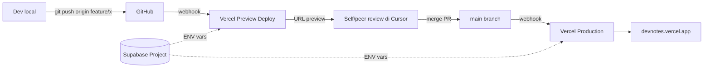
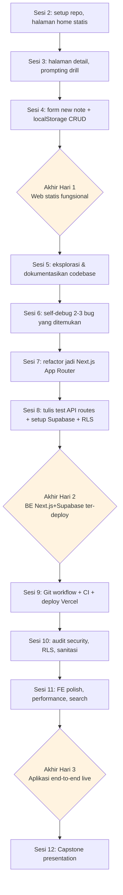

# BRD — DevNotes (Aplikasi Catatan Pembelajaran Developer)

**Versi**: Draft 0.1
**Tanggal**: 2026-06-02
**Konteks**: Project akhir pelatihan AI Cursor 3 hari (Multimatics)
**Stack**: HTML/CSS/JS (Hari 1) → Next.js + Supabase + Vercel (Hari 2–3)

---

## 1. Latar Belakang

Developer dan tim engineering banyak belajar setiap hari (bug yang dipecahkan, teknik baru, keputusan arsitektur), tapi pengetahuan itu sering hilang karena tidak ditulis. Tools yang ada (Notion, Confluence) terlalu berat untuk catatan teknis pendek, sementara Markdown lokal sulit dibagi ke tim.

**DevNotes** adalah aplikasi catatan ringan untuk developer mencatat pembelajaran teknis, dapat diakses lewat web, dan dibagikan ke publik (opsional) atau tetap privat.

## 2. Tujuan Bisnis

| #  | Tujuan                                                                       | Indikator                                                |
| -- | ---------------------------------------------------------------------------- | -------------------------------------------------------- |
| T1 | Developer punya tempat sederhana untuk write & publish catatan teknis        | User bisa publish catatan < 60 detik dari klik "New"     |
| T2 | Catatan dapat ditemukan & dibaca tanpa login                                 | Halaman publik bisa diakses anonim, indeks Google        |
| T3 | Aman & sederhana untuk dijadikan starter kit pelatihan                       | Tidak ada secret leak, RLS aktif, deploy < 10 menit      |

## 3. Target Pengguna

- **Author** — developer yang menulis catatan (terdaftar, login via email magic link).
- **Reader** — siapa saja yang membaca catatan publik (anonim, tidak perlu login).

## 4. Ruang Lingkup

### In-Scope (MVP)

**Hari 1 — Web statis (HTML/CSS/JS, data dummy)**
- Halaman daftar catatan (mock data hardcoded di JS)
- Halaman detail catatan (markdown sederhana render)
- Form "tulis catatan baru" (disimpan di `localStorage` saja)

**Hari 2 — Backend Next.js + Supabase + Vercel**
- Migrate ke Next.js (App Router)
- Schema Supabase: `notes`, integrasi dengan `auth.users`
- Auth Supabase (magic link)
- API Routes: `GET /api/notes`, `GET /api/notes/[id]`, `POST /api/notes`, `PATCH/DELETE /api/notes/[id]` (owner only)
- RLS: author hanya bisa edit miliknya, public read untuk catatan `is_public=true`
- Deploy ke Vercel + Supabase environment

**Hari 3 — Frontend integrasi + polish**
- Halaman FE Next.js yang konsumsi API:
  - `/` — feed catatan publik
  - `/login` — auth flow
  - `/dashboard` — daftar catatan user
  - `/notes/new` — editor
  - `/notes/[id]` — detail (public)
  - `/notes/[id]/edit` — edit (owner only)
- Search sederhana (filter judul, query SQL ILIKE)
- Deploy final + share link

### Out-of-Scope (eksplisit)

- Komentar, like, follow user
- Markdown editor canggih (pakai `<textarea>` + render `marked` / `react-markdown`)
- Tagging/kategori (boleh sebagai bonus, tidak wajib)
- Upload gambar/lampiran
- Notifikasi email
- Multi-tenant / organization

## 5. Functional Requirements

| FR#   | Deskripsi                                                                 | Hari            |
| ----- | ------------------------------------------------------------------------- | --------------- |
| FR-01 | User dapat melihat daftar catatan publik di halaman utama                 | 1 (mock), 3 (live) |
| FR-02 | User dapat membaca detail catatan tanpa login                             | 1, 3            |
| FR-03 | User dapat mendaftar & login via email magic link                         | 2               |
| FR-04 | User login dapat membuat catatan baru (judul, body markdown, is_public)   | 1 (local), 2 (API), 3 (UI) |
| FR-05 | User login dapat melihat dashboard berisi catatan miliknya                | 3               |
| FR-06 | User login dapat mengedit/menghapus catatan miliknya                      | 2 (API), 3 (UI) |
| FR-07 | User dapat mencari catatan berdasarkan judul                              | 3               |
| FR-08 | Catatan privat tidak boleh diakses user lain (RLS)                        | 2               |

## 6. Non-Functional Requirements

| NFR#   | Aspek           | Target                                                                            |
| ------ | --------------- | --------------------------------------------------------------------------------- |
| NFR-01 | Performance     | First contentful paint < 2.5s di koneksi 4G                                       |
| NFR-02 | Security        | Tidak ada API key di FE; RLS aktif untuk semua tabel; input disanitasi sebelum render markdown |
| NFR-03 | Maintainability | Struktur folder konsisten dengan default Next.js App Router                       |
| NFR-04 | Deployability   | `git push` ke main otomatis trigger deploy Vercel; migration Supabase reproducible |
| NFR-05 | Accessibility   | Lulus axe-core basic checks (semantic HTML, label form, kontras)                  |

## 7. Model Data

```
users  (managed by Supabase Auth → schema auth.users)
  id          uuid    PK
  email       text
  created_at  timestamptz

notes
  id          uuid          PK  default gen_random_uuid()
  author_id   uuid          FK → auth.users.id  on delete cascade
  title       text          not null
  body_md     text
  is_public   boolean       not null default false
  created_at  timestamptz   not null default now()
  updated_at  timestamptz   not null default now()
```

**Row-Level Security (RLS) Policy**:

| Operasi | Policy                                              |
| ------- | --------------------------------------------------- |
| SELECT  | `is_public = true OR auth.uid() = author_id`        |
| INSERT  | `auth.uid() = author_id`                            |
| UPDATE  | `auth.uid() = author_id`                            |
| DELETE  | `auth.uid() = author_id`                            |

## 8. Constraints (Tech Stack)

| Layer        | Pilihan                                    |
| ------------ | ------------------------------------------ |
| Hari 1 FE    | HTML + CSS + JavaScript vanilla (no build) |
| Hari 2–3 App | Next.js 15 (App Router) + TailwindCSS      |
| DB & Auth    | Supabase (Postgres + RLS + Auth)           |
| Hosting      | Vercel (preview + production)              |
| VCS          | GitHub                                     |
| AI Dev Tool  | Cursor                                     |

## 9. Success Criteria (akhir Hari 3)

Peserta dianggap selesai jika:

1. Aplikasi live di URL Vercel pribadi.
2. Bisa demo: register → login → buat catatan publik → logout → buka catatan tsb sebagai anonim.
3. Repo GitHub publik dengan README minimal (cara setup + ENV vars).
4. RLS Supabase aktif (verifikasi via dashboard).
5. Tidak ada secret yang ter-commit (cek `.gitignore` & history).

---

## 10. Process Flows

### 10.1 High-Level User Journey



### 10.2 Author Flow — Register sampai Publish



### 10.3 Reader Flow — Akses Catatan Publik



### 10.4 CRUD Flow — Authorization Check



> Catatan: validasi di-double — di API route DAN RLS Supabase. Defense in depth (didemonstrasikan di Sesi 10 Security).

### 10.5 Deploy Flow — Git → Vercel



### 10.6 Evolusi Aplikasi Lintas 3 Hari (Training Progression)



---

## 11. Wireframe / Mockup (low-fidelity)

Mockup ASCII di bawah ini cukup untuk panduan layout. Detail visual (warna, font, spacing) bebas ditentukan peserta selama lulus checklist accessibility.

### 11.1 Halaman Home / Feed Publik (`/`)

```
┌───────────────────────────────────────────────────────────────────┐
│  DevNotes                            [ Search... ] [Login] [+New] │
├───────────────────────────────────────────────────────────────────┤
│                                                                   │
│  Catatan Publik                                                   │
│                                                                   │
│  ┌─────────────────────────────────────────────────────────────┐ │
│  │ Debugging race condition di Next.js middleware              │ │
│  │ oleh @ilham · 2 jam lalu                                    │ │
│  │ Race condition muncul saat dua request bersamaan trigger... │ │
│  │ [baca selengkapnya]                                         │ │
│  └─────────────────────────────────────────────────────────────┘ │
│                                                                   │
│  ┌─────────────────────────────────────────────────────────────┐ │
│  │ Trik RLS Supabase untuk multi-tenant                        │ │
│  │ oleh @sari · 1 hari lalu                                    │ │
│  │ Gunakan kombinasi auth.uid() dan tabel membership untuk...  │ │
│  │ [baca selengkapnya]                                         │ │
│  └─────────────────────────────────────────────────────────────┘ │
│                                                                   │
│  [ Muat lebih banyak ]                                            │
└───────────────────────────────────────────────────────────────────┘
```

### 11.2 Halaman Detail Catatan (`/notes/[id]`)

```
┌───────────────────────────────────────────────────────────────────┐
│  ← Kembali                                       DevNotes  [Login]│
├───────────────────────────────────────────────────────────────────┤
│                                                                   │
│  # Debugging race condition di Next.js middleware                 │
│                                                                   │
│  oleh @ilham · 2 jam lalu · publik                                │
│                                                                   │
│  ─────────────────────────────────────────────                    │
│                                                                   │
│  Race condition muncul saat dua request bersamaan trigger         │
│  middleware refresh-token. Solusi yang saya pakai:                │
│                                                                   │
│      1. Lock per-user di Redis                                    │
│      2. Single-flight pattern                                     │
│      3. Idempotent refresh endpoint                               │
│                                                                   │
│  ```ts                                                            │
│  export async function middleware(req: NextRequest) {             │
│    // ... contoh kode                                             │
│  }                                                                │
│  ```                                                              │
│                                                                   │
│  ─────────────────────────────────────────────                    │
│  [Edit]  [Hapus]   ← hanya muncul kalau owner                     │
└───────────────────────────────────────────────────────────────────┘
```

### 11.3 Halaman Login (`/login`)

```
┌───────────────────────────────────────────────────────────────────┐
│                          DevNotes                                 │
├───────────────────────────────────────────────────────────────────┤
│                                                                   │
│                  Masuk ke akun Anda                               │
│                                                                   │
│      ┌─────────────────────────────────────────────┐              │
│      │  Email                                      │              │
│      │  ┌───────────────────────────────────────┐  │              │
│      │  │ nama@email.com                        │  │              │
│      │  └───────────────────────────────────────┘  │              │
│      │                                             │              │
│      │           [ Kirim Magic Link ]              │              │
│      │                                             │              │
│      │  Kami akan mengirim link login ke email     │              │
│      │  Anda. Klik link tersebut untuk masuk.      │              │
│      └─────────────────────────────────────────────┘              │
│                                                                   │
└───────────────────────────────────────────────────────────────────┘

State setelah submit:
┌─────────────────────────────────────────────┐
│  ✓ Magic link terkirim                      │
│  Cek inbox di nama@email.com dan klik link  │
│  untuk masuk. Link berlaku 15 menit.        │
└─────────────────────────────────────────────┘
```

### 11.4 Dashboard Author (`/dashboard`)

```
┌───────────────────────────────────────────────────────────────────┐
│  DevNotes                @ilham ▾  [Logout]                  [+New] │
├───────────────────────────────────────────────────────────────────┤
│                                                                   │
│  Catatan Saya (5)                                                 │
│                                                                   │
│  ┌─────────────────────────────────────────────────────────────┐ │
│  │ 🌐 Debugging race condition di Next.js middleware           │ │
│  │     diperbarui 2 jam lalu                  [Edit] [Hapus]   │ │
│  └─────────────────────────────────────────────────────────────┘ │
│  ┌─────────────────────────────────────────────────────────────┐ │
│  │ 🔒 Draft: catatan refactor auth module                      │ │
│  │     diperbarui 1 hari lalu                 [Edit] [Hapus]   │ │
│  └─────────────────────────────────────────────────────────────┘ │
│  ┌─────────────────────────────────────────────────────────────┐ │
│  │ 🌐 Mengukur cold start Vercel function                      │ │
│  │     diperbarui 3 hari lalu                 [Edit] [Hapus]   │ │
│  └─────────────────────────────────────────────────────────────┘ │
│                                                                   │
│  Legenda:  🌐 publik   🔒 privat                                  │
└───────────────────────────────────────────────────────────────────┘
```

### 11.5 Editor — New / Edit Note (`/notes/new`, `/notes/[id]/edit`)

```
┌───────────────────────────────────────────────────────────────────┐
│  ← Batal                  Tulis Catatan                [Simpan]   │
├───────────────────────────────────────────────────────────────────┤
│                                                                   │
│  Judul                                                            │
│  ┌─────────────────────────────────────────────────────────────┐ │
│  │ Tulis judul yang ringkas...                                 │ │
│  └─────────────────────────────────────────────────────────────┘ │
│                                                                   │
│  Isi (Markdown didukung)                                          │
│  ┌──────────────────────────────┬──────────────────────────────┐ │
│  │ Tulis di sini...             │  Preview                     │ │
│  │                              │                              │ │
│  │ # Heading                    │  Heading                     │ │
│  │ - bullet                     │  • bullet                    │ │
│  │ `kode inline`                │  kode inline                 │ │
│  │                              │                              │ │
│  └──────────────────────────────┴──────────────────────────────┘ │
│                                                                   │
│  Visibilitas:                                                     │
│   ( ) 🔒 Privat — hanya saya yang bisa lihat                      │
│   (•) 🌐 Publik — siapa saja dengan link bisa baca                │
│                                                                   │
│                                          [Simpan]  [Simpan & Buka]│
└───────────────────────────────────────────────────────────────────┘
```

### 11.6 Empty States & Error States

```
┌── Empty: dashboard kosong ────────────────────────────────────────┐
│                                                                   │
│                       Belum ada catatan                           │
│         Mulai dengan menulis catatan pertama Anda.                │
│                                                                   │
│                       [ + Buat Catatan ]                          │
└───────────────────────────────────────────────────────────────────┘

┌── 404: catatan tidak ditemukan ───────────────────────────────────┐
│                                                                   │
│                       Catatan tidak ditemukan                     │
│         Mungkin catatan ini privat atau sudah dihapus.            │
│                                                                   │
│                       [ ← Kembali ke Home ]                       │
└───────────────────────────────────────────────────────────────────┘

┌── 403: bukan owner ───────────────────────────────────────────────┐
│                                                                   │
│                       Akses ditolak                               │
│         Anda hanya bisa mengubah catatan milik sendiri.           │
│                                                                   │
└───────────────────────────────────────────────────────────────────┘
```

---

## 12. Catatan untuk Fasilitator

- Mockup di atas adalah **panduan layout**, bukan spek pixel-perfect. Peserta bebas mengeksplorasi styling lewat Cursor selama struktur informasi tetap sama.
- Spec ini disinkronkan dengan rangkaian latihan di setiap sesi — perubahan signifikan pada fitur in-scope **harus diiringi update brief latihan** di folder `latihan-XX-*`.
- Jika peserta ingin menambah fitur (mis. tagging, komentar), arahkan ke **Capstone bonus** di Sesi 12, bukan disisipkan ke MVP.
